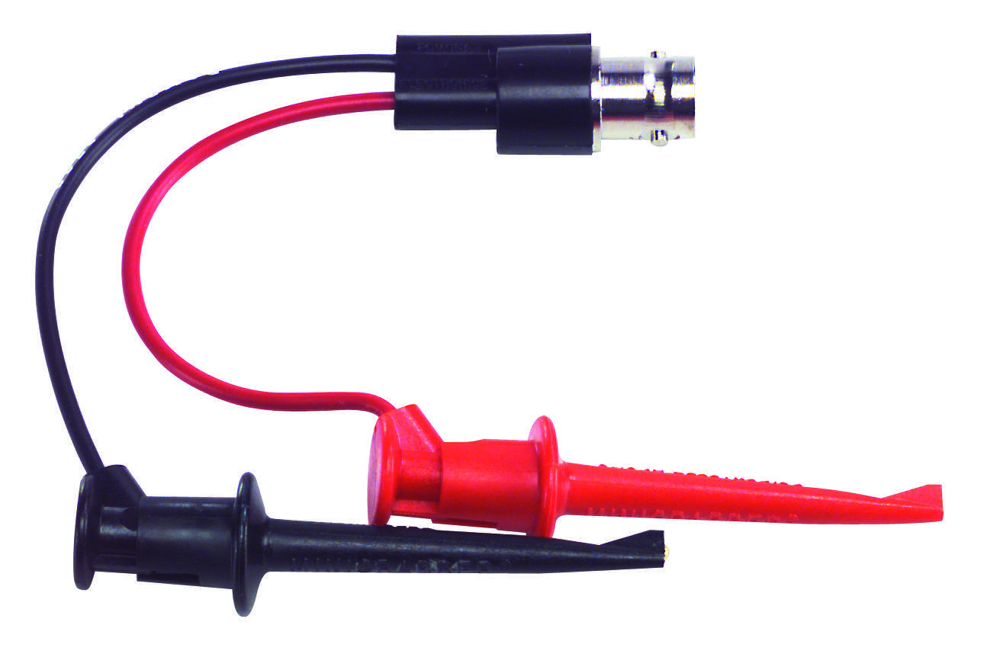
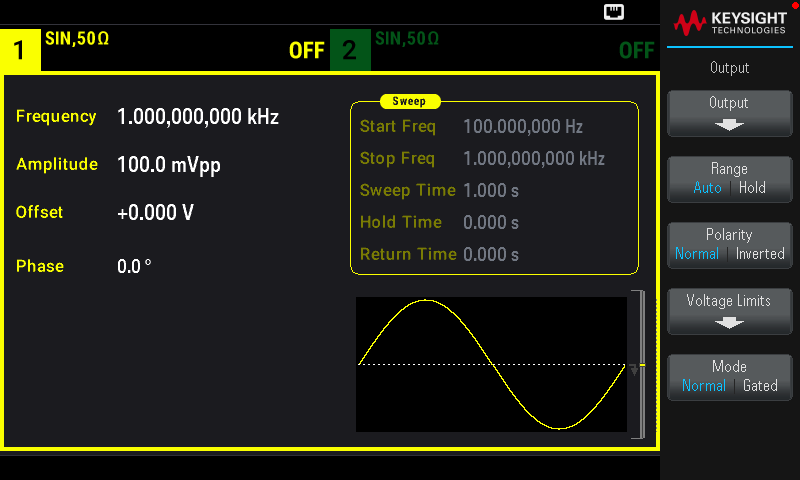
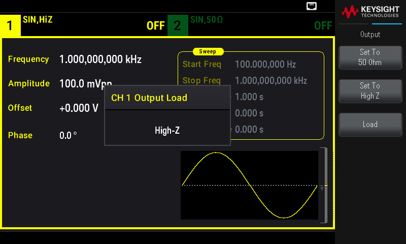

# Goals

In this lab, you will use basic test and measurement equipment that are useful for building and testing electronic circuits. In particular, you will make measurements of voltage using an oscilloscope and digital multimeter. You will also determine an accurate measurement technique for measuring small resistances.

Proficiency with new equipment

-   DC Power Supply:

    -   Set up the connections to supply both (+) and (-) voltage

    -   Operate in voltage controlled and current controlled modes

-   Oscilloscope:

    -   Measure DC voltage levels

    -   Determine the effects of DC and AC input coupling

    -   Determine the effects of changing the input impedance

    -   Trigger the scope on different waveforms

-   Function generator:

    -   Create various shaped waveforms, and modify amplitude and frequency

    -   Change the output impedance to match the rest of your system

-   Digital Multimeter (DMM):

    -   Measure DC voltages and DC currents

    -   Determine the frequency and impedance limitations of the DMM

Experimental design

-   Develop familiarity with the model-based approach to experiment

-   Measuring small resistances using a 4-terminal approach

# Lab Notebook Guidelines

The lab notebook will play an essential role in this course. You will use your notebook for keeping records of many things including:

-   Answering lab-prep questions from the lab guide

-   Answering in-lab questions

-   Recording data

-   Including plots of data

-   Analysis and results

-   Diagrams and pictures

-   Procedures of experiments that you design

The lab notebook will be an important part of your grade because learning to keep a good lab notebook is an important part of your professional development. You may find it helpful to write up many of your notes on the computer, for example, within Mathematica or another program. This is fine. However, before your notebook is turned in, the notes, plots, and analysis should be transferred to the lab notebook by printing and taping the pages or keeping them in a three-ring binder. This is standard practice in research labs. Your lab notebook is the main mechanism for communicating your process and results of the lab experiments. Each week, you will be responsible for turning in both your pre-laboratory work and your lab notebook / analysis via Canvas in scanned format. See the syllabus for more information.

# Definitions

**Power rail (or rail)** - this refers to the ± V power supply outputs that powers the circuit.

**Electrical Load** **(or load)** - this refers to the circuit or impedance connected to the output of a circuit.

**RMS (Root Mean Square)** - is the square root of the average of a periodic function squared over one period. Example: For the function $Y = A\ sin(\omega t)$, the RMS value is $\sqrt{\overline{Y^{2}}} =\ A/\sqrt{2}$.

# Useful Readings

1.  [Steck](https://atomoptics-nas.uoregon.edu/~dsteck/teaching/electronics/electronics-notes.pdf) - This text is freely available as a PDF, so you may want to download it and keep it handy. Sections 1.1 - 1.3.2 are appropriate for Lab 1.

2.  Fischer-Cripps (FC) Chapters 1 (Electricity), 2 (DC Circuits), and 3 (AC Circuits) introduce important topics relevant to the first two weeks of lecture. Note: we will revisit various sections in these chapters in more detail later - for example filters and oscillators. Also look at p. 274 for the resistor color code (or search for it on the internet).

3.  Horowitz and Hill 2^nd^ Edition (H&H) - Chapter 1, Sections 1.01-1.12

4.  The following documents, which can be found on Canvas, will be useful:

    -   Keysight EDU33210 Series Waveform Generator User Guide and Data Sheet

    -   Keysight EDU36311A Power Supply User Guide (p. 43-45) and Data Sheet

    -   Tektronix TBS2000 Series Oscilloscope User Manual

    -   Math review on complex numbers

# Setting up the DC Power Supply

Your DC power supply will provide all of your circuits with the required power. Setting up the power supply will always be the first thing you do when you begin working with a circuit. The Keysight EDU36311A DC Power Supply has three outputs that can be independently controlled. Pages 43-45 of the User Guide (which can be found the [Data Sheets and Instrument Manuals page](/PHYS-3330/manuals-data-sheets)) discuss this in detail.

## Set up the DC voltage bias

We want two of the power supply channels to be set up such that the potential difference set on one of the channels is positive with respect to ground and the other is negative with respect to ground. Each channel has outputs labeled (+) and (-) and you will find that the single output connector to the left of Channel 1 is connected to ground. The voltage indicated on the power supply display shows only the potential difference between the (+) and (-) output for a given channel. You must connect a channel's (-) output to ground to get a positive voltage with respect to ground, and a channel's (+) output to ground to get a negative voltage with respect to ground. Since Channels 2 and 3 on the Keysight EDU36311A Power Supply have the equivalent output voltage and current specifications, it makes the most sense to use these two channels. 

1.  Get some wire from the wire spool rack on the top of the blue tool cabinet to make these connections. You can unscrew the input jacks on the power supply to expose a small hole where the jumper wires can be inserted (see Figure @fig:ps).
2.  Set up your DMM (found in the grey toolbox on your lab bench) to measure a DC voltage. Confirm the sign and magnitude of the voltages displayed on the power supply using the DMM (you may need to set the voltage limits on the power supply to get a non-zero value). In your lab notebook, document the setup, the output voltage from the power supply, and the measured output on your DMM. 

## Investigate operating modes

A voltage source maintains a constant potential difference while the current output varies dependent on the load resistance (this is the Constant Voltage (CV) mode indicated at the top right corner of each channel). A current source maintains a constant current while the voltage output varies dependent on the load resistance (this is the Constant Current (CC) mode). The power supply will indicate the operational mode of each channel in the upper right corner of the respective channel window (in addition to CV and CC modes, the other mode is OFF).

1.  With no load attached, record the output voltage and current for both power rails (see definitions).

2.  Try adjusting the value of the voltage and current. Why is the current output always zero?

3.  Now short the (+) rail of Channel 2 to ground. You can use a banana cable from the rack to do this.

4.  Vary the value of the voltage and current. Describe the behavior of the voltage and current readings and the mode (CV/CC) of the power supply. What happens when you short the output to ground (have too small a load)? What is the maximum output of current and voltage your supply can produce?

{#fig:ps width="20cm"}

# Measuring Voltage with the Oscilloscope

The goal of this part of the lab is to be able to use an oscilloscope (frequently referred to as scope or o-scope) to make measurements of DC voltages and AC waveforms. You will also learn how to produce various waveforms using a function generator.

There are a few precautions to observe when operating the oscilloscope:

-   Avoid overheating the instrument. Do not block ventilation of the interior.

-   Do not apply more than 300 V to any input terminal.

-   Avoid serious or fatal injury from electrical shock. Do not remove the cover to expose the 120 V mains.

Otherwise, the instruments are robust and cannot be damaged by wrong settings. So, try whatever you're curious about and measure and document what happens.

## Measuring a DC voltage on a scope

The Tektronix TBS 2000 Series has four independent channels so that four separate signals can be displayed at once. Each trace is color coded with the buttons on the panel.

1.  Connect a +5V signal from your power supply to the scope using the supplied connectors. Measure the voltage on scope using the cursors. Try exploring the different knobs and menus on the scope to make the measurement. Refer to the appendix listed at the end of this document if you get stuck.

2.  In your lab notebook, describe the setup of the electric circuits (diagrams are useful) and the outcomes measured.

*NOTE: Oscilloscopes can only distinguish about 100 different values on the vertical axes of the screen. So before you use the oscilloscope to measure anything make sure that the trace covers at least 50% of the vertical screen without clipping at the top or bottom. This way you get a resolution/accuracy of approximately ±2%.*

{#fig:bnc width="10cm"}

{#fig:grabber width="10cm"}

## Triggering an AC waveform on the scope

Most scopes produce about 0-5 V square wave on the \"PROBE COMP\" pins to use for testing. We will use this to get familiar with triggering the scope. The trigger level controls the voltage at which the trace starts. Stability is lost when the trigger level lies outside the range of the displayed voltage.

1.  Connect the Probe Comp output to the scope using mini grabbers (see Figure @fig:grabber).

2.  Display the waveform on the scope. You will need to trigger the scope off of the waveform. Confirm with your instructor that you have the scope triggered correctly before continuing. Change TRIGGER MODE to NORMAL. Note that the trace now \"freezes\" when the trigger level is misadjusted. You can see whether or not the scope is actually being triggered by looking for the small writing TRIGD or TRIG? at the top of the display. *See Appendix for the trigger menu.* Describe the setup and outcomes in your lab notebook.

What is the frequency of the waveform? You can measure the period and then calculate the frequency using that measurement. Include your measurements, procedure, and calculations in your lab notebook.

## Creating an AC waveform using a function generator and measuring it on a scope

The Keysight EDU33212A function generator can produce sine, square, triangle, pulse, and ramp waveforms over the frequencies from 0.000001 Hz to 20 MHz. The output amplitude can be varied between 1 mV and 20 V peak-to-peak with an output impedance of 50 $\Omega$.

***There is one main precaution to keep in mind: Do not connect any output of the EDU33212A directly to dc power or to the output of any other instrument or circuit. Doing so will burn out the output amplifier!***

1.  Create a 1 V peak-to-peak (p-p) sine wave at 1 kHz with no DC offset (you may want to use this standard setup in the future if you have trouble). You will need to set the output termination of the function generator to HIGH Z (see *Appendix* or page 53 of the User Guide).

2.  Display the waveform on the scope. You can use a BNC cable (see Figure @fig:bnc) to make the connection. You will need to trigger the scope off of the waveform.

3.  Reduce the amplitude to 100 mV p-p. You may notice the scope stopped triggering. This is because the waveform never crosses the trigger level now.

4.  The function generator has a trigger output that can be used to trigger the scope (called Sync/Trigger Out). Using the trigger output is more convenient than triggering the scope off of the waveform itself because you avoid having to readjust the scope trigger every time you change the waveform. Connect the Sync output of the function generator to Channel 4 of the scope and trigger off of that waveform. Now change the amplitude and frequency of the sine wave and notice how the scope remains nicely triggered.

5.  Come up with a waveform of your own that you want to create (e.g., triangle wave at 1 MHz with a 200 mV p-p amplitude) and measure its properties with the scope. Report on the one you created and record this in your lab notebook. You can either print a screenshot directly from the scope or take a picture and print it.

# Measuring Quantities with the Digital Multimeter

**The multimeter is a useful device to measure constant voltages, currents, and resistances.**

To measure various quantities with the DMM, you must set the dial on the DMM to the correct setting that you want to measure. The Fluke 115 DMM that is in your toolbox at your workbench has three banana jack input ports at the bottom. Based on the quantity that you want to measure (voltage, current, resistance, etc.), you need to be sure that you've installed the leads into the appropriate input ports (NOTE: one of the leads will always be connected to the **COM** port).

1.  Connect the leads and set the dial to measure resistance. Get five ~5 $k \Omega$ (5%) resistors from the stock drawers. Measure the resistance of each resistor. Do all the resistors meet the 5% specification?

2.  Connect the leads and set the dial to measure voltage. Measure the voltage of both sides of the DC power supply again. Does the measured value from the DMM agree with the value indicated on the power supply?

3.  Now we will use the DMM to measure the current. This is different from measuring the voltage. To measure current, the DMM must be *part of* the circuit so that the current flows *through* the DMM. Remember, your DMM has three input ports at the bottom and you need to make sure that the leads are set up measure current. Connect the leads or cables to the proper ports and set the dial to measure current. Measure the current produced by the power supply. How do you experimentally set the current limit? Does the current measured with the DMM agree with the current indicated on the power supply? 

4.  The DMM also has an AC voltage setting. You will need to use the function generator to produce an AC (sine) waveform. Over what frequency range is the reading accurate to 2%?  Note: the DMM displays the RMS amplitude of the waveform. See Definitions at the beginning of the guide for an explanation of RMS. You will also need to consider how [“Amplitude” and “Peak-to-Peak”](https://en.wikipedia.org/wiki/Amplitude) are related.

5.  Remember in the future that this is the usable frequency range for the AC setting of the multimeter. Record this frequency in your lab notebook for future reference.

# Measuring Small Resistances

In the previous section, you measured resistances using the ohmmeter in the DMM. You will now use all the measurement techniques and devices you have learned about to determine most accurate way to measure a small resistance.

##  Measure a small resistance using a DMM ohmmeter

1.  Use a ~2 m length of magnet wire as your small resistor (this can be found on the wire spool rack on top of the blue tool cabinet next to the entrance of the lab - there should also be a 2m stick near the tool cabinet). Magnet wire has a very thin amber-colored insulating coating (about 0.001" in thickness). Make sure you remove the insulation from the ends of the wire to make a good electrical connection and measurement of the diameter of the wire. You can burn off the insulation with a flame or use sand paper to scratch it off.

2.  What is the resistance based on the diameter, length, and resistivity (the resistivity, $\rho$, of copper at room temperature is 1.68 $\mu\Omega$-cm)? Remember that $R = \rho l/a$, where $l$ is length and $a$ is area. You'll find dial calipers and a micrometer in the "Measuring Tools" drawer of the blue tool cabinet. The spool of magnet wire should be 24-gauge. Look up a copper magnet wire gauge chart online and confirm that your diameter measurement agrees with what you find.

3.  Use the ohmmeter in the DMM to measure the resistance of the wire. **Document your setup, measurements, and calculations in your lab notebook.**

## Measure a small resistance using a 4-terminal approach

1.  Use your DC power supply to run a current through the wire. You can then measure the voltage drop across the wire with a DMM to determine its resistance based on Ohms law.

2.  You can use the display on the power supply to measure the current or use your DMM as an ammeter. (Consider the resolution of both devices when making your choice.) You can use your DMM as a voltmeter to measure the potential difference across the wire. Can you just use the voltage reading on the power supply? Explain.

3.  Draw a diagram of your experimental set up in your lab notebook.

4.  Consider how the amount of current flowing through your resistor affects the sensitivity of your measurement.

5.  Calculate the resistance of the wire from your measurements using Ohm's Law.

## Compare the two measurement techniques

1.  The ohmmeter in the DMM works by supplying a current and measuring the potential difference between the outputs. How is this measurement different than the 4-terminal approach you built? *Hint: consider where the current is flowing and what resistances are involved with each measurement technique. It is usually helpful to draw a diagram including all the resistances, even of the wires in this case.*

2.  Which method is more accurate for measuring small resistances based on your explanation for part 1?

3.  Do your two measurements confirm your scientific argument made in part 2? Defend your assertion using your data.

# Appendix A: Tektronix TBS 2000 Series Oscilloscope Controls {#appendix-a-tektronix-tbs-2000-series-oscilloscope-controls .unnumbered}

**To change the horizontal (time base) scale:**

1.  Horizontal scale knob changes the time per division

2.  Horizontal position knob changes location of the trigger (labeled as a orange arrow on the top of the screen)

**To change the vertical (voltage base) scale:**

1.  Vertical scale knob changes the voltage per division

2.  Vertical position knob changes location of the ground (labeled as a colored-coded arrow on the left of the screen)

**To access the parameters for each channel:**

Ch. 1 (or 2,3,4) button \> Vertical MENU button (under Vertical Scale knob)

1.  Input Coupling (AC/DC/Ground)

2.  Invert Signal

3.  Probe Setup

4.  Input Impedance (1M$\Omega$ or 50$\Omega$)

Ch. 1 (or 2,3,4) button Vertical Off button (above Vertical Scale knob)

1.  turns off that channels trace

**To adjust the trigger:**

1.  Trigger knob changes the voltage level of the trigger

2.  Trigger MENU button

    a\. Select which channel to trigger off of (trigger level arrow changes color to show which channel is being triggered)

    b\. Slope: can trigger off a rising or falling edge.

    c\. Trigger Mode: Auto, Normal, other

**To select the AQUIRE mode:**

1.  Run/Stop: sets the scope to continuously aquire or freeze after last trigger

2.  Single sequence: draws once after it triggers

3.  Autoset: scope tries to choose overall best scope settings (sometimes useful when you cant see anything, but generally used as a last resort because it can also mislead you )

**Measure Menu (top of panel):**

You can select various measurements and which channel to measure. *Be very careful* with automatic measurements (again these can be deceptive). Generally use cursors to make accurate measurements. Note that the automatic mode searches for the very top and bottom of the signals. For example, in the schematic of a noisy sine wave below, automatic mode will return the upper and lower most lines which will include the noise contribution. A careful manual measurement indicated by the inner (shorter) lines can remove the noise from the amplitude measurement. **With small or noisy signals, the automatic mode will give very poor results.**

**Cursor Menu (top of panel):**

1.  Choose time (vertical bars) or voltage (horizontal bars) measurement.

2.  Choose which channel to measure (measurement cursors are the same color as the channel they are measuring)

3.  Big top knob moves the cursors

4.  SELECT button changes which cursor to move.

5.  Position relative to ground (trigger zero time) is displayed on the screen with the T symbol.

6.  Relative distance between cursors is displayed on the screen with the $\Delta$ symbol.

# Appendix B: Changing the Output Termination on the Function Generator (Keysight EDU33212A) {#appendix-b-changing-the-output-termination-on-the-function-generator-keysight-edu33212a .unnumbered}

1.  Press a channel \[Setup\] key to open the channel configuration screen. Note that the current output termination values (both 50 $\Omega$ in this case) appear on the tabs at the top of the screen.

{#fig:setup width="15cm"}

2.  Begin specifying the output termination by pressing Output Load.

{#fig:output width="15cm"}

3.  Select the desired output termination either by using the knob or numeric keypad to select the desired load impedance or by pressing Set to 50 $\Omega$ or Set to High Z. You can also set a specific value by pressing Load.

{#fig:termination width="15cm"}
