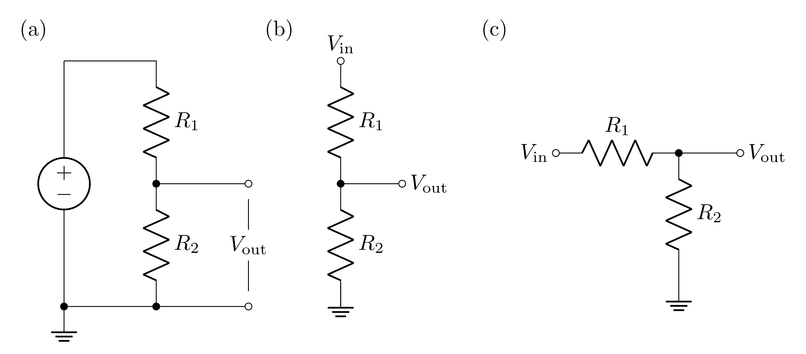
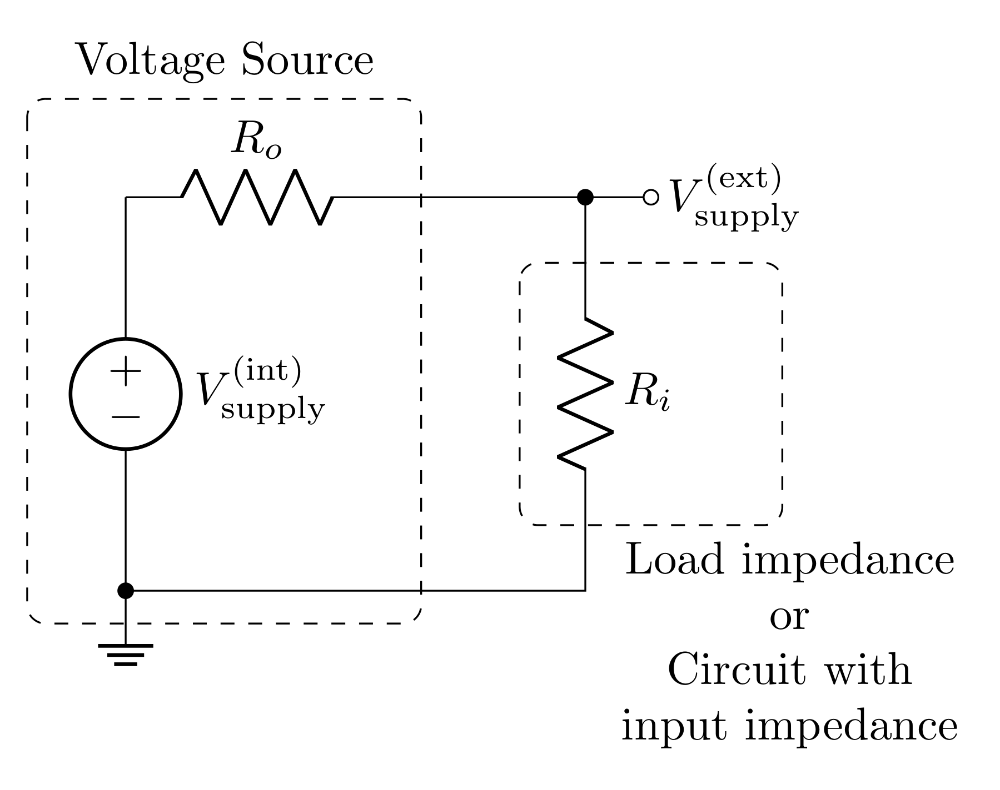
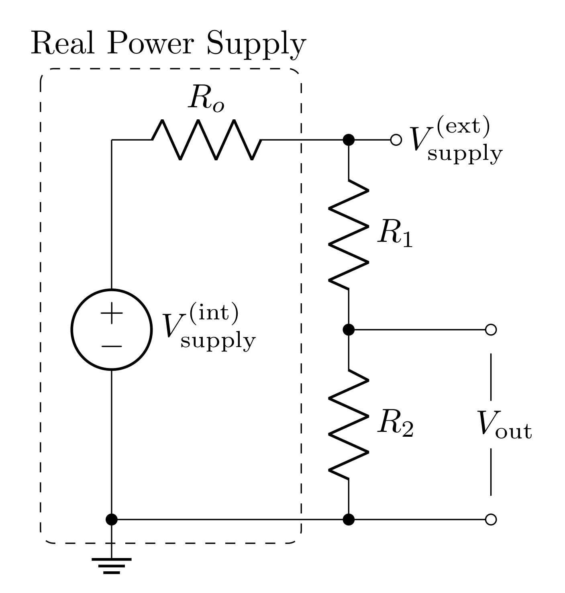
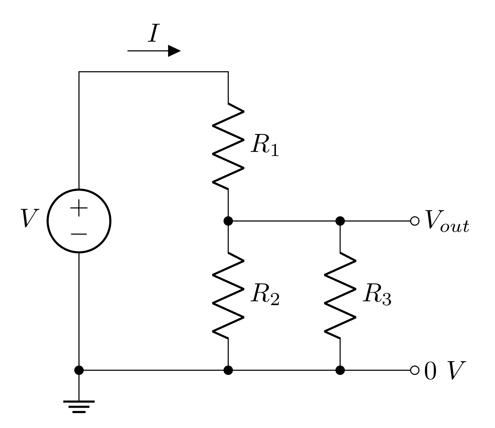
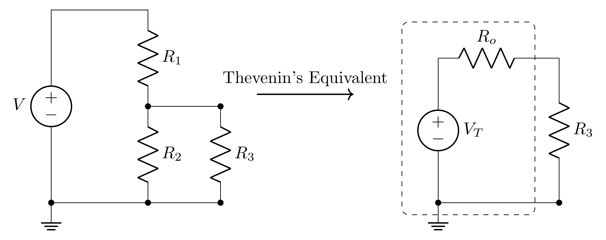

# Goals

The goals of this lab are to

-  build, test, and explore refined models of voltage divider circuits to include the effects of measurements and loads.

-  get first exposure to the impact of input and output impedance.

-  continue to use the switches and potentiometers on the header.

-  build a volume knob using your knowledge of voltage dividers and switches.

<!--# Definitions

**Potentiometer (pot)** - a three-terminal resistive device that provides a variable resistance between the ends and the \"wiper\" connection.-->

# Prelab

## Voltage Dividers

{#fig:ideal-vd height="7cm"}

An ideal voltage source (no internal resistance) drives current around the loop of  two resistors shown in Figure {@fig:ideal-vd} (all three circuits in this figure are equivalent!). Each resistor has a voltage drop across it due to the current running through them, so the voltage difference labeled $V_\text{out}$ will be less than the voltage applied to the whole circuit.

### Prelab Question {#sec:1.1}

What is the current $I$ through each resistor? Represent these with respect to $V_\text{in}$, $R_1$ and $R_2$. *Hint:* the resistors are in series, so the current through them is the same.

### Prelab Question {#sec:1.2}

What is the voltage across $R_2$? Express this with respect to the current. Explain why this is $V_\text{out}$.

### Prelab Question {#sec:1.3}

Express $V_\text{out}$ with respect to $V_\text{in}$ and the two resistors *Hint:* this expression should not depend on the current.

Make a Python function that computes $V_\text{out}$ that takes $V_\text{in}$, $R_1$, and $R_2$ as inputs. You will likely find this function useful throughout the semester.

### Prelab Question {#sec:1.4}

Build the circuit shown in Figure @fig:ideal-vd in LTspice. Use these values

- $V_\text{in} = 10\text{ V}$

- $R_1 = 1\text{ k}\Omega$

- $R_2 = 3\text{ k}\Omega$

First calculate $I$ and $V_\text{out}$ using your results from the previous questions. Then run a transient simulation and measure $I$ and $V_\text{out}$. If your calculations and simulation do not agree, resolve any issues (this could be due to a mistake in your calculations or in setting up your simulation).

## Transfer Function

A **transfer function** $T$ is ratio of an output to an input. In this class, we are interested in voltage transfer functions, so

$$\begin{equation}
T = \frac{V_\text{out}}{V_\text{in}}
\end{equation}$$

A ***voltage divider's*** output will always be less than the input, so the transfer function will range between $0$ and $1$.

### Prelab Question {#sec:2.1}

Write down the equation for the transfer function of the ideal voltage divider. *Hint:* use the result of problem @sec:1.3. This should only depend on the values of the two resistors, and should be unitless.

### Prelab Question {#sec:2.2}

For $R_1 = 2\text{ k}\Omega$ and $R_2 = 1\text{ k}\Omega$, what is the value of the transfer function?

### Prelab Question {#sec:2.3}

For a $V_\text{in}$ of $10\text{ V}$, what will $V_\text{out}$ be (using the resistance values above)?

In LTspice, build this circuit and run a transient simulation. Measure the output voltage in the simulation to confirm that your calculation is correct. If not, resolve any mistakes in either your simulation or calculation. Screen shot the circuit and result in LTspice.

## Input and Output Impedance

{#fig:input-output-impedance height="7.5cm"}

A *real* power source has series resistance (aka output impedance) $R_o$. When your circuit draws current from the power source, current will pass through $R_o$, so voltage will drop across it (according to Ohm's law). Even complicated circuits can often be modeled as a single resistor representing the "input impedance" of the circuit. The input impedance describes how the whole circuit opposes current. If the circuit being powered is just a resistor, then the input impedance is just the resistance of this resistor. Regardless, the input impedance can be thought of as the load on the circuit.

When the power source with output impedance $R_o$ drives the load with input impedance $R_i$, the output and input impedances form a voltage divider, where the input of the voltage divider is $V_\text{supply}^\text{(int)}$ and the output is $V_\text{supply}^\text{(ext)}$. The transfer function of this voltage divider is then

$$T = \frac{V_\text{supply}^\text{(ext)}}{V_\text{supply}^\text{(int)}} = \frac{R_i}{R_o+R_i}$$

### Prelab Question {#sec:3.1}

Confirm that your solution for the transfer function from problem @sec:2.1 is consistent with the transfer function shown above. If it is not, resolve the discrepancy.

### Prelab Question {#sec:3.2}

The power delivered to the circuit or the load is determined by

$$P = I^2 R_i= I V_\text{supply}^\text{(ext)} = \frac{(V_\text{supply}^\text{(ext)})^2}{R_i}$$

For a given $R_o$, find the $R_i$ that maximizes the power delivered.

*Hint:* Express $P$ in terms of $V_\text{supply}^\text{(int)}$ instead of $V_\text{supply}^\text{(ext)}$, and then find the extrema (maximum) by finding the value of $R_i$ that makes the derivative zero; i.e. find $R_i$ such that

$$\frac{\partial P}{\partial R_i} = 0$$

### Prelab Question {#sec:3.3}

Impedance matching is the process of matching load impedances with a power source's output impedance. For high frequency signals, impedance matching is very important, but it is also commonly done because, for a given $R_o$, matching the input impedance to the same value will allow for the maximum amount of power to be delivered to the circuit. Is this consistent with your result for the $R_i$ that gives maximum power? If not, revise your calculation. 

### Prelab Question {#sec:3.4}

Plot $P$ vs $R_i$ from $R_i=0\ \Omega$ to $R_i=100\ \Omega$ using $V_\text{supply}^\text{(int)}=1\text{ V}$ with the following values of $R_o$ on the same plot (use a legend to label the different plots for each $R_o$):

-  $R_o = 10\ \Omega$
-  $R_o = 25\ \Omega$
-  $R_o = 50\ \Omega$

Notice that, even though the curves peak at $R_i=R_o$, that decreasing $R_o$ still increases the power at all $R_i$. To deliver a lot of power, having a low output impedance is often the best choice, but this isn't always a parameter we can control.

Here is some sample code for plotting. 

```

import numpy as np
import matplotlib.pylab as plt
import matplotlib

matplotlib.rcParams['mathtext.fontset'] = 'cm'
matplotlib.rcParams['font.family'] = 'STIXGeneral'

```

The above imports the necessary libraries and then configures matplotlib to look nice with LaTeX.

```

def power(r_o, r_i, v):
    # your code here
    return # result

volt = 1
Ri = np.linspace(0, 100, 1000)  # input impedance
output_impedances = (10, 25, 50)

fig, ax = plt.subplots(1, 1, figsize=(4, 3))

for Ro in output_impedances:
    ax.plot(Ri, power(Ro, Ri, volt), label=f'{Ro} $\\Omega$')

ax.set_xlabel('Input Impedance ($\\Omega$)')
ax.set_ylabel('Power (W)')

ax.set_title('Power delivered from non-ideal voltage source')

ax.set_xticks(np.arange(0, 101, 10))
ax.set_xticks(np.arange(0, 101, 2), minor=True)

ax.set_xlim(0, 100)
ax.set_ylim(0, .026)

ax.yaxis.set_minor_locator(matplotlib.ticker.AutoMinorLocator())
ax.tick_params(axis='both', which='both', direction='in', top=True, right=True)

ax.legend(title="Output Impedance")
ax.grid(linestyle="dotted")

fig.tight_layout()
fig.savefig('impedance_matching_plot.png', dpi=600, bbox_inches='tight')

```

Print out this plot and put it in your notebook, along with some explanation of what it is.

## Voltage Divider with Non-ideal Power Supply

{#fig:nonideal-vd height="7.5cm"}

Now consider a real voltage source (modeled with a resistor in series with the voltage as seen in Figure @fig:nonideal-vd) powering a voltage divider. The following questions will explore the potential impact the output impedance can have on a voltage divider circuit.

### Prelab Question {#sec:4.1}

What is the input impedance of the voltage divider circuit? *Hint:* the input impedance would be the resistance that you would measure from $V_\text{supply}^\text{(ext)}$ to ground.

### Prelab Question {#sec:4.2}

The $V_\text{in}$ of the voltage divider will be the $V_\text{supply}^\text{(ext)}$ from the power supply (see figure {@fig:input-output-impedance}); i.e. $V_\text{in}=V_\text{supply}^\text{(ext)}$. Express $V_\text{in}$ as a function of $V_\text{supply}^\text{(int)}$ and the resistor values. *Hint:* the results from the input/output impedance section will be helpful here.

### Prelab Question {#sec:4.3}

Using the voltage divider equation (you found this in problem {@sec:1.3}), express $V_\text{out}$ of the circuit with respect to $V_\text{supply}^\text{(int)}$ (of the voltage supply) and the resistor values.

Write a Python function that computes the output voltage of a voltage divider with a non-ideal voltage supply that takes the following inputs: $V_\text{supply}^\text{(int)}$, $R_o$, $R_1$, and $R_2$.

### Prelab Question {#sec:4.7}

- For an ideal voltage divider $(R_o=0\text{ V})$, having $R_1=100\ \Omega$ and $R_2=50\ \Omega$ or $R_1=2\text{ k}\Omega$ and $R_2=1\text{ k}\Omega$ or $R_1=200\text{ k}\Omega$ and $R_2=100\text{ k}\Omega$ will have the same transfer function. Predict $V_\text{out}$ when the ideal voltage source is set to $10\text{ V}$

- Build all 3 of these circuits side by side in an LTspice simulation (use a unique voltage source for each circuit). Screen shot your circuit and confirm that the simulation agrees with your calculations.

### Prelab Question {#sec:4.8}

- What is $V_\text{out}$ for each circuit above if instead of using ideal voltage sources, they each had an output impedance of $R_o=50\ \Omega$? You can do this by adding an additional resistor in series, immediately after your voltage source.
    - $R_1=100\ \Omega\text{ and }R_2=50\ \Omega$
    - $R_1=2\text{ k}\Omega\text{ and }R_2=1\text{ k}\Omega$
    - $R_1=200\text{ k}\Omega\text{ and }R_2=100\text{ k}\Omega$


### Prelab Question {#sec:4.9}

- Compare the output voltage of the voltage divider with an ideal voltage source vs a non ideal voltage source.
- How does the input impedance of the voltage divider $(R_1+R_2)$ impact the non-ideal circuit compared to the ideal circuit?
- What condition should be met such that both the ideal and non-ideal voltage source models sufficiently agree?

## Impacts of Parallel Impedances

{#fig:modified-vd height="7cm"}

In the lab activities we will discover that the circuit shown in Figure {@fig:modified-vd} more accurately models a voltage divider being measured. $R_3$ is an impedance/resistance in parallel with $R_2$ which is due to the impedance of a voltage measuring device. This model can also be used to predict the affects of placing an external load on a voltage divider.

The transfer function for this circuit can be solved by adding $R_2$ and $R_3$ in parallel; we can call this parallel resistance $R_p$. The circuit with these two combined is just a voltage divider with a transfer function:

$$T = \frac{R_p}{R_1 + R_p}$$

where

$$R_p=\frac{R_2R_3}{R_2+R_3}$$

Before plugging in $R_p$, it is helpful to divide the top and bottom by $R_p$ to make the transfer function only have one $R_p$ in its equation

$$T = \frac{1}{\frac{R_1}{R_p}+1} = \frac{1}{\frac{R_1(R_2+R_3)}{R_2R_3}+1} = \frac{R_2R_3}{R_1(R_2+R_3)+R_2R_3}$$

As a final step, the $R_1$ can be distributed in the denominator to put this in a nice form

$$T = \frac{R_2R_3}{R_1R_2+R_1R_3+R_2R_3}$$

### Prelab Question {#sec:5.1}

Rearrange the equation you just found to solve for $R_3$ given the other values. This equation will be used during the lab.

Make this a Python function; the inputs of the function should be $V_\text{in}$, $V_\text{out}$, $R_1$, and $R_2$.

## Thevenin's Theorem and the Voltage Divider

Thevenin's theorem states that any circuit (and therefore the voltage divider) can be modeled as an ideal voltage source with an output impedance $R_o$ (see the figure below).

 {#fig:thev height="7cm"}

For the voltage divider:

$$V_T = V_\text{in} \frac{R_2}{R_1+R_2}$$

$$R_o = \frac{R_1R_2}{R_1+R_2}$$

Naively, one would think that when a load $R_3$ is attached to the voltage divider, you might expect the voltage applied will be the $V_\text{out}$ of the voltage divider: i.e. $V_\text{in} \frac{R_2}{R_1+R_2}$, and indeed, the Thevenin voltage $V_T$ *is* this. However, the Thevenin equivalent resistance is very significant, and the voltage that gets to $R_3$ won't be $V_T$.

<!--
### Prelab Question {#sec:6.1}

Use your result of problem {@sec:5.1} to show that the voltage across $R_3$ is the same as the voltage predicted by the Thevenin equivalent circuit.
# HOLDING OFF OF THIS ONE FOR NOW
--> 

## Lab Activities

### Prelab Question {#sec:7.1}

Please review the lab activities so that you're better prepared when you arrive to your lab section.

# Useful Readings

You can find more helpful information in the following sections of the text books:

1.  [Steck](https://atomoptics-nas.uoregon.edu/~dsteck/teaching/electronics/electronics-notes.pdf) Sections 1.3.3 -- 1.4.2

2.  Fischer-Cripps Sections 2.1 -- 2.3

3.  Horowitz and Hill 2<sup>nd</sup> Ed., 1 -- 1.04

4.  Horowitz and Hill 3<sup>rd</sup> Ed., 1 -- 1.3.1

# Lab activities


## Building and Testing Voltage Dividers

Components (resistors, capacitors, transistors, etc.) are available from the community stock. Take what components you need for your experiments, and keep them for the term. If you notice the inventory getting low, please let your instructor know.

## Fixed-value voltage divider - $1\text{ k}\Omega$

1.  Build a voltage divider similar to the one shown in Figure {@fig:ideal-vd} using resistors of around $1\text{ k}\Omega$ and connect it to the +5 VDC source on your protoboard. Draw a diagram of the circuit in your lab notebook. Make sure to label the resistors and record all measured component values and voltages.

2.  Measure each resistor with your DMM before inserting it into your circuit and record the value. Why should you measure component values before placing them in the circuit?

3.  Predict the output voltage you should measure based on your input voltage and resistance measurements. Include your calculations and numerical predictions in your lab notebook.

4.  Now, connect your voltage divider so that it divides the $+5\text{ V}$. Measure the output voltage using your DMM and then using your oscilloscope. Record your measurements. *Do not have the DMM and the oscilloscope connected at the same time because each may perturb the measurement differently.*

5.  Compare the voltages you predicted to the voltages you measured. Does your model of the voltage divider agree with each of your measurements? Explicitly record what criteria you used to determine whether or not the model and measurements agreed.

<!--6.  *Complete this step only if your model and measurements did not agree.* If your model and measurements did not agree, you will have to either refine your model or your experiment. Lets start by refining your model. Consider the input resistance of your measurement device. Draw a circuit diagram that includes that resistance. *HINT: See Figure @fig:modified-vd*. Derive an expression for the output voltage now including the unknown measurement device resistance. Use this new model to determine the input resistance of measurement device. (that is, rearrange your equation to solve for $R_3$.. You did this in the prelab).-->

## Fixed-value voltage dividers of $1\text{ M}\Omega$ and $10\text{ M}\Omega$ {#sec:parallel-model}

1.  Complete the steps in the previous section for two additional voltage dividers, one using resistors $1\text{ M}\Omega$ and one with resistors $10\text{ M}\Omega$ (with both the DMM and the scope).

2.  Evaluate whether the results for these two voltage dividers continue to agree with your model.

3.  Describe why your model and experiment don't agree. *Hint:* think about how a voltage measurement works.

4.  Which model explored in the prelab will more accurately represent your circuit while it is being measured? Draw this circuit diagram and label any resistances you know (with the measured resistances), and any resistances you don't know (with some $R$ with an appropriate subscript). Somewhere with your diagram, describe what each unknown resistance represents.

5.  Use your model and your measurements to calculate the unknown resistance when measuring with the DMM and with the scope. *Hint:* you worked this function out in the prelab.

6.  Look at the [specification (spec) sheets or data sheets](/PHYS-3330/manuals-data-sheets) for the DMM and the scope to find their measurement impedances (input resistance). There is an easy way to determine the specified measurement impedance of the scope (this sort of thing is typically labeled near the inputs on the scope).

7.  Does the measured input impedance agree with the instrument specs? Explicitly record what criteria you used to determine whether or not the resistances agree.

We just practiced changing our model to better represent our experiment. Next week we will practice changing our experiment to better be represented by our model.

# Day 2 --------------------------

## Working with the function generator

In this section we will experiment with the function generator and 
measure the output on a function generator, 
create audio signals with it, 
and use a set of resistors and the potentiometer to act as a volume knob. 

***In this section you will use the function generator to power your circuit.
You will use the breadboard on the protoboard to construct your circuit but at
no time will you use the power on the protoboard to power your circuit.***

### Generating an audio signal

1.  Connect a BNC-to-banana plug to the output of the function generator.

2.  Create a $2\ \text{V}_\text{pp}$ sine wave with a $432\ \text{Hz}$ frequency (or so) and trigger on the *Sync* (in the trigger menu, change the channel to Channel 1). This will provide a nice lower frequency tone (a $\text{C}_4$ note) at a volume that won't be too obnoxious to your neighbors.

3.  Use the probe on the oscilloscope to measure the output of the function generator.

4.  Confirm on the oscilloscope that the frequency and the amplitude of your wave match the settings on the function generator; i.e. measure and record the values and how you determined them.

5.  Now disconnect the oscilloscope and connect the function generator to the speaker on the breadboard.
If the volume is too loud, adjust the "*Amplitude*" on the oscilloscope.

## Build a Controllable Voltage Source (Volume Knob)

You will now use your skills with building and testing circuits to build a controllable voltage source using a potentiometer.

1.  Remind yourself of how the 1kOhm potentiometer on your protoboard works, by testing it out with the DMM.

2.  Put the function generator in parallel with a) the 1kOhm potentiometer and b) a series circuit of
a 4kOhm resistor (or thereabouts) and the speaker (note the resistance of the speaker). 

3.  Does the 1kOhm pot act like a volume knob? Why? 

4.  Now replace the 4kOhm resistor with a resistor on the order of hundreds of Ohms. What effect
has this had? Why?

5.  With either resistor, use the oscilloscope to measure the voltage drop across the resitor that
is in series with the speaker. Is it what you expect? What happens to the signal when you turn the
potentiometer?


