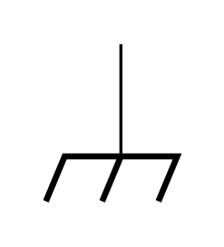
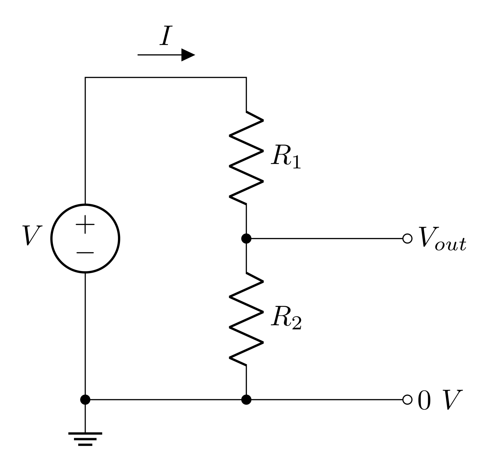
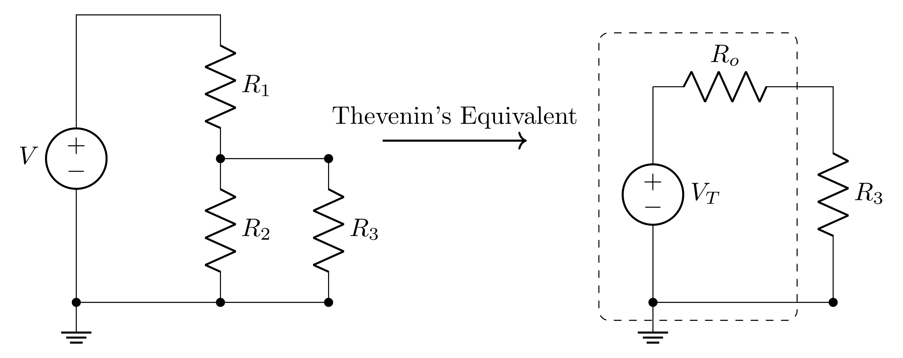
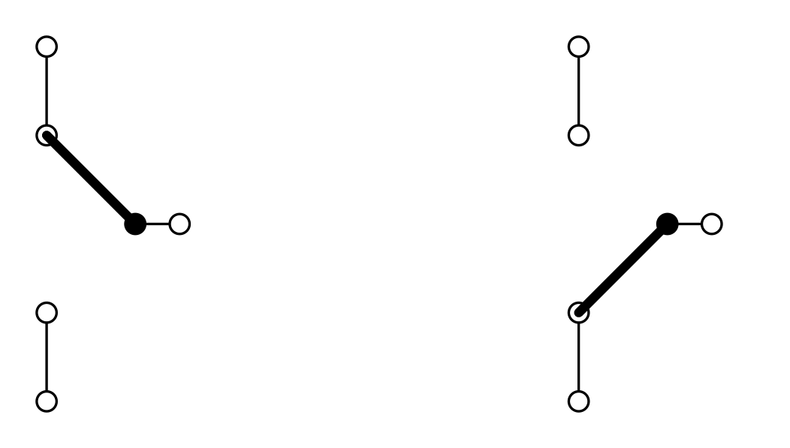

# Goals

The goals of this lab are to

-  familiarize yourself with the prototyping boards (breadboards). You will use this tool extensively for the rest of the semester. 

-  learn how to interface your equipment with the prototyping board through the header attached to the board.

-  build, test, and explore refined models of voltage divider circuits to include the effects of measurements and loads.

-  get first exposure to the impact of input and output impedance.

-  learn how to use the switches and potentiometers on the header.

-  build a volume knob using your knowledge of voltage dividers and switches.

<!--# Definitions

**Potentiometer (pot)** - a three-terminal resistive device that provides a variable resistance between the ends and the \"wiper\" connection.-->

# Prelab

## Breadboard

Before modern prototyping boards, people would take wooden cutting boards (aka breadboards) and tack nails into them to provide scaffolding for testing circuits. [Take a look!](https://learn.sparkfun.com/tutorials/how-to-use-a-breadboard/history) Modern prototyping boards are far more sophisticated but are affectionately still called breadboards.

Breadboards allow you to quickly create and modify circuits without needing to solder anything. Once the circuit works and meets the desired specifications, a printed circuit board (PCB) can be designed and made. All the components can be soldered to the PCB and the circuit can be mounted in a metal case to shield it from external electromagnetic fields. Present technology allows anyone to cheaply design, layout, and print professional circuit boards. For example: <http://www.expresspcb.com/>

](../resources/lab2fig/breadboard-pins.jpg){#fig:breadpins width="10cm"}

Breadboards are composed of several holes that you can stick wires into. The holes form rows of metallic connection (as seen in Figure {@fig:breadpins}). Each of these rows are constructed like little grabbers that allow for secure connections (as seen in Figure {@fig:breadrow}).

](../resources/lab2fig/breadboard-row.JPG){#fig:breadrow width="6cm"}

Our breadboards have custom built headers (see Figure @fig:breadheader) to allow you to easily interface your equipment (scope, power supply, function generator, etc.) with the breadboard. All the connectors, switches, and potentiometers are connected to the green screw terminals that wires can be clamped in to connect to the breadboard.

{#fig:breadheader width="13cm"}

The far left and far right screw terminals are connected to switches and potentiometers (three terminal, variable resistors). The mid-left screw terminal is connected to banana ports, and the mid-right screw terminal is connected to the inner conductors of BNC ports.

### Prelab Question {#sec:0.1}

{#fig:chassis-ground width="4cm"}

The symbol shown above is chassis ground. This refers to a common connection to the case. Notice that this is labeled in a few places on the breadboard's header (suggesting connection to the metal case).

Which screw terminal (there's just one) should be used to access the outer conductor of the BNCs? You can describe the screw terminal by which connector is connected to it.

## Voltage Dividers

{#fig:ideal-vd height="7cm"}

An ideal voltage source (no internal resistance) drives current around the loop of  two resistors shown in Figure {@fig:ideal-vd} (all three circuits in this figure are equivalent!). Each resistor has a voltage drop across it due to the current running through them, so the voltage difference labeled $V_\text{out}$ will be less than the voltage applied to the whole circuit.

### Prelab Question {#sec:1.1}

What is the current $I$ through each resistor? Represent these with respect to $V_\text{in}$, $R_1$ and $R_2$. *Hint:* the resistors are in series, so the current through them is the same.

### Prelab Question {#sec:1.2}

What is the voltage across $R_2$? Express this with respect to the current. Explain why this is $V_\text{out}$.

### Prelab Question {#sec:1.3}

Express $V_\text{out}$ with respect to $V_\text{in}$ and the two resistors *Hint:* this expression should not depend on the current.

Make a Python function that computes $V_\text{out}$ that takes $V_\text{in}$, $R_1$, and $R_2$ as inputs. You will likely find this function useful throughout the semester.

### Prelab Question {#sec:1.4}

Build the circuit shown in Figure @fig:ideal-vd in LTspice. Use these values

- $V_\text{in} = 10\text{ V}$

- $R_1 = 1\text{ k}\Omega$

- $R_2 = 3\text{ k}\Omega$

First calculate $I$ and $V_\text{out}$ using your results from the previous questions. Then run a transient simulation and measure $I$ and $V_\text{out}$. If your calculations and simulation do not agree, resolve any issues (this could be due to a mistake in your calculations or in setting up your simulation).

## Transfer Function

A **transfer function** $T$ is ratio of an output to an input. In this class, we are interested in voltage transfer functions, so

$$\begin{equation}
T = \frac{V_\text{out}}{V_\text{in}}
\end{equation}$$

A ***voltage divider's*** output will always be less than the input, so the transfer function will range between $0$ and $1$.

### Prelab Question {#sec:2.1}

Write down the equation for the transfer function of the ideal voltage divider. *Hint:* use the result of problem @sec:1.3. This should only depend on the values of the two resistors, and should be unitless.

### Prelab Question {#sec:2.2}

For $R_1 = 2\text{ k}\Omega$ and $R_2 = 1\text{ k}\Omega$, what is the value of the transfer function?

### Prelab Question {#sec:2.3}

For a $V_\text{in}$ of $10\text{ V}$, what will $V_\text{out}$ be (using the resistance values above)?

In LTspice, build this circuit and run a transient simulation. Measure the output voltage in the simulation to confirm that your calculation is correct. If not, resolve any mistakes in either your simulation or calculation. Screen shot the circuit and result in LTspice.

## Input and Output Impedance

{#fig:input-output-impedance height="7.5cm"}

A *real* power source has series resistance (aka output impedance) $R_o$. When your circuit draws current from the power source, current will pass through $R_o$, so voltage will drop across it (according to Ohm's law). Even complicated circuits can often be modeled as a single resistor representing the "input impedance" of the circuit. The input impedance describes how the whole circuit opposes current. If the circuit being powered is just a resistor, then the input impedance is just the resistance of this resistor. Regardless, the input impedance can be thought of as the load on the circuit.

When the power source with output impedance $R_o$ drives the load with input impedance $R_i$, the output and input impedances form a voltage divider, where the input of the voltage divider is $V_\text{supply}^\text{(int)}$ and the output is $V_\text{supply}^\text{(ext)}$. The transfer function of this voltage divider is then

$$T = \frac{V_\text{supply}^\text{(ext)}}{V_\text{supply}^\text{(int)}} = \frac{R_i}{R_o+R_i}$$

### Prelab Question {#sec:3.1}

Confirm that your solution for the transfer function from problem @sec:2.1 is consistent with the transfer function shown above. If it is not, resolve the discrepancy.

### Prelab Question {#sec:3.2}

The power delivered to the circuit or the load is determined by

$$P = I^2 R_i= I V_\text{supply}^\text{(ext)} = \frac{(V_\text{supply}^\text{(ext)})^2}{R_i}$$

For a given $R_o$, find the $R_i$ that maximizes the power delivered.

*Hint:* Express $P$ in terms of $V_\text{supply}^\text{(int)}$ instead of $V_\text{supply}^\text{(ext)}$, and then find the extrema (maximum) by finding the value of $R_i$ that makes the derivative zero; i.e. find $R_i$ such that

$$\frac{\partial P}{\partial R_i} = 0$$

### Prelab Question {#sec:3.3}

Impedance matching is the process of matching load impedances with a power source's output impedance. For high frequency signals, impedance matching is very important, but it is also commonly done because, for a given $R_o$, matching the input impedance to the same value will allow for the maximum amount of power to be delivered to the circuit. Is this consistent with your result for the $R_i$ that gives maximum power? If not, revise your calculation. 

### Prelab Question {#sec:3.4}

Plot $P$ vs $R_i$ from $R_i=0\ \Omega$ to $R_i=100\ \Omega$ using $V_\text{supply}^\text{(int)}=1\text{ V}$ with the following values of $R_o$ on the same plot (use a legend to label the different plots for each $R_o$):

-  $R_o = 10\ \Omega$
-  $R_o = 25\ \Omega$
-  $R_o = 50\ \Omega$

Notice that, even though the curves peak at $R_i=R_o$, that decreasing $R_o$ still increases the power at all $R_i$. To deliver a lot of power, having a low output impedance is often the best choice, but this isn't always a parameter we can control.

Here is some sample code for plotting. You can use `%matplotlib widget` to allow you to interact with the inline plot. Otherwise, the default should be `%matplotlib inline`, and this might be preferable to you. To use the widget you will need to install have [ipympl](https://matplotlib.org/ipympl/) installed. This can be done with `pip install ipympl` in your Anaconda prompt with your environment activated.

```

import numpy as np
import matplotlib.pylab as plt
import matplotlib
%matplotlib widget
matplotlib.rcParams['mathtext.fontset'] = 'cm'
matplotlib.rcParams['font.family'] = 'STIXGeneral'

```

The above imports the necessary libraries and then configures matplotlib to look nice with LaTeX.

```

def power(r_o, r_i, v):
    # your code here
    return # result

volt = 1
Ri = np.linspace(0, 100, 1000)  # input impedance
output_impedances = (10, 25, 50)

fig, ax = plt.subplots(1, 1, figsize=(4, 3))
for Ro in output_impedances:
    ax.plot(Ri, power(Ro, Ri, volt), label=f'{Ro} $\\Omega$')
ax.set_xlabel('Input Impedance ($\\Omega$)')
ax.set_ylabel('Power (W)')
ax.set_title('Power delivered from non-ideal voltage source')
ax.set_xticks(np.arange(0, 101, 10))
ax.set_xticks(np.arange(0, 101, 2), minor=True)
ax.set_xlim(0, 100)
ax.set_ylim(0, .026)
ax.yaxis.set_minor_locator(matplotlib.ticker.AutoMinorLocator())
ax.tick_params(axis='both', which='both', direction='in', top=True, right=True)
ax.legend(title="Output Impedance")
ax.grid(linestyle="dotted")
fig.tight_layout()
fig.savefig('impedance_matching_plot.png', dpi=600, bbox_inches='tight')

```

## Voltage Divider with Non-ideal Power Supply

{#fig:nonideal-vd height="7.5cm"}

Now consider a real voltage source (modeled with a resistor in series with the voltage as seen in Figure @fig:nonideal-vd) powering a voltage divider. The following questions will explore the potential impact the output impedance can have on a voltage divider circuit.

### Prelab Question {#sec:4.1}

What is the input impedance of the voltage divider circuit? *Hint:* the input impedance would be the resistance that you would measure from $V_\text{supply}^\text{(ext)}$ to ground.

### Prelab Question {#sec:4.2}

The $V_\text{in}$ of the voltage divider will be the $V_\text{supply}^\text{(ext)}$ from the power supply (see figure {@fig:input-output-impedance}); i.e. $V_\text{in}=V_\text{supply}^\text{(ext)}$. Express $V_\text{in}$ as a function of $V_\text{supply}^\text{(int)}$ and the resistor values. *Hint:* the results from the input/output impedance section will be helpful here.

### Prelab Question {#sec:4.3}

Using the voltage divider equation (you found this in problem {@sec:1.3}), express $V_\text{out}$ of the circuit with respect to $V_\text{supply}^\text{(int)}$ (of the voltage supply) and the resistor values.

Write a Python function that computes the output voltage of a voltage divider with a non-ideal voltage supply that takes the following inputs: $V_\text{supply}^\text{(int)}$, $R_o$, $R_1$, and $R_2$.

### Prelab Question {#sec:4.7}

- For an ideal voltage divider $(R_o=0\text{ V})$, having $R_1=100\ \Omega$ and $R_2=50\ \Omega$ or $R_1=2\text{ k}\Omega$ and $R_2=1\text{ k}\Omega$ or $R_1=200\text{ k}\Omega$ and $R_2=100\text{ k}\Omega$ will have the same transfer function. Predict $V_\text{out}$ when the ideal voltage source is set to $10\text{ V}$

- Build all 3 of these circuits side by side in an LTspice simulation (use a unique voltage source for each circuit). Screen shot your circuit and confirm that the simulation agrees with your calculations.

### Prelab Question {#sec:4.8}

- What is $V_\text{out}$ for each circuit above if instead of using ideal voltage sources, they each had an output impedance of $R_o=50\ \Omega$?
    - $R_1=100\ \Omega\text{ and }R_2=50\ \Omega$
    - $R_1=2\text{ k}\Omega\text{ and }R_2=1\text{ k}\Omega$
    - $R_1=200\text{ k}\Omega\text{ and }R_2=100\text{ k}\Omega$

- Right click each voltage source in the simulation and change the series resistance (output impedance) to $50\ \Omega$.

- Re-run the simulation and confirm your calculations are correct.

### Prelab Question {#sec:4.9}

- Compare the output voltage of the voltage divider with an ideal voltage source vs a non ideal voltage source.
- How does the input impedance of the voltage divider $(R_1+R_2)$ impact the non-ideal circuit compared to the ideal circuit?
- What condition should be met such that both the ideal and non-ideal voltage source models sufficiently agree?

## Impacts of Parallel Impedances

{#fig:modified-vd height="7cm"}

In the lab activities we will discover that the circuit shown in Figure {@fig:modified-vd} more accurately models a voltage divider being measured. $R_3$ is an impedance/resistance in parallel with $R_2$ which is due to the impedance of a voltage measuring device. This model can also be used to predict the affects of placing an external load on a voltage divider.

The transfer function for this circuit can be solved by adding $R_2$ and $R_3$ in parallel; we can call this parallel resistance $R_p$. The circuit with these two combined is just a voltage divider with a transfer function:

$$T = \frac{R_p}{R_1 + R_p}$$

where

$$R_p=\frac{R_2R_3}{R_2+R_3}$$

Before plugging in $R_p$, it is helpful to divide the top and bottom by $R_p$ to make the transfer function only have one $R_p$ in its equation

$$T = \frac{1}{\frac{R_1}{R_p}+1} = \frac{1}{\frac{R_1(R_2+R_3)}{R_2R_3}+1} = \frac{R_2R_3}{R_1(R_2+R_3)+R_2R_3}$$

As a final step, the $R_1$ can be distributed in the denominator to put this in a nice form

$$T = \frac{R_2R_3}{R_1R_2+R_1R_3+R_2R_3}$$

### Prelab Question {#sec:5.1}

Rearrange the equation you just found to solve for $R_3$ given the other values. This equation will be used during the lab.

Make this a Python function; the inputs of the function should be $V_\text{in}$, $V_\text{out}$, $R_1$, and $R_2$.

## Thevenin's Theorem and the Voltage Divider

Thevenin's theorem states that any circuit (and therefore the voltage divider) can be modeled as an ideal voltage source with an output impedance $R_o$ (see the figure below).

 {#fig:thev height="7cm"}

For the voltage divider:

$$V_T = V_\text{in} \frac{R_2}{R_1+R_2}$$

$$R_o = \frac{R_1R_2}{R_1+R_2}$$

Naively, one would think that when a load $R_3$ is attached to the voltage divider, you might expect the voltage applied will be the $V_\text{out}$ of the voltage divider: i.e. $V_\text{in} \frac{R_2}{R_1+R_2}$, and indeed, the Thevenin voltage $V_T$ *is* this. However, the Thevenin equivalent resistance is very significant, and the voltage that gets to $R_3$ won't be $V_T$.

### Prelab Question {#sec:6.1}

Use your result of problem {@sec:5.1} to show that the voltage across $R_3$ is the same as the voltage predicted by the Thevenin equivalent circuit.


## Lab Activities

### Prelab Question {#sec:7.1}

Please review the lab activities so that you're better prepared when you arrive to your lab section.

# Useful Readings

You can find more helpful information in the following sections of the text books:

1.  [Steck](https://atomoptics-nas.uoregon.edu/~dsteck/teaching/electronics/electronics-notes.pdf) Sections 1.3.3 -- 1.4.2

2.  Fischer-Cripps Sections 2.1 -- 2.3

3.  Horowitz and Hill 2<sup>nd</sup> Ed., 1 -- 1.04

4.  Horowitz and Hill 3<sup>rd</sup> Ed., 1 -- 1.3.1

# Lab activities


## Test your protoboard

1.  Get a protoboard (breadboard) from the shelf labeled with your section number. Using the label printer in the lab (and 12mm label tape), make a label for each of your group member's names and place on the metal plate that the breadboards are attached to. Your team will use the same board all semester. It's good practice to note the bin number in your lab notebook and continue to use that bin for the semester. At the end of the lab, you will store your protoboard in this bin (the protoboards may not be removed from the lab).

2. On the protoboard interface panel, you will find:

   -   BNC cable jacks that carry electric signals between your circuit on the board and the function generator and oscilloscope.

   -   Colored banana jacks to bring in DC power for transistors or chips from an external power supply.
   
   -   Two precision $10\text{ k}\Omega$ ten‑turn potentiometers with fuses on the wiper (the fuse is a 125 mA Type 2AG measuring 5 mm x 20 mm if you need a replacement).
   
   -   Four switches.
   
   -   Screw terminals which can be used to grab wires to connect the header components to your breadboard.

   <br>The components on the interface panel are pre-soldered to the screw terminals and a wiring diagram is printed on the panel. If you think there are any issues with your interface panel, please notify the [technical staff](/PHYS-3330/report-lab-issue).

3.  The breadboard contains arrays of holes, interconnected by buried conductors. There is a pattern to how the the holes are connected: typically in the form of short rows and long columns (sometimes called rails). Use the DMM, mini-grabbers, and a couple short wires to test the connections of the breadboard.

    - There are hundreds of holes, so testing every pair of holes would take days. Take a strategic approach to testing.

    - Assume connections are in single rows or columns.

    - How far does each row/column connect?

4.  Draw a diagram of the basic pattern in your lab notebook of the connections. You can refer back to this diagram throughout the semester as you build new circuits.

5.  Find a $1\text{ k}\Omega$ resistor and measure the resistor directly with the DMM. Now insert the resistor into two holes on the breadboard that you know are not connected and remeasure the resistance. Now insert the resistor into two holes on the breadboard that you know **are** connected and remeasure the resistance. Explain your results. What does this tell you about when/where you should measure resistors?

### Making power connections to your protoboard

1.  Many circuits require DC power connections. This semester, you will commonly use components that need $+15\text{ V}$ and $-15\text{ V}$. Connect the power supply to the breadboard header using banana cables, so that you can get $+15\text{ V}$ and $-15\text{ V}$ to your board.

2.  **USE A COLOR CODE FOR THE POWER CONNECTIONS!** The convention used in this course is **black = ground**, <span style="color: red;">**red = $+15\text{ V}$**</span>, and <span style="color: blue;">**blue = $-15\text{ V}$**</span>. Using a consistent color code will allow you and others to understand and debug your circuits quickly. You are also less likely to plug something in incorrectly and burn up a component. You should also have a white colored banana jack on your interface panel. You may find that this is useful during your final project phase if you require a 3rd voltage source. Remember to note your color code in your lab notebook. 

3.  Once you have power connected to the interface panel, use jumper wires (from the spools of wire) to connect the screw terminals to to the breadboard (+15, -15, and ground). The long rails that run the length of the board are best for distributing power to all of your components.

    - ***Note:* Use these long columns for only DC power or ground.**
    - There is capacitance between all the breadboard connections, and the longer the row/column, the more capacitance there will be to a neighbor.
    - We will learn in lab 4 that putting capacitance between power and ground is actually helpful, so connecting ground next to both your $+15\text{ V}$ and $-15\text{ V}$ columns is good.

4.  Good electrical contact is essential when you plug in components or wires. Use 22-gauge solid wire, not stranded wire. The 22-gauge wire should make a good connection with the conductors inside the board without slipping out easily. Push in each wire until you feel the contacts grip. **Don't force larger wires into the protoboard. You can damage the connectors.**

    - *Note:* rotating the screws counter-clockwise (like loosening a screw) will lower/open the clamp of the terminal, allowing you place wire in the terminal; you can then turn the screw clockwise (like tightening a screw) to raise/close the clamp onto the wire. You should inspect and tug on wires when you clamp them to ensure they are connected securely.

5.  It is essential to have reliable access to ground from any point on the breadboard. The interface panel is wired such that outer conductor on the BNC connectors are connected to the **black** banana jack, which forces a common chassis ground. This is indicated on the wiring diagram printed on the interface panel. To confirm this, measure the resistance between the black banana socket and the outer conductors of the BNC ports. They should read basically $0\ \Omega$. Record this in your lab notebook.

{#fig:header width="10cm"}

### Supplying power to your protoboard

1.  Turn on your DC power supply; the red wire to your breadboard should now be $+15\text{ V}$ and the blue wire to your breadboard should be $-15\text{ V}$. Use your DMM to confirm this and record your results.

2.  Set the current limit to about $100\text{ mA}$. This will reduce the amount of smoke released from your components when you happen to plug in the power incorrectly.

## Building and Testing Voltage Dividers

Components (resistors, capacitors, transistors, etc.) are available from the community stock. Take what components you need for your experiments, and put things back when you're done with them. If you notice the inventory getting low, please let the [technical staff](/PHYS-3330/report-lab-issue) know.

## Fixed-value voltage divider - $1\text{ k}\Omega$

1.  Build a voltage divider similar to the one shown in Figure {@fig:ideal-vd} using resistors of around $1\text{ k}\Omega$. Draw a diagram of the circuit in your lab notebook. Make sure to label the resistors and record all measured component values and voltages.

2.  Measure each resistor with your DMM before inserting it into your circuit and record the value. Why should you measure component values before placing them in the circuit?

3.  Predict the output voltage you should measure based on your input voltage and resistance measurements. Include your calculations and numerical predictions in your lab notebook.

4.  Now, connect your voltage divider so that it divides the $+15\text{ V}$. Measure the output voltage using your DMM and then using your oscilloscope. Record your measurements. *Do not have the DMM and the oscilloscope connected at the same time because each may perturb the measurement differently.*

5.  Compare the voltages you predicted to the voltages you measured. Does your model of the voltage divider agree with each of your measurements? Explicitly record what criteria you used to determine whether or not the model and measurements agreed.

<!--6.  *Complete this step only if your model and measurements did not agree.* If your model and measurements did not agree, you will have to either refine your model or your experiment. Lets start by refining your model. Consider the input resistance of your measurement device. Draw a circuit diagram that includes that resistance. *HINT: See Figure @fig:modified-vd*. Derive an expression for the output voltage now including the unknown measurement device resistance. Use this new model to determine the input resistance of measurement device. (that is, rearrange your equation to solve for $R_3$.. You did this in the prelab).-->

## Fixed-value voltage dividers of $1\text{ M}\Omega$ and $10\text{ M}\Omega$ {#sec:parallel-model}

1.  Complete the steps in the previous section for two additional voltage dividers, one using resistors $1\text{ M}\Omega$ and one with resistors $10\text{ M}\Omega$ (with both the DMM and the scope).

2.  Evaluate whether the results for these two voltage dividers continue to agree with your model.

3.  Describe why your model and experiment don't agree. *Hint:* think about how a voltage measurement works.

4.  Which model explored in the prelab will more accurately represent your circuit while it is being measured? Draw this circuit diagram and label any resistances you know (with the measured resistances), and any resistances you don't know (with some $R$ with an appropriate subscript). Somewhere with your diagram, describe what each unknown resistance represents.

5.  Use your model and your measurements to calculate the unknown resistance when measuring with the DMM and with the scope. *Hint:* you worked this function out in the prelab.

6.  Look at the [specification (spec) sheets or data sheets](/PHYS-3330/manuals-data-sheets) for the DMM and the scope to find their measurement impedances (input resistance). There is an easy way to determine the specified measurement impedance of the scope (this sort of thing is typically labeled near the inputs on the scope).

7.  Does the measured input impedance agree with the instrument specs? Explicitly record what criteria you used to determine whether or not the resistances agree.

We just practiced changing our model to better represent our experiment. Next week we will practice changing our experiment to better be represented by our model.

## Hidden Voltage Dividers (Output Impedance)

In this section we will explore how a real voltage source with an output impedance voltage divides with a load (input impedance).

1.  Draw a diagram representing a real voltage source powering a load.

2.  Remember last week when you set the function generator to an output termination of *High Z*? We want to do this EVERY TIME we use the function generator in this class. This does not change the output impedance of the function generator: it's ALWAYS $50\ \Omega$, but by default, it *assumes* you are impedance matching everything with $50\ \Omega$ (you worked out why this might be important to do in the prelab). Turn on your function generator and set it to *High Z*. If you don't remember how to change this setting, refer to Appendix B in Lab 1. 

3.  Grab a speaker (this will be your load) and use your DMM to measure the resistance of the speaker. On your diagram label the resistances of the output impedance of the function generator ($50\ \Omega$) and the impedance of your speaker.

4.  What you program the function generator to deliver to your load will be $V_\text{supply}^\text{(int)}$; if the transfer function is $T=V_\text{supply}^\text{(ext)}/V_\text{supply}^\text{(int)}$, calculate this transfer function. This will determine how much of your function generator's voltage will actually reach the load.

5.  Set up the function generator and the oscilloscope.

    1.  Set up the function generator and the oscilloscope so that you can read Channel 1 from the function generator with Channel 1 of the oscilloscope (use a BNC T-connector so that later you can eventually connect this to your speaker).

    2.  Connect the *Sync* on the function generator with Channel 4 of the oscilloscope.

    3.  Create a $2\ \text{V}_\text{pp}$ sine wave with a $432\ \text{Hz}$ frequency and trigger on the *Sync* (in the trigger menu, change the channel to Channel 4). This will provide a nice lower frequency tone (a $\text{C}_4$ note) at a volume that won't be too obnoxious to your neighbors.

6.  Confirm on the oscilloscope that the frequency and the amplitude of your wave match the settings on the function generator; i.e. measure and record the values and how you determined them.

7.  Apply the signal from the function generator to the speaker (use the T-connector, so you can still see it on the oscilloscope). You can use mini grabbers to connect to the two ends of the speaker.

    1.  Now what is the amplitude of the sine wave on Channel 1 of the oscilliscope?

    2.  Why did the amplitude change after applying the load to the function generator's output? Disconnect the speaker: did the amplitude recover? Why? Reconnect the function generator to your circuit and confirm the voltage changes.

4.  When you measure the voltage without the speaker, there is (virtually) no current, so no voltage drops across the $50\ \Omega$ output impedance of the function generator. In this case, we are measuring the internal, source voltage $V_\text{supply}^\text{(int)}$ ($V_\text{in}$ of our voltage divider model). When you apply the speaker, current flows and voltage drops across the output impedance, so that the full voltage doesn't reach the load $V_\text{supply}^\text{(ext)}$ ($V_\text{out}$ in our voltage divider model). Using both measurements calculate the transfer function.

5.  Compare the calculated result from the measurements to the calculation from the model based on the resistances.

Since neither the impedance of the speaker nor the output impedance of the function generator can be changed, in order to get more power to the speaker, you will have to design more circuitry to deliver the signal in a way that draws little to no current from the function generator. In Lab 4, you will learn to build a voltage buffer circuit that does just that.

## Build a Controllable Voltage Source (Volume Knob)

You will now use your skills with building and testing voltage dividers to build a controllable voltage source using a potentiometer and a switch.

{#fig:pot width="8cm"}

## Testing the Potentiometer (pot)

1.  Set the dial to some point between 0 and 1000, but not 500. Since you have a 10-turn, $10\text{ k}\Omega$ pot, each "tick" of the dial represents ~$10\ \Omega$; therefore, the resistance between the wiper and one of the terminals should be equal to the dial value multiplied by $10\ \Omega$. The resistance between the wiper and the remaining terminal should be the previous resistance subtracted from $10\text{ k}\Omega$.

2.  Use the DMM to measure the resistance between all possible pairs of connections. Determine which terminal corresponds to the wiper, and which terminals correspond to the ends of the dial. Test with a DMM at a few different dial settings to get the hang of it.

3.  Draw a diagram of the pot including a model of the internal components and external connections using the resistance observations (which "resistor" gets smaller and which gets bigger when you turn the dial clockwise?).

## Testing the Switch

{#fig:switch width="7cm"}

1. Connect wires to screw terminals of a switch and test with your DMM which lever position corresponds to which connections.

## Build a variable voltage source

1. Draw a circuit diagram that uses one pot and one switch to create a variable voltage divider that can be switched off (*Hint:* have the switch switch between connecting the output to the voltage divider or to ground).

2. Check in with an instructor regarding your circuit diagram.

3. Derive an expression for the output voltage based on the input voltage and the two resistances. Since the two resistances always add up to $10\text{ k}\Omega$, express it in terms of this resistance and just one of the resistances of an end of the pot to the wiper.

4. Construct your voltage divider using the function generator for $V_\text{in}$ and use a scope to measure the output voltage.

    - Should you include the oscilliscope input impedance in your model? Explain why or why not. Compare the scope input impedance to the resistance of the 10k pot. Consider the situation where $R_1\approx 0\ \Omega$ and $R_2\approx 10\text{ k}\Omega$; when you combine $R_2$ and the scope in parallel, does the resistance significantly deviate from when there is no scope (think back to section {@sec:parallel-model}).

    - Do you need to include the function generator's $50\ \Omega$ output impedance in your model? Explain why or why not. Consider the extreme ends of having the pot turned all the way one way and all the way the other way.

5. Predict the maximum and minimum output voltage (when the wiper is at one end and then the other).

6. Test your model by making measurements on the scope. Make sure to include the limits of the voltage source. Do your measurements agree with your predictions? Explicitly record what criteria you used to determine whether or not the model and measurements agree.

   <!--Now connect a low voltage light bulb to the output. Do not exceed a current limit of 120 mA or the fuse on your potentiometer will blow out (it is a 125 mA fuse). Describe qualitatively the brightness of the bulb as the pot knob is adjusted. What is the minimum voltage needed to see the light bulb turn on?-->

7. **Bonus question:** Draw a diagram that would accurately model the circuit if you try to power the speaker with this volume knob. How will the impedance of the load impact the model? Express $V_\text{out}$ with respect to one of the resistances (from the wiper to one end of the resistor) of the potentiometer. The equation should include the $50\ \Omega$ output impedance of the function generator, $10\text{ k}\Omega$ of the total potentiometer resistance, and the measured resistance of the speaker (you can round to the nearest Ohm).

<!--7. **Bonus question:** A good voltage source has very little (a few ohms) output resistance and thus very little power is dissipated in the supply. What is the output resistance of the circuit (including your power supply and external components) if it produces 10V? Would this circuit be good for creating a variable voltage source in the range of 5-10 V? HINT: Consider the power dissipated in the source. Explain using your diagram, model, and values of resistance.-->

# Appendix A: Calibrating the 10-turn Potentiometer (If Needed) {#appendix-a-calibrating-the-10-turn-potentiometer-if-needed .unnumbered}

1.  The potentiometer on the circuit board panel has three connections. Two of the connections are at opposite end of a resistor. The third connection is connected to a sliding \"wiper.\"

2.  Your potentiometer is actually a very precise device! You can control the intermediate resistances at the level of 0.1% with a little care. To understand how, examine the dial on the potentiometer. It should have a window with a number in it, and a dial marked with a scale that goes from 00 to 99. The digit in the window increments with each full turn of the dial, so it represents the most significant digit of the setting number: if it says 3 in the window and the dial reads 55, then the setting is 355. For a 10-turn potentiometer such as yours, the dial should be able to run from 000 to 1000 by turning the knob ten full turns.

3.  First, check if your pot is already calibrated! Turn the knob counterclockwise until it stops. If the dial reads 000 in this position, your pot is calibrated.

4.  If the dial reads something other than 000 in this position, do the following procedure:

    1.  Use a 0.050" Allen key to loosen the small set-screw on the side of the knob.

    2.  Pull the entire dial off the panel.

    3.  Turn the inner knob that remains on your panel counterclockwise until it stops.

    4.  Turn the now-detached knob until the dial reads 000.

    5.  Lock the dial by depressing the black switch on knob (and verify that the dial still reads 000).

    6.  Push the dial back onto the inner knob, rotating the outside of the dial **counterclockwise** until it snaps in place against the panel and wont rotate. The dial should still read 000. If it doesnt, repeat the last three steps.
    
    7.  Use the Allen key to tighten the set screw. Check the calibration again: the knob should stop at 000 and 1000.