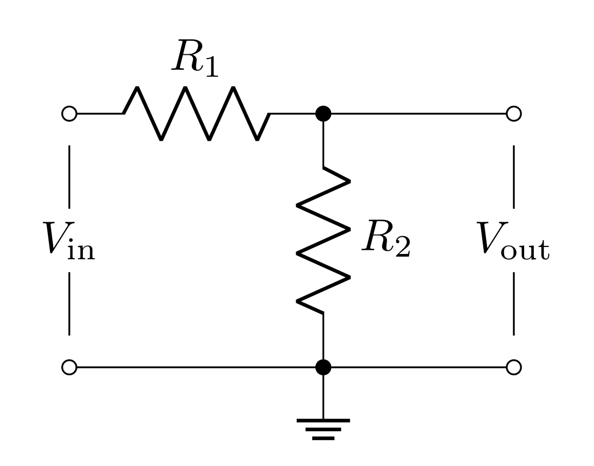
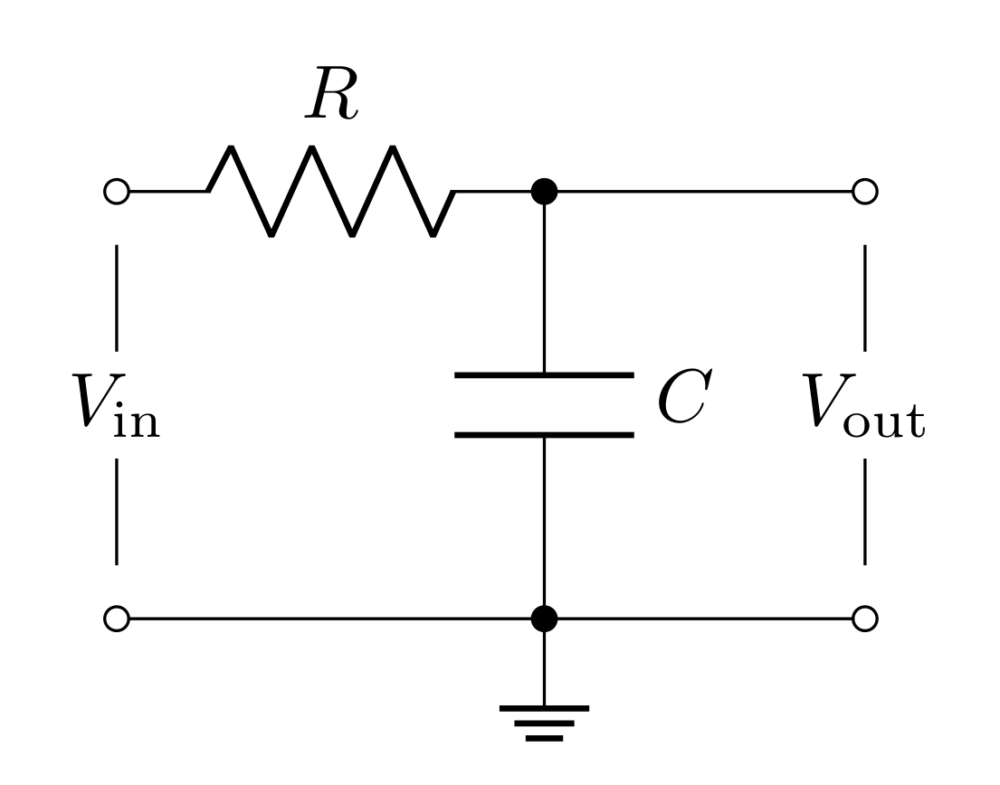
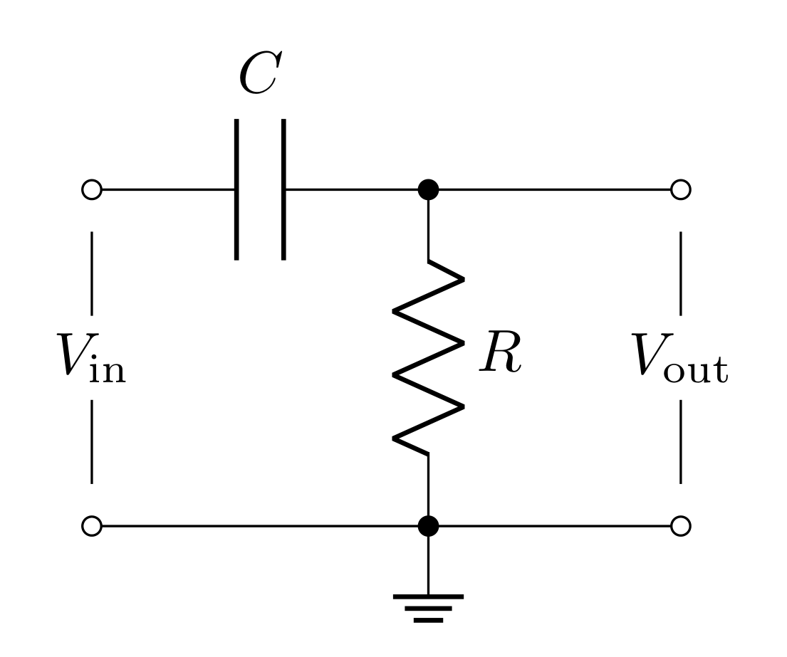
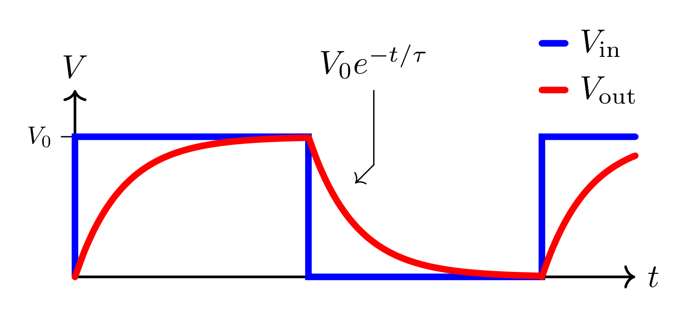

# Goals

In this lab, you will characterize the frequency dependence of two passive filters. You will model, simulate, and test passive filter circuits and learn how to make more accurate high-frequency measurements with the oscilloscope.

You will learn to use new equipment and devices

-   Oscilloscope probe

-   Capacitors 

You will learn to model the frequency dependence and effects on phase of passive filters

Filters are incredibly important components in physical experiments. Often times your experimental goal is to detect an electronic signal hidden in a background of noise and unwated signals. Filters are a tool that remove (cut) signals and noise of certain frequencies, and preserve (pass) signals of other frequencies. For example, the signal of interest may be at a particular frequency, as in an NMR (nuclear magnetic resonance) experiment, or it may be an electrical pulse from a single photon detector. The background generally contains thermal noise from the transducer and amplifier, pick up of $60\text{ Hz}$ wall power, transients from machinery, radiation from radio, TV stations, light sources, cell phones, and so forth. The purpose of filtering is to enhance the signal of interest by recognizing its characteristic time dependence and to reduce the unwanted background to the lowest possible level. A radio does this when you tune to a particular station, using a resonant circuit to only allow a narrow band of frequency through (the center frequency of this band is *the station*). The signal you want may be less than $10^{-6}$ of the total radiation power at your antenna, yet you get a high-quality signal from the selected station due to the filtering. Many experiments require specific filters designed so that the signal from the phenomenon of interest lies in the pass-band of the filter, while the attenuation bands are chosen to suppress the background and noise.

There are 4 basic kinds of filters:

- Low-pass filter (passes low frequencies, cuts high frequencies)
    
- High-pass filter (passes high frequencies, cuts low frequencies)
    
- Bandpass filter (passes frequencies centered around a center frequency and cuts both high and low frequencies)
    
- Notch filter (passes low and high frequencies and cuts frequencies centered arounda center frequency)

In this lab you will model, simulate, and test the first *two* kinds of circuits.

# Definitions

**Scope probe** - a test probe used to increase the resistive impedance and lower the capacitive impedance compared to a simple coax cable probe.

**Transfer function** - An output over an input (in the context of circuits: a voltage output over a voltage input). In this lab, we will explore situations where this is a complex valued function which will lead to phase lags/shifts.

**Gain** - the magnitude of the transfer function is the voltage gain $G=|T|=|V_\text{out}/V_\text{in}|$. The power gain is the square of this: $|V_\text{out}/V_\text{in}|^2$. If the gain is not specified, you can assume it is the voltage (or amplitude) gain. Often when the gain is less than one, it is referred to as *attenuation*.

**Decibel (dB)** - a measure of the power transmitted by converting the power gain (or voltage gain) to a logarithmic scale. The difference in power between output and input in decibels (dB) is $10\log_{10}|V_\text{out}/V_\text{in}|^2 =20\log_{10}|V_\text{out}/V_\text{in}|$. One common reference point is where the ratio of output to input power is 1/2, which is $10\log_{10}(0.5) = -3\text{ dB}$. This corresponds to $|V_\text{out}/V_\text{in}| = 1/\sqrt 2 = 0.707 = 70.7\%$ (Remember, this happens to be the same number from RMS).

**Pass band** - the range of frequencies that can pass through a filter without being attenuated.

**Attenuation band** - the range of frequencies where the filter attenuates the signal.

**Half power point** or **cutoff frequency** or **corner frequency** or **3 dB frequency, $f_0$** - frequency separating the pass and attenuation bands. It is the frequency at the half-power $(-3\text{ dB})$ point, where the *power* transmitted is half the maximum power transmitted. The output voltage *amplitude* at $f = f_c$ is $\frac{1}{\sqrt{2}} = 70.7\%$ of the maximum amplitude.

**Low-pass filter** - a filter that passes low frequency signals and attenuates (reduces the amplitude of) signals with frequencies higher than the cutoff frequency. Also known as an integrator.

**High-pass filter** - a filter that passes high frequency signals and attenuates (reduces the amplitude of) signals with frequencies lower than the cutoff frequency. Also known as a differentiator.

**Bandpass filter** - passes frequencies within a certain range and attenuates frequencies outside that range.

**Bandpass filter bandwidth** - the range of frequencies between the upper ($f_{c,+}$) and lower ($f_{c,-}$) half power (3dB) points: $\Delta f = f_{c,+} - f_{c,-}$.

# Voltage Divider Review

{#fig:vd width="10cm"}

You found last week that the voltage divider splits the total voltage $V_\text{in}$ across $R_1$ and $R_2$ so that the output voltage $V_\text{out}$ is the voltage just across the second resistor. Since

$$V_\text{in} = I (R_1+R_2)$$

$$V_\text{out} = IR_2$$

the transfer function is

$$T = \frac{V_\text{out}}{V_\text{in}} = \frac{R_2}{R_1+R_2}$$

In general, any two passive elements that obey Ohm's law (resistors, capacitors, inductors) in this configuration lead to this same equation. We can generalize it in the following way

$$T = \frac{Z_2}{Z_1+Z_2}$$

where $Z_1$ and $Z_2$ are the *impedances* of the two passive elements (in the case of a resistor, the impedance is the resistance). For capacitors and inductors, the impedance is complex valued; this will lead to complex valued transfer functions!

Last week we considered the affects of a voltage supply's output impedance on a circuit. This week we will utilize the function generator for each circuit we build. The function generator has a $50\ \Omega$ output impedance.

{#fig:nonideal-vd height="7.5cm"}

The amount of voltage across the circuit $V_\text{supply}^\text{(ext)}$ will be determined by the input impedance $R_i$ of the circuit.

$$V_\text{supply}^\text{(ext)} = V_\text{supply}^\text{(int)}\frac{R_2}{R_1+R_2}$$

where $V_\text{supply}^\text{(int)}$ is the voltage you program the function generator to deliver. *Note:* for $R_i \gg R_o$: $V_\text{supply}^\text{(ext)} = V_\text{supply}^\text{(int)}$

# Quick Complex Numbers Review

Capacitors and inductors have imaginary impedances. When these elements are used in voltage divider arrangements, this will lead to transfer functions that are complex valued (they have real and imaginary parts). When dealing with complex transfer functions, it is much simpler to represent sinusoidal functions as complex exponentials:

$$e^{j\omega t} = \cos{\omega t} + j \sin{\omega t}$$

*Note:* in the context of electrical engineering and circuits, we use $j=\sqrt{-1}$ to avoid confusion with $i$ potentially representing a current.

Therefore if $V_\text{in}(t)$ is a sine-wave (or cosine-wave) with amplitude $V_0$ and angular frequency $\omega$, we would write it as:

$$V_\text{in}(t) = V_0e^{j\omega t}$$

Applying any transfer function $T$ to this input will lead to the following output

$$V_\text{out}(t) = TV_\text{in}(t) = V_0 T e^{j\omega t}$$ {#eq:complex-transfer}

When $T$ is a complex function, it is far easier to multiply it and the complex exponential when $T$ is put into its "magnitude and phase" form

$$T = |T|e^{j\delta}$$

where $|T|$ is the magnitude of $T$ and $\delta$ is the phase of $T$ in the complex plane.

$$|T| = \sqrt{TT^*} = \sqrt{\text{Re}[T]^2 + \text{Im}[T]^2}$$

$$\tan\delta = \frac{\text{Im}[T]}{\text{Re}[T]}$$

In this form, Equation @eq:complex-transfer becomes

$$V_\text{out} = |T|V_0e^{j\omega t + \delta}$$

So the magnitude of $T$ scales the amplitude of $V_\text{out}$ and the phase of $T$ creates an offset in time (or time delay).

If you need more review on complex numbers, [check out this resource](/PHYS-3330/resources/complex).

# Prelab

## Capacitors

A capacitor is an object that stores energy in the form of electric fields (between two metal objects) when a voltage difference is applied. The capacitance is defined as the ratio of the induced charge (on each of the two metal objects) to the voltage applied; i.e.

$$Q = C\ \Delta V$$

Capacitance is purely determined by the geometry of the pieces of metal that are separated. You may remember that for parallel plates of area $A$ separated by distance $d$, the capacitance is

$$C = \varepsilon_r\varepsilon_0 \frac{A}{d}$$

where $\varepsilon_r$ is the relative dielectric constant of whatever material is between the plates.

With regards to Ohm's law $(\Delta V=IZ)$, the impedance of a capacitor is

$$Z_C = \frac{1}{j\omega C}$$

where $\omega$ is the angular frequency (in radians per second) and is related to the frequency (in Hertz) by

$$\omega = 2\pi f$$

Angular frequency $\omega$ is typically used when working out theory to avoid writing $2\pi$ over and over again. However, experimentally, you will be working with cycle frequency $f$ (inverse period) because it is easier to measure.

### Prelab Question {#sec:1.1}

Evaluate the impedance of the capacitor at the two frequency extremes ($\omega = 0$ and $\omega\rightarrow\infty$). Describe what the capacitor acts like at these extremes (think in terms of open or short circuits).

## Inductors

The inductor is an element that stores energy in the form of magnetic fields when current is passed through them. Any loop(s) of current has an associated magnetic field that it self generates, so all circuits have some amount of inductance (which is often ignored). When the current changes, naturally the strength of the self-induced magnetic field through the loop changes. Faraday's law states that this will create a back EMF (electromagnetic force in units of volts). This can be written as a voltage across the inductor

$$\Delta V = L\frac{dI}{dt}$$

where $L$ is the inductance of the inductor. Inductors are made by carefully wrapping long wires into compact coils or solenoids. The inductance of a solenoid can be calculated from its geometry

$$L = \mu_r\mu_0\frac{N^2 A}{\ell}$$

where $\mu_r$ is the relative magnetic permeability of any material the coil is wrapped around and $N$ is the number of turns, $A$ is the cross-sectional area of a loop, $\ell$ is the length of the solenoid.

The impedance of an inductor is

$$Z_L = j\omega L$$

### Prelab Question {#sec:3.1}

Evaluate the impedances of the inductor at the two frequency extremes ($\omega = 0$ and $\omega\rightarrow\infty$). Describe what the inductor acts like at these extremes (think in terms of open or short circuits). Compare these results to what you found for the capacitor.

## Low-Pass Filters

{#fig:lowpass width="10cm"}

The filter shown in Figure @fig:lowpass is like the voltage divider, except with $R_2$ replaced with a capacitor. Applying the impedance of these elements to the voltage divider equation yields

$$T_\text{low-pass}(\omega)=\frac{V_\text{out}}{V_\text{in}} = \frac{Z_C}{R+Z_C}= \frac{(j\omega C)^{-1}}{(R+(j\omega C)^{-1})} = \frac{1}{1+j\omega RC}$$

Note that the transfer function depends on frequency (and is complex)! This means that this circuit will affect different frequencies differently (this is how it acts as a filter)

For this filter's transfer function, you will find the magnitude in the following questions. The phase $\delta$ can be found to be

$$\delta = -\tan^{-1}(\omega RC)$$

The input impedance of the low-pass filter is

$$R_i = R + Z_C = R + \frac{1}{j\omega C}=R\sqrt{1+\frac{1}{\omega^2 R^2C^2}}\ \ e^{\tan^{-1}\frac{1}{\omega R C}}$$

Notice that this is frequency dependent as well. The lowest possible input impedance will be when the frequency is really high and will diverge to infinity at DC (0 frequency).

### Prelab Question {#sec:4.1}

Find $T_\text{low-pass}$ when $\omega=0$ and when $\omega\rightarrow\infty$. Based on these calculations, describe what frequencies the low-pass filter cuts and passes. Is this consistent with its name?

### Prelab Question {#sec:4.2}

Find $|T_\text{low-pass}|$ (the magnitude of the complex number) and express it with respect to $f$ instead of $\omega$. *Hint:* Use the $|T|=\sqrt{TT^*}$ relation.

### Prelab Question {#sec:4.3}

Write a Python function called `T_low_pass` that, for a low-pass filter

- Takes in $R$, $C$, and $f$ as inputs.
- And returns that $|T|$ and $\delta$ (in degrees)

To use complex numbers in python, you can use the `nj` notation, where `n` is a number. For example, 
here is how you would construct a complex number and then find the magnitude (or argument) and
the phase. 

```

z = 3 + 4j

print(z)

mag = np.abs(z)
phase = np.angle(z)

print(f"magnitude: {mag}    phase: {phase}")

```
## High-Pass Filters

{#fig:highpass width="10cm"}

The filter shown in Figure @fig:highpass swaps the positions of the capacitor and resistor compared to the previous filter. We can swap $Z_C$ and $R$ in the voltage divider equation to get

$$T_\text{high-pass} = \frac{R}{(j\omega C)^{-1}+R} = \frac{j\omega RC}{1 + j\omega RC}$$

For this filter's transfer function, you will find the magnitude in the following questions. The phase $\delta$ can be found to be

$$\delta = \tan^{-1}\bigg(\frac{1}{\omega RC}\bigg)$$

The input impedance of the high-pass filter is

$$R_i = Z_C+R = \frac{1}{j\omega C}+R=R\sqrt{1+\frac{1}{\omega^2 R^2C^2}}\ \ e^{\tan^{-1}\frac{1}{\omega R C}}$$

*Note:* this is the same as the low-pass filter.

### Prelab Question {#sec:5.1}

Find $T_\text{high-pass}$ for $\omega=0$ and $\omega\rightarrow\infty$ to confirm this is a high-pass filter; i.e. does this cut low frequencies and pass high frequenceis?

### Prelab Question {#sec:5.2}

Calculate $|T_\text{high-pass}|$ and express it in terms of $f$ instead of $\omega$.

### Prelab Question {#sec:5.3}

Write a Python function called `T_high_pass` that, for a high-pass filter

- Takes in $R$, $C$, and $f$ as inputs.
- And returns that $|T|$ and $\delta$ (in degrees)


## Cutoff Frequency

Defining what frequency a filter starts to *cut* (as opposed to pass) is somewhat arbitrary. There is a smooth transition between where $T=1$ and $T=0$; however, the convention is to define the cutoff frequency $f_c$ as **the frequency when the power has dropped half from its full power**.

***DEFINITION:*** **Half power point** or **cutoff frequency** or **corner frequency** or **3 dB frequency, $f_c$** - frequency separating the pass and attenuation bands. It is the frequency at the half-power $(-3\text{ dB})$ point, where the *power* transmitted is half of the maximum possible power.

The relationship between voltage and power is

$$P = \frac{V^2}{Z}$$

Therefore, when the power is cut in half, the voltage is cut by a factor of $\frac{1}{\sqrt{2}}$

$$\frac{V_\text{out}}{V_\text{in}} = \sqrt{\frac{P_\text{out}}{P_\text{in}}} = \frac{1}{\sqrt{2}}\approx 0.707$$

So the cutoff frequency $f_c$ is the frequency at which $T\approx 0.707$

For both the low-pass and high-pass filter, you can take the magnitude of the transfer function you calculated and set it equal to $\frac{1}{\sqrt{2}}$. This will lead to the same result for both kinds of filters:

$$f_c = \frac{1}{2\pi RC}$${#eq:cutoff-freq}

### Prelab Question {#sec:6.1}

A Decibel is a "relative unit of measurement." In electronics, decibels are meant to describe how the power changes. You can calculate decibels with the following equation:

$$10\log_{10} \bigg[\frac{P_\text{out}}{P_\text{in}}\bigg]\text{ dB}$$

When decibels are negative, it means the power is attenuated (gets reduced), and, when positive, it means there is power gain.

Calculate the decibels for when the power is cut in half. Does it make sense that the half power point is also called the 3 dB point?

### Prelab Question {#sec:6.2}

Plug the cutoff frequency from Equation @eq:cutoff-freq into the equations you found for $|T_\text{low-pass}|$ and $|T_\text{high-pass}|$ to confirm this is the half power point.

### Prelab Question {#sec:6.3}

The cutoff frequency of these filters is related to the RC-time (resistance times capacitance has units of time) of the circuit: $f_c = 1/2\pi RC = 1/(2\pi RC)=\frac{1}{2\pi RC}$.

*Note:* we've explicitly written $f_c$ in this way as we've seen some students see the expression $1/2\pi RC$ and read this as $\frac{1}{2}\pi RC$ or $\frac{\pi RC}{2}$. This is incorrect, and we wanted to use this opportunity to clear up this misconception. The expression from $1/2\pi RC$ is common in the [academic literature](https://en.wikipedia.org/wiki/Order_of_operations#Mixed_division_and_multiplication), so hopefully this aside provides you value in the future.


This means that the cutoff frequency can be determined by measuring the RC-time constant related to the charging and discharging of the capacitor. For the low-pass filter, this can be done by applying a voltage long enough to fully charge the capacitor to the input voltage (i.e. when $V_\text{in}=V_\text{out}$), and then turning off the voltage to allow the capacitor to discharge. This discharge will be an exponential decay over time

$$V_\text{out}(t) = V_0e^{-t/\tau}$$

where $\tau$ is the time constant of the decay $(\tau=RC)$ and $t$ is the time since turning off the input voltage.

{#fig:rc-time width="14cm"}

Evaluate $V_\text{out}(\tau)$; i.e. the voltage across the capacitor when $t=\tau$ (*hint:* express this in terms of the natural number $e$). Experimentally, you can measure the time it takes for the capacitor to discharge to this voltage. When the voltage is $V_\text{out}(\tau)$, then the time it takes to discharge to this voltage will be $\tau=RC$; therefore, measure the time it takes to reach this voltage is a measure of $RC$ which you can use to calculate $f_c$.

## Bode plots

Bode plots are log-log plots of a property vs frequency. You will find all sorts of Bode plots in datasheets for all kinds of devices, and they are also a useful way of visualizing how a filter acts.

In Python, log-log plots can be done in the following way

```

import numpy as np
import matplotlib.pylab as plt

def function_to_plot(frequency):
    # code to compute function
    return result

# create an array frequencies, evenly spaced on a log scale
# this will range from 10^0 to 10^8
frequency = np.logspace(0, 8, 1000)

fig, ax = plt.subplots(1, 1, figsize=(4, 3))
ax.plot(x, y)
ax.set_xscale('log')
ax.set_yscale('log')

```

which gives you control over which axes are on what scale. For the plots that you will be making, 
  try turning off and on the log-scale to see what the figure looks like. Sketch
  these figures in your lab book.


### Prelab question {#sec:9.1}

Create a Bode plot for $|T|$ and $\delta$ as a function of $f$ (from $100\text{ Hz}$ to $1\text{ MHz}$) for both the **low-pass filter** and the **high-pass** filter.
- with $R=10\text{ k}\Omega$ and $C=1\text{ nF}$.

- Both of the filters should be on the same plots. See the template code below.


```

import matplotlib.pylab as plt
import matplotlib
import numpy as np

matplotlib.rcParams['mathtext.fontset'] = 'cm'
matplotlib.rcParams['font.family'] = 'STIXGeneral'

matplotlib.rcParams['mathtext.fontset'] = 'cm'
matplotlib.rcParams['font.family'] = 'STIXGeneral'

"""set your component (resistor and capacitor) values here"""

frequency = np.logspace(2, 6, 100)

"""Calculate gain and phase shift"""
gain_lp, phase_shift_lp = T_low_pass(r, c, frequency)
gain_hp, phase_shift_hp = T_high_pass(r, c, frequency)

fig, axes = plt.subplots(1, 2, figsize=(12, 5))

ax1 = axes[0]
ax2 = axes[1]

# Plot the gains (magnitude of transfer function)
ax1.plot(frequency, gain_lp, color='b', label="low-pass")
ax1.plot(frequency, gain_hp, color='k', label="high-pass")

ax1.set_xlabel('Frequency (Hz)')
ax1.set_ylabel('gain')
ax1.set_xscale('log')
ax1.set_yscale('log')

ax1.set_xlim(1e2, 1e6)

ax1.set_title('Gain')
ax1.tick_params(axis='both', which='both', direction='in', top=True, right=True)
ax1.grid(axis='both', linestyle='dotted')

ax1.legend(loc="lower left", bbox_to_anchor=(0.11, 0.15))


# Plot the phase shift (angle of transfer function)
ax2.plot(frequency, phase_shift_lp, color='b', linestyle='dashed', label="low-pass")
ax2.plot(frequency, phase_shift_hp, color='k', linestyle='dashed', label="high-pass")

ax2.set_ylabel('phase shift $(\\degree)$')
ax2.grid(axis='both', linestyle='dotted')
ax2.set_xscale('log')
ax1.set_xlim(1e2, 1e6)

ax1.set_title('Phase shift')
ax2.tick_params(axis='both', which='both', direction='in', top=True, right=True)

ax2.legend(loc="lower left", bbox_to_anchor=(0.11, 0.15))

fig.tight_layout()

;
```

Note that we included "scatter" point on your plot where the 3 dB frequency is. This will be a point where $f=f_c$ and $|T|=1/\sqrt{2}$

`ax1.scatter(1 / (2 * np.pi * r * c), 1 / np.sqrt(2), color='r', s=100)`

### Prelab question {#sec:9.4}

Create both circuits above in LTspice (the low-pass, high-pass and bandpass filters with values you used for your plots). For testing the frequency response of filters, an AC Analysis is performed.

- Create all three circuits with unique voltage sources for each circuit.

- Set the values for the resistors, capacitors, and inductor.

- Right click the voltage source and select "Advanced".

- Under "Small signal AC analysis(.AC)" set:

    - AC amplitude: 1

    - AC phase: 0

- The above configuration is specific for "AC Analysis" simulations.

- In the "Configure Analysis" prompt, select the "AC Analysis" tab and set

    - Type of sweep: decade

    - Number of points per decade: 10

    - Start frequency: 100

    - Stop frequency: 1000k (this is 1 MHz)

- Run the simulation and measure $V_\text{out}$ for each circuit.

- Screen shot each circuit and simulation result.

The Bode plots you made in Python are gain vs frequency and the simulated Bode plots are dB vs frequency. However, they should show the same general behavior. Compare your Bode plots to the simulation, and if the shapes are completely different it is likely that you made a mistake calculating $|T|$ or implementing $|T|$ as a Python function. Revise your plots if necessary.


### Prelab question {#sec:10.1}
Please review the lab activities so that you're better prepared when you arrive to your lab section.

# Lab Activities

## Measure components, Predict, Build

***In this section you will use the function generator to power your circuit.
You will use the breadboard on the protoboard to construct your circuit but at
no time will you use the power on the protoboard to power your circuit.***

## Preparation

1. Start by drawing the following circuits in your lab manual
    - the low-pass filter,
    - the high-pass filter,

2. Gather the components to be able to build all four of these circuits (grab enough components to have them all built simultaneously) ***Do not build them yet***
    - low-pass filter: $R = 10\text{ k}\Omega$, $C = 1\text{ nF}$,
    - high-pass filter: $R = 10\text{ k}\Omega$, $C = 1\text{ nF}$,

## Building the Circuits

1. Build the low-pass filter on your breadboard. 

2. Set the function generator to a 10 Hz sine wave and use it to power the filter. 

3. Use the oscilloscope to measure the signal at the $V_{\rm out}$ point, as shown in 
the circuit diagrams in the lab. Take note of the amplitude of the signal 
and set the function generator to output something on the order of a few volts.
Record the signal amplitude in your logbook.

4.  Change the frequency until the output is 0.707 of the input. Record the frequency and explain why this is the 3 dB point.

5. Now go back down to 100 Hz. Vary the frequency of the signal coming from the function generator and
go up in factors of 10x (100 Hz, 1000 Hz, 10 kHz, etc.) and each time, record the
amplitude of the signal record this in your logbook for later plotting. 

6. Describe the behavior you are seeing and write it in your logbook. 

7. Repeat this process for the high-pass filter.

8. Plot this data on a new plot, overlaid over the theoretical predictions you made earlier.
How well do they agree?

9. Repeat this process for the high-pass filter.

# Day 2 -----------------------------------


## Measure the RC-time of the low-pass filter

1.  Change the waveform to a square wave and give it an offset so that the wave oscillates between $0$ and $5\text{ V}$.

2.  Adjust the frequency to be slow enough such that the capacitor fully charges. How are you able to tell that the capacitor charges?

3.  Set the trigger mode to trigger on a falling edge so that the scope's display centers around when the voltage falls from $5\text{ V}$ to $0$. At this moment, the capacitor will start to discharge. Use the cursors to measure the RC-time based on the exponential decay of the capacitor discharging. *Hint:* you worked this out in the prelab.

4.  Calculate the 3 dB point from the RC-time and compare it to your previous measure of the 3 dB point.

