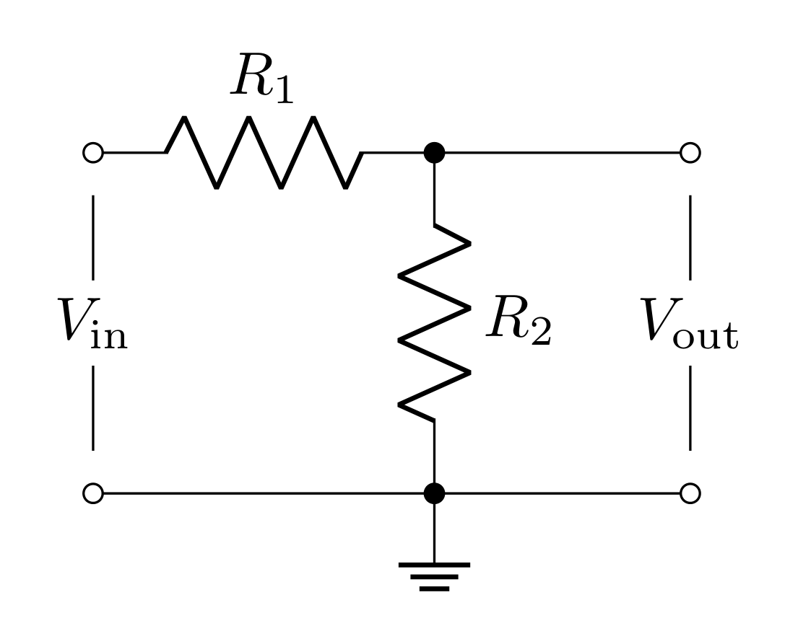
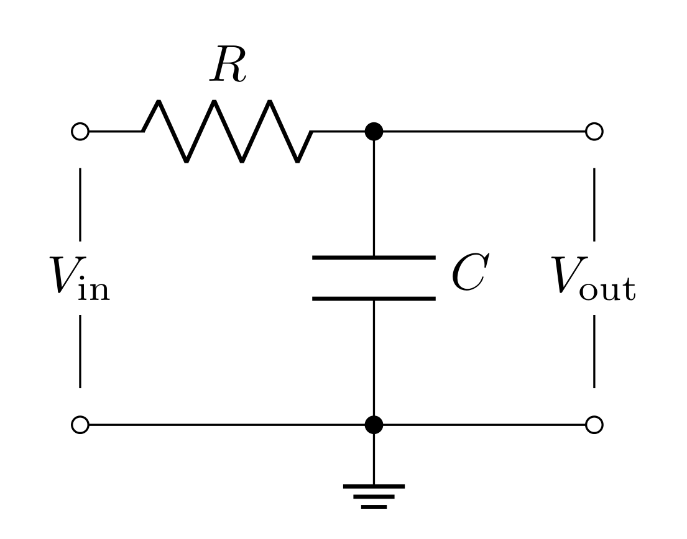
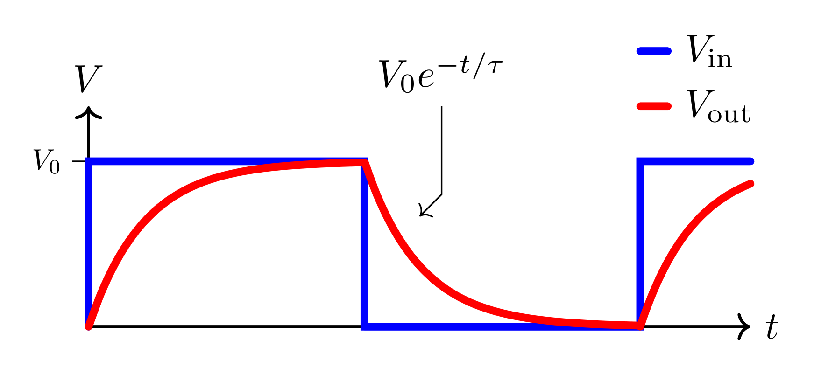
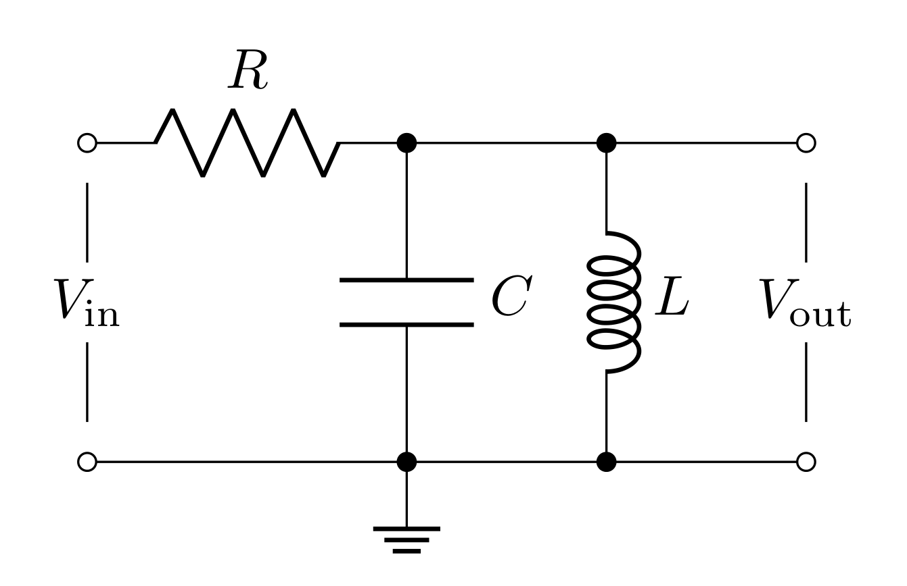

# Goals

In this lab, you will characterize the frequency dependence of three passive filters. You will model, simulate, and test passive filter circuits and learn how to make more accurate high-frequency measurements with the oscilloscope.

You will learn to use new equipment and devices

-   Oscilloscope probe

-   Capacitors and inductors

-   LCR meter

You will learn to model the frequency dependence and effects on phase of passive filters

You will also learn how to refine the oscilloscope measurement to reduce the effect of coax capacitance.

Filters are incredibly important components in physical experiments. Often times your experimental goal is to detect an electronic signal hidden in a background of noise and unwated signals. Filters are a tool that remove (cut) signals and noise of certain frequencies, and preserve (pass) signals of other frequencies. For example, the signal of interest may be at a particular frequncy, as in an NMR (nuclear magnetic resonance) experiment, or it may be an electrical pulse from a single photon detector. The background generally contains thermal noise from the transducer and amplifier, pick up of $60\text{ Hz}$ wall power, transients from machinery, radiation from radio, TV stations, light sources, cell phones, and so forth. The purpose of filtering is to enhance the signal of interest by recognizing its characteristic time dependence and to reduce the unwanted background to the lowest possible level. A radio does this when you tune to a particular station, using a resonant circuit to only allow a narrow band of frequency through (the center frequency of this band is *the station*). The signal you want may be less than $10^{-6}$ of the total radiation power at your antenna, yet you get a high-quality signal from the selected station due to the filtering. Many experiments require specific filters designed so that the signal from the phenomenon of interest lies in the pass-band of the filter, while the attenuation bands are chosen to suppress the background and noise.

There are 4 basic kinds of filters:

- Low-pass filter (passes low frequencies, cuts high frequencies)
    
- High-pass filter (passes high frequencies, cuts low frequencies)
    
- Bandpass filter (passes frequencies centered around a center frequency and cuts both high and low frequencies)
    
- Notch filter (passes low and high frequencies and cuts frequencies centered arounda center frequency)

In this lab you will model, simulate, and test the first three kinds of circuits, but you will gain the requisite skills to be able to implement a notch filter in your final project if necessary.

# Definitions

**Scope probe** - a test probe used to increase the resistive impedance and lower the capacitive impedance compared to a simple coax cable probe.

**Transfer function** - An output over an input (in the context of circuits: a voltage output over a voltage input). In this lab, we will explore situations where this is a complex valued function which will lead to phase lags/shifts.

**Gain** - the magnitude of the transfer function is the voltage gain $G=|T|=|V_\text{out}/V_\text{in}|$. The power gain is the square of this: $|V_\text{out}/V_\text{in}|^2$. If the gain is not specified, you can assume it is the voltage (or amplitude) gain. Often when the gain is less than one, it is referred to as *attenuation*.

**Decibel (dB)** - a measure of the power transmitted by converting the power gain (or voltage gain) to a logarithmic scale. The difference in power between output and input in decibels (dB) is $10\log_{10}|V_\text{out}/V_\text{in}|^2 =20\log_{10}|V_\text{out}/V_\text{in}|$. One common reference point is where the ratio of output to input power is 1/2, which is $10\log_{10}(0.5) = -3\text{ dB}$. This corresponds to $|V_\text{out}/V_\text{in}| = 1/\sqrt 2 = 0.707 = 70.7\%$ (Remember, this happens to be the same number from RMS).

**Pass band** - the range of frequencies that can pass through a filter without being attenuated.

**Attenuation band** - the range of frequencies where the filter attenuates the signal.

**Half power point** or **cutoff frequency** or **corner frequency** or **3 dB frequency, $f_0$** - frequency separating the pass and attenuation bands. It is the frequency at the half-power $(-3\text{ dB})$ point, where the *power* transmitted is half the maximum power transmitted. The output voltage *amplitude* at $f = f_c$ is $\frac{1}{\sqrt{2}} = 70.7\%$ of the maximum amplitude.

**Low-pass filter** - a filter that passes low frequency signals and attenuates (reduces the amplitude of) signals with frequencies higher than the cutoff frequency. Also known as an integrator.

**High-pass filter** - a filter that passes high frequency signals and attenuates (reduces the amplitude of) signals with frequencies lower than the cutoff frequency. Also known as a differentiator.

**Bandpass filter** - passes frequencies within a certain range and attenuates frequencies outside that range.

**Bandpass filter bandwidth** - the range of frequencies between the upper ($f_{c,+}$) and lower ($f_{c,-}$) half power (3dB) points: $\Delta f = f_{c,+} - f_{c,-}$.

# Voltage Divider Review

{#fig:vd width="10cm"}

You found last week that the voltage divider splits the total voltage $V_\text{in}$ across $R_1$ and $R_2$ so that the output voltage $V_\text{out}$ is the voltage just across the second resistor. Since

$$V_\text{in} = I (R_1+R_2)$$

$$V_\text{out} = IR_2$$

the transfer function is

$$T = \frac{V_\text{out}}{V_\text{in}} = \frac{R_2}{R_1+R_2}$$

In general, any two passive elements that obey Ohm's law (resistors, capacitors, inductors) in this configuration lead to this same equation. We can generalize it in the following way

$$T = \frac{Z_2}{Z_1+Z_2}$$

where $Z_1$ and $Z_2$ are the *impedances* of the two passive elements (in the case of a resistor, the impedance is the resistance). For capacitors and inductors, the impedance is complex valued; this will lead to complex valued transfer functions!

Last week we considered the affects of a voltage supply's output impedance on a circuit. This week we will utilize the function generator for each circuit we build. The function generator has a $50\ \Omega$ output impedance.

{#fig:nonideal-vd height="7.5cm"}

The amount of voltage across the circuit $V_\text{supply}^\text{(ext)}$ will be determined by the input impedance $R_i$ of the circuit.

$$V_\text{supply}^\text{(ext)} = V_\text{supply}^\text{(int)}\frac{R_2}{R_1+R_2}$$

where $V_\text{supply}^\text{(int)}$ is the voltage you program the function generator to deliver. *Note:* for $R_i \gg R_o$: $V_\text{supply}^\text{(ext)} = V_\text{supply}^\text{(int)}$

# Quick Complex Numbers Review

Capacitors and inductors have imaginary impedances. When these elements are used in voltage divider arrangements, this will lead to transfer functions that are complex valued (they have real and imaginary parts). When dealing with complex transfer functions, it is much simpler to represent sinusoidal functions as complex exponentials:

$$e^{j\omega t} = \cos{\omega t} + j \sin{\omega t}$$

*Note:* in the context of electrical engineering and circuits, we use $j=\sqrt{-1}$ to avoid confusion with $i$ potentially representing a current.

Therefore if $V_\text{in}(t)$ is a sine-wave (or cosine-wave) with amplitude $V_0$ and angular frequency $\omega$, we would write it as:

$$V_\text{in}(t) = V_0e^{j\omega t}$$

Applying any transfer function $T$ to this input will lead to the following output

$$V_\text{out}(t) = TV_\text{in}(t) = V_0 T e^{j\omega t}$$ {#eq:complex-transfer}

When $T$ is a complex function, it is far easier to multiply it and the complex exponential when $T$ is put into its "magnitude and phase" form

$$T = |T|e^{j\delta}$$

where $|T|$ is the magnitude of $T$ and $\delta$ is the phase of $T$ in the complex plane.

$$|T| = \sqrt{TT^*} = \sqrt{\text{Re}[T]^2 + \text{Im}[T]^2}$$

$$\tan\delta = \frac{\text{Im}[T]}{\text{Re}[T]}$$

In this form, Equation @eq:complex-transfer becomes

$$V_\text{out} = |T|V_0e^{j\omega t + \delta}$$

So the magnitude of $T$ scales the amplitude of $V_\text{out}$ and the phase of $T$ creates an offset in time (or time delay).

If you need more review on complex numbers, [check out this resource](/PHYS-3330/resources/complex).

# Prelab

## Capacitors

A capacitor is an object that stores energy in the form of electric fields (between two metal objects) when a voltage difference is applied. The capacitance is defined as the ratio of the induced charge (on each of the two metal objects) to the voltage applied; i.e.

$$Q = C\ \Delta V$$

Capacitance is purely determined by the geometry of the pieces of metal that are separated. You may remember that for parallel plates of area $A$ separated by distance $d$, the capacitance is

$$C = \varepsilon_r\varepsilon_0 \frac{A}{d}$$

where $\varepsilon_r$ is the relative dielectric constant of whatever material is between the plates.

With regards to Ohm's law $(\Delta V=IZ)$, the impedance of a capacitor is

$$Z_C = \frac{1}{j\omega C}$$

where $\omega$ is the angular frequency (in radians per second) and is related to the frequency (in Hertz) by

$$\omega = 2\pi f$$

Angular frequency $\omega$ is typically used when working out theory to avoid writing $2\pi$ over and over again. However, experimentally, you will be working with cycle frequency $f$ (inverse period) because it is easier to measure.

### Prelab Question {#sec:1.1}

Evaluate the impedance of the capacitor at the two frequency extremes ($\omega = 0$ and $\omega\rightarrow\infty$). Describe what the capacitor acts like at these extremes (think in terms of open or short circuits).

## Capacitance of cables

Cables carry current to a load and then back to the source (creating a circuit). The two most common cable constructions are a pair of wires (sometimes twisted into a "twisted pair") or a coaxial cable. Either way, when used, there will be a voltage difference between the conductor carrying current to the load and the conductor carrying current back to the source; therefore, the cable has capacitance!

{#fig:cap-geo width="5cm"}

For a coax cable, we can use Gauss's Law to determine the electric field between the conductors. Drawing a Gaussian cylinder co-axial to the cable and between the conductors $(a<r<b)$ will enclose the charge on the inner conductor. However, if you take the radius of the Gaussian cylinder to be greater than the whole cable $(r>b)$, then the charge on the outer conductor will cancel the charge on the inner conductor, so there is **no** field outside the cable (one of the advantages of this choice of cable geometry). If our Gaussian cylinder has radius $r$ and length $\ell$, then the surface area of the wall is $2\pi r\ell$. The charge enclosed then would be $2\pi a \ell\sigma$ (where $\sigma$ is the surface charge density). Gauss's law says

$$\int\mathbf{E}\cdot d\mathbf{A} = \frac{\rho_\text{enclosed}}{\varepsilon_r\varepsilon_0}$$

$$2\pi E r\ell = \frac{2\pi a\ell\sigma}{\varepsilon_r\varepsilon_0}$$

$$\mathbf{E} = \frac{\sigma}{\varepsilon_r \varepsilon_0}\frac{a}{r}\hat{\mathbf{r}}$$

We can relate this to the voltage by integrating from $r=b$ (where the voltage is held at ground) to $r=a$

$$\Delta V = -\int_b^a \mathbf{E}\cdot d\mathbf{r}' = -\frac{\sigma a}{\varepsilon_r \varepsilon_0} \int_b^a\frac{dr}{r} = \frac{\sigma a}{\varepsilon_r \varepsilon_0}\ln\bigg(\frac{b}{a}\bigg)$$

The capacitance can then be found by dividing the charge $Q=2\pi a \ell\sigma$ by this voltage

$$C = \frac{Q}{V} = \varepsilon_r\varepsilon_0\frac{2\pi a \ell\sigma}{\sigma a\ln{(b/a)}} = \varepsilon_r\varepsilon_0\frac{2\pi \ell}{\ln{(b/a)}}$$

Often cables are labeled by their capacitance per length

$$\frac{C}{\ell} = \varepsilon_r\varepsilon_0\frac{2\pi}{\ln{(b/a)}}$$

### Prelab question {#sec:2.1}

A BNC cable has an inner conductor with a diameter of roughly 1.1 mm and a dielectric with a diameter of roughly 4.5 mm. The dielectric, Teflon, has a relative dielectric constant of roughly 2. Estimate the capacitance per unit length of this cable (report it in pF/m). *Note:* the electric permitivity of free space in picofarad per meter is $8.85\text{ pF/m}$.

## Inductors

The inductor is an element that stores energy in the form of magnetic fields when current is passed through them. Any loop(s) of current has an associated magnetic field that it self generates, so all circuits have some amount of inductance (which is often ignored). When the current changes, naturally the strength of the self-induced magnetic field through the loop changes. Faraday's law states that this will create a back EMF (electromagnetic force in units of volts). This can be written as a voltage across the inductor

$$\Delta V = L\frac{dI}{dt}$$

where $L$ is the inductance of the inductor. Inductors are made by carefully wrapping long wires into compact coils or solenoids. The inductance of a solenoid can be calculated from its geometry

$$L = \mu_r\mu_0\frac{N^2 A}{\ell}$$

where $\mu_r$ is the relative magnetic permeability of any material the coil is wrapped around and $N$ is the number of turns, $A$ is the cross-sectional area of a loop, $\ell$ is the length of the solenoid.

The impedance of an inductor is

$$Z_L = j\omega L$$

### Prelab Question {#sec:3.1}

Evaluate the impedances of the inductor at the two frequency extremes ($\omega = 0$ and $\omega\rightarrow\infty$). Describe what the inductor acts like at these extremes (think in terms of open or short circuits). Compare these results to what you found for the capacitor.

## Low-Pass Filters

{#fig:lowpass width="10cm"}

The filter shown in Figure @fig:lowpass is like the voltage divider, except with $R_2$ replaced with a capacitor. Applying the impedance of these elements to the voltage divider equation yields

$$T_\text{low-pass}(\omega)=\frac{V_\text{out}}{V_\text{in}} = \frac{Z_C}{R+Z_C}= \frac{(j\omega C)^{-1}}{(R+(j\omega C)^{-1})} = \frac{1}{1+j\omega RC}$$

Note that the transfer function depends on frequency (and is complex)! This means that this circuit will affect different frequencies differently (this is how it acts as a filter)

For this filter's transfer function, you will find the magnitude in the following questions. The phase $\delta$ can be found to be

$$\delta = -\tan^{-1}(\omega RC)$$

The input impedance of the low-pass filter is

$$R_i = R + Z_C = R + \frac{1}{j\omega C}=R\sqrt{1+\frac{1}{\omega^2 R^2C^2}}\ \ e^{\tan^{-1}\frac{1}{\omega R C}}$$

Notice that this is frequency dependent as well. The lowest possible input impedance will be when the frequency is really high and will diverge to infinity at DC (0 frequency).

### Prelab Question {#sec:4.1}

Find $T_\text{low-pass}$ when $\omega=0$ and when $\omega\rightarrow\infty$. Based on these calculations, describe what frequencies the low-pass filter cuts and passes. Is this consistent with its name?

### Prelab Question {#sec:4.2}

Find $|T_\text{low-pass}|$ (the magnitude of the complex number) and express it with respect to $f$ instead of $\omega$. *Hint:* Use the $|T|=\sqrt{TT^*}$ relation.

### Prelab Question {#sec:4.3}

Write two Python functions:

- one that calculates $|T|$ with $R$, $C$, and $f$ as inputs.

- one that calculates $\delta$ with the same inputs (convert radians to degrees).

Alternatively, you can write a single function that spits out both results, but this is up to you.

## High-Pass Filters

{#fig:highpass width="10cm"}

The filter shown in Figure @fig:highpass swaps the positions of the capacitor and resistor compared to the previous filter. We can swap $Z_C$ and $R$ in the voltage divider equation to get

$$T_\text{high-pass} = \frac{R}{(j\omega C)^{-1}+R} = \frac{j\omega RC}{1 + j\omega RC}$$

For this filter's transfer function, you will find the magnitude in the following questions. The phase $\delta$ can be found to be

$$\delta = \tan^{-1}\bigg(\frac{1}{\omega RC}\bigg)$$

The input impedance of the high-pass filter is

$$R_i = Z_C+R = \frac{1}{j\omega C}+R=R\sqrt{1+\frac{1}{\omega^2 R^2C^2}}\ \ e^{\tan^{-1}\frac{1}{\omega R C}}$$

*Note:* this is the same as the low-pass filter.

### Prelab Question {#sec:5.1}

Find $T_\text{high-pass}$ for $\omega=0$ and $\omega\rightarrow\infty$ to confirm this is a high-pass filter; i.e. does this cut low frequencies and pass high frequenceis?

### Prelab Question {#sec:5.2}

Calculate $|T_\text{high-pass}|$ and express it in terms of $f$ instead of $\omega$.

### Prelab Question {#sec:5.3}

Write two Python functions:

- one that calculates $|T|$ with $R$, $C$, and $f$ as inputs.

- one that calculates $\delta$ with the same inputs (convert from radians to degrees).

Alternatively, you can write a single function that spits out both results, but this is up to you.

## Cutoff Frequency

Defining what frequency a filter starts to *cut* (as opposed to pass) is somewhat arbitrary. There is a smooth transition between where $T=1$ and $T=0$; however, the convention is to define the cutoff frequency $f_c$ as **the frequency when the power has dropped half from its full power**.

***DEFINITION:*** **Half power point** or **cutoff frequency** or **corner frequency** or **3 dB frequency, $f_c$** - frequency separating the pass and attenuation bands. It is the frequency at the half-power $(-3\text{ dB})$ point, where the *power* transmitted is half of the maximum possible power.

The relationship between voltage and power is

$$P = \frac{V^2}{Z}$$

Therefore, when the power is cut in half, the voltage is cut by a factor of $\frac{1}{\sqrt{2}}$

$$\frac{V_\text{out}}{V_\text{in}} = \sqrt{\frac{P_\text{out}}{P_\text{in}}} = \frac{1}{\sqrt{2}}\approx 0.707$$

So the cutoff frequency $f_c$ is the frequency at which $T\approx 0.707$

For both the low-pass and high-pass filter, you can take the magnitude of the transfer function you calculated and set it equal to $\frac{1}{\sqrt{2}}$. This will lead to the same result for both kinds of filters:

$$f_c = \frac{1}{2\pi RC}$${#eq:cutoff-freq}

### Prelab Question {#sec:6.1}

A Decibel is a "relative unit of measurement." In electronics, decibels are meant to describe how the power changes. You can calculate decibels with the following equation:

$$10\log_{10} \bigg[\frac{P_\text{out}}{P_\text{in}}\bigg]\text{ dB}$$

When decibels are negative, it means the power is attenuated (gets reduced), and, when positive, it means there is power gain.

Calculate the decibels for when the power is cut in half. Does it make sense that the half power point is also called the 3 dB point?

### Prelab Question {#sec:6.2}

Plug the cutoff frequency from Equation @eq:cutoff-freq into the equations you found for $|T_\text{low-pass}|$ and $|T_\text{high-pass}|$ to confirm this is the half power point.

### Prelab Question {#sec:6.3}

The cutoff frequency of these filters is related to the RC-time (resistance times capacitance has units of time) of the circuit: $f_c = 1/2\pi RC = 1/(2\pi RC)=\frac{1}{2\pi RC}$.

*Note:* we've explicitly written $f_c$ in this way as we've seen some students see the expression $1/2\pi RC$ and read this as $\frac{1}{2}\pi RC$ or $\frac{\pi RC}{2}$. This is incorrect, and we wanted to use this opportunity to clear up this misconception. The expression from $1/2\pi RC$ is common in the [academic literature](https://en.wikipedia.org/wiki/Order_of_operations#Mixed_division_and_multiplication), so hopefully this aside provides you value in the future.


This means that the cutoff frequency can be determined by measuring the RC-time constant related to the charging and discharging of the capacitor. For the low-pass filter, this can be done by applying a voltage long enough to fully charge the capacitor to the input voltage (i.e. when $V_\text{in}=V_\text{out}$), and then turning off the voltage to allow the capacitor to discharge. This discharge will be an exponential decay over time

$$V_\text{out}(t) = V_0e^{-t/\tau}$$

where $\tau$ is the time constant of the decay $(\tau=RC)$ and $t$ is the time since turning off the input voltage.

{#fig:rc-time width="14cm"}

Evaluate $V_\text{out}(\tau)$; i.e. the voltage across the capacitor when $t=\tau$ (*hint:* express this in terms of the natural number $e$). Experimentally, you can measure the time it takes for the capacitor to discharge to this voltage. When the voltage is $V_\text{out}(\tau)$, then the time it takes to discharge to this voltage will be $\tau=RC$; therefore, measure the time it takes to reach this voltage is a measure of $RC$ which you can use to calculate $f_c$.

## Parallel LCR Bandpass Filters

{#fig:bandpass width="13cm"}

Figure @fig:bandpass shows a simple bandpass filter using a resistor, capacitor, and inductor. The capacitor and inductor can be treated as a single lumped element with an impedance equal to the elements' impedances in parallel

$$ \frac{1}{Z_{LC}} = \frac{1}{(j\omega C)^{-1}} + \frac{1}{j\omega L}$$

$$Z_{LC} = \frac{j\omega L}{1- \omega^2 LC}$$

Treating this as another generalized voltage divider leads to the transfer function

$$T_\text{bandpass} = \frac{Z_{LC}}{R+Z_{LC}} = \frac{j\omega L}{R-\omega^2 LRC + j\omega L}$$

$$|T_\text{bandpass}| = \frac{\omega L}{\sqrt{(R-\omega^2 LRC)^2+(\omega L)^2}}$$

$$\delta = \tan^{-1}\bigg(\frac{R-\omega^2LRC}{\omega L}\bigg)$$

The input impedance is

$$R_i = R + Z_{LC} = R + \frac{j\omega L}{1-\omega^2 LC}$$

where

$$|R_i| = R\sqrt{1+ \frac{\omega^2L^2}{(R-\omega^2LRC)^2}}$$

### Prelab Question {#sec:7.1}

As the name suggests, this filter passes a "band" of frequencies. This means that it should "cut" both low and high frequencies. Show that at $\omega=0$ and $\omega\rightarrow\infty$ the magnitude of $T$ goes is zero.

### Prelab Question {#sec:7.2}

The *center frequency* $f_0$ is defined by the frequency that maximizes the transfer function (this is the frequency it passes "strongest"). For these simple LRC bandpass filters, this happens when 

$$|T_\text{bandpass}|=1$$

Find $f_0$ using this fact and the equation for $|T_\text{bandpass}|$ above $($*Hint:* $\omega_0=2\pi f_0)$

### Prelab Question {#sec:7.3}

Write two Python functions:

- one that calculates $|T|$ with $R$, $L$, $C$, and $f$ as inputs.

- one that calculates $\delta$ with the same inputs (convert from radians to degrees).

Alternatively, you can write a single function that spits out both results, but this is up to you.

## Quality factor

For a low-pass and high-pass filter, the bandwidth can be described simply by the cutoff frequency. For a low-pass filter, the bandwidth is $0\text{ Hz}$ to $f_c$ and for the high-pass filter, the bandwidth is $f_c$ to $\infty\text{ Hz}$. The bandpass filter however, has two cutoff frequencies, one above, and one below the center frequency. The bandwidth is then

$$\Delta f = f_{c,+} - f_{c,-}$$

However, this bandwidth is usually represented as a dimensionless quantity called the *quality factor* $Q$ which is the center frequency divided by the bandwidth:

$$Q = \frac{f_0}{\Delta f}$$

A *quality factor* in general, is a property of any resonator (oscillator). Our LCR bandpass filter is a resonator ([here's a nice, short video explanation](https://www.youtube.com/watch?v=nh4q7mIhLrY)): the capacitor and inductor exchange electric field energy (in the capacitor) for magnetic field energy (in the inductor) with a frequency of $f_0$ (the center frequency).

For a bandpass filter, the *quality factor* defines the "sharpness" of the filter. The higher the *quality factor*, the smaller the bandwidth around the center frequency is. Conversely, the smaller the *quality factor*, the wider the bandwidth.

The two cut off frequencies can be found by setting the magnitude of the transfer function to the -3 dB ratio: $(1/\sqrt{2})$

$$\frac{\omega L}{\sqrt{(R-\omega^2 LRC)^2+(\omega L)^2}} = \frac{1}{\sqrt{2}}$$
$$\frac{(\omega L)^2}{(R-\omega^2 LRC)^2+(\omega L)^2} = \frac{1}{2}$$

Clearly, the left hand side equals $1/2$ when

$$(R-\omega^2 LRC)^2 = (\omega L)^2$$

$$R-\omega^2 LRC = \pm\omega L$$

$$RC \omega^2 \pm\omega - \frac{R}{L} = 0$$

$$\omega_{c,\pm} = \frac{\pm1+\sqrt{1+4\frac{R^2C}{L}}}{2RC}$$

$$\Delta\omega = \omega_{c,+}-\omega_{c,-} = \frac{1}{RC}$$

### Prelab Question {#sec:8.1}

Express the quality factor $Q$ with respect to $L$, $R$, and $C$.

## Bode plots

Bode plots are log-log plots of a property vs frequency. You will find all sorts of Bode plots in datasheets for all kinds of devices, and they are also a useful way of visualizing how a filter acts.

In Python, log-log plots can be done in the following way

```

import numpy as np
import matplotlib.pylab as plt

def function_to_plot(frequency):
    # code to compute function
    return result

# create an array frequencies, evenly spaced on a log scale
# this will range from 10^0 to 10^8
frequency = np.logspace(0, 8, 1000)

fig, ax = plt.subplots(1, 1, figsize=(4, 3))
ax.loglog(frequency, function_to_plot(frequency))

```

The `loglog` function plots with both the x and y axes on a log scale; you can set an individual axis to log scale with

```

fig, ax = plt.sublots(1, 1, figsize=(4, 3))
ax.plot(x, y)
ax.set_xscale('log')
ax.set_yscale('log')

```

which gives you more control over which axes are on what scale.

Here's [the documentation for matplotlib.pylab.loglog](https://matplotlib.org/stable/api/_as_gen/matplotlib.pyplot.loglog.html) which may be helpful to look at.

### Prelab question {#sec:9.1}

Create a Bode plot for $|T|$ and $\delta$ as a function of $f$ (from $100\text{ Hz}$ to $1\text{ MHz}$) for the **low-pass filter**
- with $R=10\text{ k}\Omega$ and $C=1\text{ nF}$.

- Both of these should be on the same plot. See the template code below to be able to plot two different y-scales on the same plot.

- To make your Bode plots consistent with LTSpice, you should make the phase dashed with the `linestyle='dashed'` argument in your plotting command.

- Set both to have the same color with `color='b'` (or whatever color you want).

- Don't forget to label your axes and title your plots!

Here is a template for plotting with two separate y-axes.

```

import matplotlib.pylab as plt
import matplotlib
%matplotlib widget
matplotlib.rcParams['mathtext.fontset'] = 'cm'
matplotlib.rcParams['font.family'] = 'STIXGeneral'

"""set your component values here"""

frequency = np.logspace(2, 6, 100)

"""Calculate gain and phase shift"""
gain, phase_shift = low_pass(r, c, frequency)
# or
gain = low_pass_gain(r, c, frequency)
phase_shift = low_pass_phase(r, c, frequency)

fig, ax1 = plt.subplots(1, 1, figsize=(4, 3))

ax1.set_xlabel('Frequency (Hz)')
ax1.set_ylabel('gain')
ax1.plot(frequency, gain, color='b', label="gain")
ax1.set_xscale('log')
ax1.set_yscale('log')
ax1.set_title('Low-pass filter')
ax1.tick_params(axis='both', which='both', direction='in', top=True, right=True)
ax1.set_xlim(1e2, 1e6)
ax1.grid(axis='both', linestyle='dotted')

ax2 = ax1.twinx()
ax2.tick_params(axis='y', which='both', direction='in', top=True, right=True)
ax2.set_yticks(np.arange(-90, 1, 10))
ax2.set_yticks(np.arange(-90, 1, 2), minor=True)

ax2.set_ylabel('phase shift $(\\degree)$')
ax2.plot(frequency, phase_shift, color='b', linestyle='dashed', label="phase")
fig.legend(loc="lower left", bbox_to_anchor=(0.11, 0.15))

fig.tight_layout()

```

Include a "scatter" point on your plot where the 3 dB frequency is. This will be a point where $f=f_c$ and $|T|=1/\sqrt{2}$

`ax1.scatter(1 / (2 * np.pi * r * c), 1 / np.sqrt(2), color='r', s=100)`

### Prelab question {#sec:9.2}

Create a new Bode plot for $|T|$ and $\delta$ as a function of $f$ (from $100\text{ Hz}$ to $1\text{ MHz}$) for the *high-pass filter* with the same capacitance and resistance values and all the same considerations above.

- You will have to change the title of the plot.

- Changing the color may be nice (up to you).

- You will also need to change these two lines to change the phase shift axis ticks:

    - `ax2.set_yticks(np.arange(0, 91, 20))`

    - `ax2.set_yticks(np.arange(0, 91, 5), minor=True)`

- You can move the legend by altering the `loc` command ([valid locations can be found here](https://matplotlib.org/stable/api/_as_gen/matplotlib.pyplot.legend.html)), and the `bbox_to_anchor` is used to offset the legend.

- Include a "scatter" point on your plot where the 3 dB frequency is. This will be a point where $f=f_c$ and $|T|=1/\sqrt{2}$.

### Prelab question {#sec:9.3}

Create a new Bode plot for $|T|$ and $\delta$ as a function of $f$ (from $100\text{ Hz}$ to $1\text{ MHz}$) for the bandpass filter with $R=10\text{ k}\Omega$, $C=10\text{ nF}$, and $L=10\text{ mH}$ with all the same considerations above.

- You will have to change the title of the plot.

- Changing the color may be nice (up to you).

- You will have to alter the `yticks` for `ax2` for this plot:

    - `ax2.set_yticks(np.arange(-90, 91, 10))`
    
    - `ax2.set_yticks(np.arange(-90, 91, 2), minor=True)`

- Make sure the legend is a nice place.

- Include two "scatter" points on your plot where the 3 dB frequency is. This will be a point for both $f=f_{c,-}$ and $f=f_{c,+}$ where $|T|=1/\sqrt{2}$, you can change the `s` option in the `scatter` function to change the size of the dots on the plot.


<!--### Prelab question {#sec:6.4}

Draw the 3 circuits in your lab notebook with the values labeled (the ones you used for the Bode plots). You will build these circuits in lab.-->

### Prelab question {#sec:9.4}

Create all three circuits above in LTspice (the low-pass, high-pass and bandpass filters with values you used for your plots). For testing the frequency response of filters, an AC Analysis is performed.

- Create all three circuits with unique voltage sources for each circuit.

- Set the values for the resistors, capacitors, and inductor.

- Right click the voltage source and select "Advanced".

- Under "Small signal AC analysis(.AC)" set:

    - AC amplitude: 1

    - AC phase: 0

- The above configuration is specific for "AC Analysis" simulations.

- In the "Configure Analysis" prompt, select the "AC Analysis" tab and set

    - Type of sweep: decade

    - Number of points per decade: 10

    - Start frequency: 100

    - Stop frequency: 1000k (this is 1 MHz)

- Run the simulation and measure $V_\text{out}$ for each circuit.

- Screen shot each circuit and simulation result.

The Bode plots you made in Python are gain vs frequency and the simulated Bode plots are dB vs frequency. However, they should show the same general behavior. Compare your Bode plots to the simulation, and if the shapes are completely different it is likely that you made a mistake calculating $|T|$ or implementing $|T|$ as a Python function. Revise your plots if necessary.


### Prelab question {#sec:9.5}

During the lab section, you will enter your measurements into your Jupyter notebook and plot them with your model predictions. To prepare for this, create a list of "fake data" and plot it on your Bode plots. This will provide you with a template to be able to compare your measurements to the model.

In Python, it is usually best to handle data as a NumPy array. There are two common schemes for data, which are considered C-like, and Fortran-like. In C, array data is stored from left to right, while in Fortran, it is stored from top to bottom. Numpy is flexible and you can use either convention.

```

# C-like data
data = np.array([
    [x0, x1, x2, x3, ...],
    [y0, y1, y2, y3, ...]
])

"""You can get all the x's or all the y's by either calling just the row index, or by calling for the slice of all columns at a row"""
x = data[0]
y = data[1]
# or
x = data[0, :]
y = data[1, :]

"""You can get a single data point by slicing all the rows at a given column index"""
data_point4 = data[:, 4]

```

```

# Fortran-like data
data = np.array([
    [x0, y0],
    [x1, y1],
    [x2, y2],
    [x3, y3],
    ...
])

"""To slice the x-data and y-data, you have to ask for all the rows at a given column"""
x = data[:, 0]
y = data[:, 1]

"""You can get a single point however by either slicing all the columns at a row, or just by asking for the row index"""

data_point4 = data[4]
# or
data_point4 = data[4, :]

```

Both C-like and Fortran-like data have their pros and cons, but Fortran-like is far more common when working with experimental data because of how simply it translates to and from saved data in the form of data files where the types of data are separated by columns (left to right) and data points are stored in successive rows (top to bottom). Ultimately it is up to you to determine your own workflows and preferences, so we'll leave this up to you to decide.

## Lab activities

### Prelab question {#sec:10.1}
Please review the lab activities so that you're better prepared when you arrive to your lab section.

# Useful Readings

You can read more on passive elements and passive filters in the follow sections of the following texts.

1.  [Steck](https://atomoptics-nas.uoregon.edu/~dsteck/teaching/electronics/electronics-notes.pdf) Sections 2.1, 2.3, 2.4, 2.6

2.  Fischer-Cripps 3.4-3.18

3.  Horowitz & Hill 2<sup>nd</sup> Ed. 1.13-1.24 (and Appendix A on scope probes)

4. Horowitz & Hill 3<sup>rd</sup> Ed. 1.3-1.5, 1.7, 6.2 (and Appendix O.1.5 on scope probes)

# Lab Activities

## Measure components, Predict, Build

You can measure your resistors, and in some cases your capacitors, with your DMM. However, we have two powerful LCR measurement bridges in the lab for measuring inductances, capacitances, and resistances very accurately.

{#fig:lcr-meter width="12cm"}

On the left of the front panel, you can select what you intend to measure. The first letter determines whether you are measuring a resistance, capacitance, or inductance. The second letter is usually some associated parameter that has something to do with "how good" the component is. For example, you can determine the $Q$ of an inductor or the loss of a capacitor. Most of the time, in this class, the second parameter isn't very important.

The bridge uses an AC voltage to make the measurement, and often components are frequency dependent. Ask an instructor to help you pick the best measurement frequency if you're unsure. Often times, using the lowest frequency is a good bet, but if you know what frequency you will be using with the component, measuring with that frequency is a good idea.

### Preparation

1. Start by drawing the following circuits in your lab manual
    - the voltage divider,
    - the low-pass filter,
    - the high-pass filter,
    - the bandpass filter.

2. Gather the components to be able to build all four of these circuits (grab enough components to have them all built simultaneously) ***Do not build them yet***
    - voltage divider: $R_1 = 10\text{ k}\Omega$, $R_2=6.8\text{ k}\Omega$,
    - low-pass filter: $R = 10\text{ k}\Omega$, $C = 1\text{ nF}$,
    - high-pass filter: $R = 10\text{ k}\Omega$, $C = 1\text{ nF}$,
    - bandpass filter: $R = 10\text{ k}\Omega$, $C = 10\text{ nF}$, $L = 10\text{ mH}$.

*Reminder:* all components that aren't resistors or capacitors (which would include the $10\text{ mH}$ inductor) are found in the ***Guided Lab Components*** bins on the wall next to the resistors and capacitors. 

3. Measure all components and keep track of which ones will go into which circuits: this can be done by drawing labeled circles in your lab notebook and placing them in the corresponding circles or by using pieces of label tape on each component (or any other method you come up with). Label the values in your circuit diagrams.

4. Justify why you don't need to consider the $50\ \Omega$ output impedance of the function generator in your models. Consider the minimal input impedance for each of these circuits and make a mathematical argument.

### Building the Circuits

1.  You should not design these circuits such that the signal and the ground wires from the header go to the long rails on the breadboard. Consider why that would be in terms of parasitic capacitance, and estimate the parasitic capacitance between two of the long rails. *Hint:* Measure the length of the rail and treat it like a parallel plate capacitor (this will underestimate the capacitance because it won't consider the fringe fields, but it should get you pretty close). You can take the gap between the rails to be $1.5\text{ mm}$ and the height of the wire grabbers enclosed to be $4\text{ mm}$.

2.  Explain (using a mathematical argument) why you would not want to put a signal and ground in the long rails next to each other (consider the fact that a signal will oscillate at some or many frequencies, and the impedance of a capacitor).

3. Build all four circuits on separate parts of your breadboard. Don't connect anything to power or ground yet. **The leads on the inductors are too thick to be inserted into the breadboards directly.** There should already be jumper wires soldered onto the ends of the inductor leads (please talk to your instructor or TA if that is not the case). 


### Use the models to predict the behavior of the circuits

1.  Calculate the expected gain $|T|$ of the resistive divider using the measured component values.

2.  Calculate the expected values of the cut-off frequencies for the high- and low-pass filters using the measured component values.

3.  Calculate the expected resonant (center) frequency $f_0$ and quality factor $Q$ for the bandpass filter using the measured component values.

4. Make new Bode plots for all three filter circuits (three independent Bode plots) using your measured component values. The frequency range should cover about 2 orders of magnitude above and below the cutoff frequency (i.e. $10^{-2}f_c-10^2f_c$).

## Setting Up Test and Measurement Equipment and Testing Your Circuits

{#fig:setup width="10cm"}

### Prepare to test the circuits

1.  Connect the circuit board to the function generator and the oscilloscope as shown in Figure @fig:setup. It is always helpful to display both the input voltage as well as the output voltage on the scope at the same time.

2.  Test your setup by creating a $1\text{ kHz}$ sine wave at $1\text{ V}_{pp}$ using the function generator and confirm the waveform frequency and amplitude by measuring the signal on the scope. Trigger the scope off of the Sync output of the function generator. Remember that the output termination on the function generator can be set to either $50\ \Omega$ or HIGH Z. Consider which setting should be used here and [set it to that setting](/PHYS-3330/lab-guides/lab1#appendix-b-changing-the-output-termination-on-the-function-generator-keysight-edu33212a). *Hint:* is your load $50\ \Omega$?

### Measure the frequency dependence of the voltage divider {#sec:vd-freq}

In this experiment, you will test the frequency response of the voltage divider.

1. According to your model, what is the frequency dependence of the voltage divider? I.e. how should the transfer function behave as a function of frequncy?

2. Connect the signal from the function generator to the input of the voltage divider.

3. Measure the transfer function (attenuation) $V_\text{out}/V_\text{in}$ over a large range in frequency ($1\text{ kHz}$ to $15\text{ MHz}$ in approximately decade (x10) steps; i.e. on a log-scale; i.e. 10, 100, 1000, ...). Record your measurements in your lab notebook.

4. Plot your data points on a log-log plot.

5. At lower frequencies (like $1\text{ kHz}$), compare your measured value of the attenuation to what your model predicted using your actual component values. Does your low frequency measurement agree with your prediction? Explicitly record what criteria you used to determine whether or not the model and measurements agree.

6. At high frequencies (like $15\text{ MHz}$), compare your measured value of the attenuation to what your model predicted. Does this agree with your prediction? Explicitly record what criteria you used to determine whether or not the model and measurements agree.

7. What do you think might be missing from your model that would accurately account for this discrepancy? *Hint:* compare the shape of the log-log plot of your data to the Bode plots you made in the prelab.

### Refining the measurement system of the voltage divider

1. Your voltage divider is cutting very high frequencies (like a low pass filter). Find the cutoff frequency (where the voltage is reduced to 0.707 of the low frequency value of the transfer function). Record the cut-off frequency. *Note:* in this case, because the voltage divider already attenuates a fixed amount, the cutoff frequency is the frequency when $V_\text{out}$ falls to $0.707\cdot V_\text{out}$ where $V_\text{out}$ is the low frequency output voltage (when it is acting like an ideal voltage divider).

2. An ideal voltage divider containing only resistors should not have any frequency dependence. However, these coax cables have a capacitance of about $80\text{ pF/m}$. You could refine your model to include this capacitance by considering the fact that the cable carrying $V_\text{out}$ to the scope introduces capacitance in parallel to $R_2$. However, in this case, we will refine the physical system instead by using a scope probe (see definitions) in place of the coax cable to reduce the capacitance of the measurement probe.

    - *Note:* the scope's measurement involves a capacitor (this is labeled near the inputs). This leads to fundamental limitations to what frequencies can be measured by the scope (regardless of scope-probe design).

3. Repeat the measurements (and record them in your lab notebook) from @sec:vd-freq\.1 using the 10x probe to measure the output of the circuit. Whenever you use the 10x probe, you will need to change the probe setting in the channel menu to "10x".

4. Plot the data using the scope-probe on the same plot as the data without using the scope-probe. Use a legend to differentiate the two.

5. Does you original model of just two resistors now predict the behavior of the circuit when you use a 10X probe? 

## Measure the frequency dependence of the low-pass

**In the previous section, you have shown with data that the 10X probe perturbs your measurements less than the coax cable. Use the probe for the rest of your measurements!** 

1.  Connect the signal from the function generator to the input of the low-pass filter. Measure the transfer function $|V_\text{out}/V_\text{in}|$ at a low frequency (say $500\text{ Hz}$) and confirm that the filter fully passes the low frequency; i.e. has a transfer function of 1.

2.  Change the frequency until the output is 0.707 of the input. Record the frequency and explain why this is the 3 dB point.

3.  Record a frequency and transfer function roughly an order of magnitude above and below and a few points in between.

4.  Plot the data you recorded on top of the theoretical model you plotted based on your measured values of $R$ and $C$. Do your measurements agree with your model?

## Measure the RC-time of the low-pass filter

1.  Change the waveform to a square wave and give it an offset so that the wave oscillates between $0$ and $5\text{ V}$.

2.  Adjust the frequency to be slow enough such that the capacitor fully charges. How are you able to tell that the capacitor charges?

3.  Set the trigger mode to trigger on a falling edge so that the scope's display centers around when the voltage falls from $5\text{ V}$ to $0$. At this moment, the capacitor will start to discharge. Use the cursors to measure the RC-time based on the exponential decay of the capacitor discharging. *Hint:* you worked this out in the prelab.

4.  Calculate the 3 dB point from the RC-time and compare it to your previous measure of the 3 dB point.

## Measure the frequency dependance of the high-pass filter

1. Over a large range in frequency, $1\text{ kHz}$ to $1\text{ MHz}$ at each decade (order of magnitude), and several extra steps within the decade around your expected cutoff frequency. Record your measurements in your lab notebook.

2. Determine and record the cut-off frequency for the high-pass filter. Compare your measured half power point with the cut-off frequency computed from the actual component values used. Include your comparison in your lab notebook.

3.  Test the predicted frequency response by plotting your data points directly on your Bode plot. Does the model agree with your data? Explicitly record what criteria you used to determine whether or not the model and measurements agree.

## Measure the frequency dependence of the bandpass filter

1.  When the input frequency is at the resonance value (i.e. center frequency) $f_0$, $V_\text{out}$ will be a maximum and the phase shift between the input and output waveforms will be zero. Consider both these facts and find the resonant frequency. Describe your procedure and compare your result to your predicted value.

<!--Find the resonant frequency $f_0$ both ways. That is, adjust the frequency so that (1) $|V_{out}/V_{in}|$ is a maximum, and (2) there is zero phase difference between $V_{out}$ and $V_{in}$. Record both measurements of $f_0$. Which method is more precise? Explain why you think so. *Hint: try to estimate the uncertainty in both cases.*-->

<!--2.  The LCR meter measured the inductance of your inductor at a particular frequency. Your inductor's inductance changes slightly at different frequencies. Use your measurement of $f_c$ to get a more accurate measure of $L$ on resonance by doing the following. Compare the measured $f_c$ with the expected value $1/(2\pi\sqrt{LC})$. Refine the model of the inductor by calculating a corrected value of $L$ from the measured values of $f_0$ and $C$, and use this refined value below. Compare this value to the value you measured using the LCR meter in the lab.-->

2.  The LCR meter measured the inductance of your inductor at a particular frequency; however, the inductance itself is frequency dependent. In the prelab, you calculated the relationship between the resonant frequency and the capacitance and inductance. Use this equation and your measurements of the center frequency and the capacitance to refine your measure of the inductance.

3.  Determine the quality factor $Q$ by measuring the frequencies at the two half-power points $f_{c,+}$ and $f_{c,–}$. Record your measurements. Recall that $Q=f_0/\Delta f$ where $\Delta f=f_{c,+}-f_{c,-}$. *Hint:* The half-power points are where $V_\text{out}=V_\text{out}(\text{max})/\sqrt 2$, not necessarily $V_\text{in}/\sqrt{2}$.

4.  Compare the measured value of $Q$ with your predicted value. Do they agree?

5.  It is common in all electrical circuits to find $Q$ values that are somewhat lower than values you predict. This is due to additional losses in the circuit. In this case the losses are primarily in the inductor. Measure the inductor's "equivalent series resistance" (ESR) using a DMM. You can refine your model by including this resistance in your circuit. Draw a schematic that includes this resistor. What is the predicted $Q$ when you include this resistance in your model? *See Appendix A.* Does this result in better agreement with your measured $Q$?

6.  Measure the gain $(|V_\text{out}/V_\text{in}|)$ as function of frequency. Use your model prediction to decide what values of frequency to take data. Plot your measurements on the same graph as your model. Does your data match your model prediction? Note, your transfer function did not include the refined value of $Q$.

# Appendix A: Refined LCR BandPass Filter Model {#appendix-a-refined-lcr-bandpass-filter-model .unnumbered}

Inductors often have considerable resistance as they are just wires wrapped around a ferrite core. One can include this resistance as a resistor in series with the inductor. The refined model of the Q of this system is

$$Q_\text{refined} = \frac{\frac{R}{R_{L}}}{R\sqrt{\frac{C}{L}} + \frac{1}{R_{L}}\sqrt{\frac{L}{C}}}$${#eq:10}

where $R_L$ is the equivalent series resistance of the inductor. This is non-trivial to derive.
