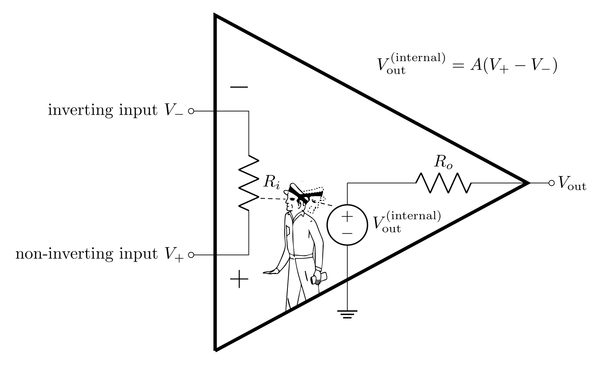

# Goals

In this lab you will get your first exposure with op-amps and use them to build two of the simpler circuits that can be made with them: the voltage buffer (aka voltage follower), and the non-inverting amplifier. These two circuits are closely related and are both very useful in many applications.

Op-amps serve many purposes, but one of the main uses is to amplify a small signal by increasing the voltage level while preserving as accurately as possible the original waveform. In real physics experiments, transducers are used to convert basic physical quantities into electric signals, as shown in Figure @fig:lab-measurement. An amplifier is usually needed to raise the small transducer voltage (μV to mV) to a useful level (mV to V) for the signal to be measured reliably.

{#fig:lab-measurement}

Even though there are commercial amplifiers available for purchase, they are often very expensive (>$1000) and have many features that may not be needed. Meanwhile, you can design your own simple amplifier with an op-amp which could cost less than a dollar.

To prepare for this lab, you will learn to apply new analysis techniques (the op-amp golden rules) to predict the behavior and inform the design of op-amp circuits. In this lab, you will:

-   Explore obstacles due to the function generator's output impedance.

-   Learn how to easily test an op-amp to see if it's working.

-   Build a voltage buffer (follower) to 
    -   provide a voltage with low output impedance,
    -   test the maximum output current of the LF356 op-amp.

-   Build a non-inverting amplifier to amplify small signals and test
    -   the gain,
    -   the frequency dependence,
    -   the maximum output voltages,
    -   the effects of resistors in series with the input,
    -   the output impedance and its effects on driving a load.

# Prelab

## Op-amps

> The op-amp is, essentially, a “perfect part”: a complete integrated amplifier gain block, best thought of as a dc-coupled differential amplifier with single-ended output, and with extraordinarily high gain. It also excels in precise input symmetry and nearly zero input current. Op-amps are designed as “gain engines” for negative feedback, with such high gain that the circuit performance is set almost entirely by the feedback circuitry. Op-amps are small and inexpensive, and they should be the starting point for nearly every analog circuit you design. In most op-amp circuit designs we’re in the regime where they are essentially perfect: with them we will learn to build nearly perfect amplifiers, current sources, integrators, filters, regulators, current-to voltage converters, and a host of other modules. (Horowitz and Hill 3rd Ed. 223)

In this lab, you will use op-amps to build a voltage buffer and a non-inverting amplifier.  Op-amps are ICs (integrated circuits) made up of many transistors. Most textbooks discuss transistors prior to op-amps; we are going in the opposite order because we are not particularly interested in how op-amps are designed and the details of the inner workings. When considering how op-amps work at a higher level, the analysis is often far easier than that of transistor circuits. The ***GOLDEN RULES*** can be used to solve most op-amp circuits with relative ease; these golden rules are approximations (which most of the time are quite reasonably accurate) that greatly reduce the complexity of op-amp circuit analysis.

## Open Loop Gain

{#fig:opamp-man width="15cm"}

The op-amp has two inputs (inverting and non-inverting) and one output. It can be thought of as a "black-box" (as seen in Figure @fig:opamp-man) which has an internal voltage source that is controlled by the potential difference between the non-inverting input and the inverting input. The op-amp's output is the difference between the inputs times **the open-loop gain** $A$.

$$V_\text{out} = A (V_+-V_-)$$

Note that this is true when there is no voltage drop across $R_o$. Op-amps have very small output impedance, and for an ideal op-amp, $R_o=0$.

**Definition 1: Open-loop gain, $A$** - the gain of the op-amp when there is no feedback.

The open-loop gain depends on frequency according to the following equation:

$$A(f) = \frac{A_\text{VOL}}{1+j\frac{f}{f_0}}$$

where $A_\text{VOL}$ is the **open-loop DC gain** and $f_0$ is the **open-loop 3 dB point**. Notice that this is the same kind of equation as a low-pass filter. At low frequencies, this equation is flat and equal to $A_\text{VOL}$, but near the 3 dB point, it starts to drop (this drop is typically described in dB/octave or dB/decade) and can be reported in strange units like V/mV (which is essentially a weird way of writing $10^3$).

**Definition 2: Open-loop DC gain, $A_\text{VOL}$** - The open-loop gain at low frequencies before the frequency dependence starts to take over and the open-loop gain starts to decrease. This is cited in any op-amp datasheet (sometimes as $A_\text{OL}$ or $A_\text{VO}$).

**Definition 3: Open-loop 3 dB point, $f_0$** - The frequency that the open-loop gain falls -3 dB from $A_\text{VOL}$. Beyond this frequency, $A$ typically continues to fall with a constant dB per log-scale (quoted in dB/octave (log2) or dB/decade (log10)). This value is usually ***not*** quoted in datasheets. It can be calculated from other values, and people often aren't concerned with the value of $f_0$.

An ideal op-amp has an **open-loop gain** of infinity and does *not* depend on frequency. Treating the gain as infinite is usually a really good approximation because real op-amps have open-loop gain values of $10^5-10^8$. This approximation is known as the first ***GOLDEN RULE*** of op-amps.

**GOLDEN RULE 1:** The open-loop gain is infinitely large: $A\rightarrow\infty$.

### Prelab Question {#1.1}

In this course, you will be using the LF356 op-amp. Open up its datasheet on the [Datasheets and Instrument Manuals page](/PHYS-3330/manuals-data-sheets). You should keep this open, as you'll refer to it multiple times for the prelab. Starting on page 2 there are tables holding values for various properties of this op-amp and other closely related op-amps (make sure you pull values from the right column).

What is the open-loop DC gain, $A_\text{VOL}$? Report it in a unitless number.

## Input and output impedance

Op-amps are designed to have very large input impedance ($R_i$ in Figure @fig:opamp-man) and very small output impedances ($R_o$ in Figure @fig:opamp-man). The very small output impedance allows it drive loads without voltage dividing much of its output over its output impedance (consider taking $R_1$ to zero in the voltage divider transfer function where $R_1$ is the output impedance and $R_2$ is a load). Even though op-amps have this advantage, they have a limit of how much current they are able to output. The maximum output current is an important consideration when it comes to the ability of an op-amp to drive a load. This maximum output current acts very much like a current limit would on the power supply.

The very large input impedance means that very little current flows into (or out of) the inputs. The second ***GOLDEN RULE*** assumes that the input impedance is infinitely large and ***no*** current flows in or out of the inputs.

**GOLDEN RULE 2:** No current flows in or out of the inputs: $I_+=I_-=0$.

### Prelab Question {#2.1}

According to the datasheet, what is the input impedance (resistance) $R_i$?

### Prelab Question {#2.2}

What is the maximum output positive current at $0\text{ V}$ for a supply voltage of $\pm 15 \text{ V}$ at $25 ^{\circ} \text{C}$ (look for a graph on page 5)?

## Intro to negative feedback

Negative feedback is at the heart of nearly every op-amp circuit. The op-amp itself doesn't have negative feedback; it has to be externally applied by feeding back part of (or all of) the output voltage back into the inverting input $V_-$. Negative feedback results in a circuit with a **closed-loop gain**, $G<A$, which depends on the amount of $V_\text{out}$ that is fed back into $V_-$. The feedback also improves the linearity and stability of the output and greatly increases the bandwidth: the **3 dB point** $f_b > f_0$. In fact, the bandwidth times the DC gain is a constant value called the **gain bandwidth product** ($\text{GBW}$), so the smaller the gain, the wider the bandwidth. When the gain is 1, the 3 dB point is equal to the $\text{GBW}$ and is referred to as the **unity gain frequency**, $f_T$ (unity means 1). Often **unity gain frequency** and **gain bandwidth product** are used interchangeably since they are mathematically the same value. All these values can be related to each other with the following equations:

$$\text{GBW} = G_0 f_B = 1\cdot f_T = A_\text{VOL}f_0$$

The frequency dependence of $G$ follows the same form as for $A$, but with a larger bandwidth:

$$G(f)=\frac{G_0}{1+j\frac{f}{f_B}}$$

**Definition 4: Closed-loop gain, $G$** - when a fraction of the output is fed back into the inverting input $V_-$, the op-amp's gain is greatly reduced from $A$ to some value $G$. Just like the open-loop gain, this value is frequency dependent and starts to fall from $G_0$ near the 3 dB point, $f_B$.

**Definition 5: Closed-loop DC gain, $G_0$** - the closed-loop gain at frequencies well below the 3 dB point. Except in active filter design, the point of an op-amp is to operate at a frequency such that $G(f)=G_0$, so almost always, the closed-loop DC gain is referred to simply as ***THE* gain**.

**Definition 6: 3 dB point, $f_B$** - the frequency where $G$ drops -3 dB from $G_0$. This is also often referred to as the bandwidth or operating bandwidth, as typical operation should be done below this frequency.

**Definition 7: gain bandwidth product, $\text{GBW}$** - the product of the DC gain and the 3 dB point is a constant value. This should be cited in datasheets as it's a foundational property of each op-amp's internal design. Just like resistor values, however, the precise $\text{GBW}$ varies from op-amp to op-amp of the same name.

**Definition 8: unity gain frequency, $f_T$** - the 3 dB point when the gain is 1 (unity). Since this is mathematically equivalent to the $\text{GBW}$, these terms are often used interchangeably.

### Prelab question {#3.1}

Find the gain bandwidth product in the datasheet. Report this property, and calculate $f_0$ using the open-loop DC gain found earlier in the datasheet.

### Prelab question {#3.2}

Create a Bode plot (which is a log-log plot of a property vs frequency) for the magnitude of various gain values shown above.

- On the same log-log plot, plot $|G(f)|$ for $G_0=1$, $100$, $1000$, and $A_\text{VOL}$ (as found in the datasheet)
- Make the range of the x-axis from  $1\text{ Hz}-10^8\text{ Hz}$

*Hint:* $G(f)$ is complex, so to find it's magnitude you have to calculate $\sqrt{GG^*}$ where $G^*$ is the complex conjugate.

*Python Hint:* use `np.logspace()` instead of `np.linspace()` to generate the array of frequencies.

## Negative feedback continued

Negative feedback also brings us to the third ***GOLDEN RULE***

**GOLDEN RULE 3:** Negative feedback forces the voltage at the inverting input to equal the voltage at the non-inverting input; $V_+=V_-$.

Again, this an approximation. In reality $V_+\approx V_-$; for there to be any $V_\text{out}$, there has to be small differences between $V_+$ and $V_-$.

A voltage buffer (aka voltage follower) is the simplest possible negative feedback ciruit you can build; you will use this circuit to demonstrate that you can *show* the 3rd golden rule to be true, given the first 2. In this circuit, **all** of the output is fed back into the inverting input, and the signal $V_\text{in}$ is plugged directly into the non-inverting input.

{#fig:buffer-intro width="10cm"}

Figure @fig:buffer-intro shows a voltage buffer circuit. First notice there is no power to the op-amp in the diagram; often you'll find op-amp example circuits without power explicitly drawn in, but op-amps ***always*** need power (the power is implied - see Figure @fig:pin-diagram for a pinout of the LF356 Op-amp that includes the power info).

### Prelab question {#4.1}

Start with $V_\text{out}=A(V_+-V_-)$, and use the first two golden rules to show that $G_0=1$ and that $V_+=V_-$.

*Hint:* Start by plugging in $V_+=V_\text{in}$ and $V_-=V_\text{out}$ and solve for $V_\text{out}/V_\text{in}$.

## Non-Inverting Amplifier

Alongside the buffer, the non-inverting amplifier is one of the most used and simplest op-amp circuits; as the name implies, the non-inverting amplifier outputs a signal with greater amplitude than the input (without inverting it). It is very similar in design to the buffer, but with a resistor, $R_F$, in the feedback loop and a resistor, $R$, from the inverting input to ground. There are many ways you'll see this diagram drawn as seen in Figure @fig:non-invert-var. Note that sometimes people draw the inverting input on top, and sometimes on bottom, but the feedback resistor always goes to the inverting input.

{#fig:non-invert-var width="20cm"}

The two resistors form a voltage divider *feedback network* with a transfer function $B$ (think of $R_F$ as $R_1$ and $R$ as $R_2$ in the voltage divider equation from lab 2):

$$B = \frac{R}{R_F+R}$$

### Prelab question {#5.1}

Use golden rules 2 and 3 to show that the DC gain, $G_0$, of the non-inverting amplifier is

$$G_0 = \frac{1}{B} = 1 + \frac{R_F}{R}$$

*Hint 1:* First use the second golden rule and Kirchhoff's current law to argue that the current flowing through $R_F$ is the same as the current flowing through $R$.

*Hint 2:* Use Kirkhoff's voltage rule tracing from $V_\text{out}$ to ground and from $V_\text{in}$ to ground to make two equations. You can use these to find $V_\text{out}/V_\text{in}$.

### Prelab question {#5.2}

Calculate $G_0$ and the bandwidth, $f_B$, for the non-inverting amplifier with $R_F = 10\ \text{k}\Omega$ and $R = 100\ \Omega$ (use the $\text{GBW}$ you found in the datasheet to calculate $f_B$). Feel free to round $G_0$ to a nice clean number ending in zero(s).

### Prelab question {#5.3}

Predict the amplitude of the output voltage, $V_\text{out}$, for the non-inverting amp with $R_F = 10\ k\Omega$ and $R = 100\ \Omega$ when

1. $V_\text{in} = 1\ \text{mV}$

2. $V_\text{in} = 1\ \text{V}$

## Input and Output Impedance of the Non-Inverting Amplifier

The non-inverting op-amp circuit has different input impedance, $R_i'$, and output impedance, $R_o'$, from the bare op-amp. You can find the derivation for how to find $R_i'$ and $R_o'$ in Horowitz and Hill 2nd ed. section 4.26 (copies can be found in the lab).

$$R_{i}' = R_{i}(1 + AB)$$

$$R_{o}' = \frac{R_{o}}{(1 + AB)}$$

where $R_i$ and $R_o$ are the input and output impedances of the bare op-amp (you already looked up $R_i$ in the datasheet). These impedances will be improved from the values for the bare op-amp if $A B$ is large ($A$ is large, but $B\le 1$). With reasonable conditions, $AB$ is still quite large. Notice then that in the non-inverting amplifier configuration, negative feedback causes the input impedance to increase (from an already large value) and the output impedance to decrease (from an already small value).

### Prelab question {#6.1}

The output impedance of the LF356 op-amp with no feedback is about $40\ \Omega$ (and you already found $R_i$ from the datasheet). Calculate $R_i'$ and $R_o'$ when $R_F = 10\ k\Omega$ and $R = 100\ \Omega$. Does it seem reasonable to assume the input impedance is infinitely large and the output impedance is $0$?

### Prelab question {#6.2}

The oscilliscope has a finite measurement impedance $(1\text{ M}\Omega)$, so if you're measuring $V_\text{in}$, you are putting a resistor $R_\text{scope}$ from the input to ground (see Figure @fig:non-invert-input-measure). This will inevitably reduce the input impedance of the amplifier. In the case when $R_F = 10\ k\Omega$ and $R = 100\ \Omega$, what is the input impedance of the amplifier?

*Hint:* $R_\text{scope}$ is in parallel with $R_o'$.

{#fig:non-invert-input-measure width="10cm"}

### Prelab question {#6.3}

Maybe you already noticed that the buffer is a non-inverting amplifier with $R_F=0$ and $R=\infty$. We already know that it has a DC gain of 1, so $B=1$. Calculate $R_i'$ and $R_o'$ for the buffer.

## Powering the op-amp

Thus far, we've ignored the fact that the op-amp requires external power to operate, but the op-amp ***NEEDS*** external power to function. The recommended supply voltage to the LF356 is $15\ \text{V}$ at the positive power pin $V^+$ (aka $+V_{cc}$ or $+V_\text{supply}$) and $-15\ \text{V}$ at the negative power pin $V^-$ (aka $-V_{ee}$ or $-V_\text{supply}$). 

{#fig:pin-diagram width="10cm"}

Here we can see the pin diagram for the LF356. Don't confuse $V_+$ and $V^+$. The subscripts $V_+$ and $V_-$ refer to the non-inverting and inverting inputs and $V^+$ and $V^-$ refer to the power pins. Pins 2 and 3 are the inputs and 4 and 7 are for power.

We always want to apply decoupling capacitors to the the power: plugging one end as close to the power pin as possible and the other end into ground. [Here's a nice explanation why](https://forum.allaboutcircuits.com/threads/decoupling-or-bypass-capacitors-why.45583/).

**Definition 9: capacitive coupling** - capacitive coupling is the process of sending a signal or energy through a capacitor (remember that the impedance of a capacitor is inversely proportional to the frequency). Capacitive coupling is a way of sending AC while blocking DC. Parasitic capacitance often leads to this happening by mistake.

**Definition 10: decoupling capacitor** - decoupling is coupling to ground. Decoupling capacitors charge up and provide a reservoir of energy that can be supplied to the circuit as the circuit's current draw changes over time. Power supplies and transmission lines have inherent inductance which impedes changes in current, $dI/dt$, so the decoupling capacitors compensate  with the energy stored and provide the current necessary to maintain constant voltage.

{#fig:powering-with-decouple width="8cm"}

Each op-amp design has limits to how much voltage you can apply to the power pins (before something breaks), and typically there is a recommended voltage that is less than this limit (e.g. the LF356 can take up to $\pm 22\ \text{V}$, but it recommends you apply $\pm 15\ \text{V}$). The voltage out is really coming from the power pins (the inputs, in a sense, just tell the op-amp how much of the power voltage to send to the output), so the maximum $V_\text{out}$ depends on the supply voltage.

### Prelab question {#7.1}

Check the datasheet for the maximum output voltage when the LF356 is powered with $\pm 15\ \text{V}$. This is usually referred to as the **output voltage swing**.

### Prelab question {#7.2}

Look back at your calculations in prelab question @sec:5.3; when supplying the LF356 with $\pm 15\ \text{V}$, what do you expect happens when the predicted $V_\text{out}$ is greater than the output voltage swing?

## Lab activities

### Prelab question {#8.1}

Read through all of the lab steps and identify the step that you think will be the most challenging.

### Prelab question {#8.2}

List at least one question you have about the lab activity.

# Op-amp TLDR

This section summarizes information covered in the prelab (you may find this useful for a quick reference in the future).

The op-amp is a differential amplifier that outputs an amplified difference between the inputs:

$$V_\text{out}=A(V_+-V_-)$$

Feeding the output back into the inverting input drives the system into a very stable state which no longer depends on many of the details or imperfections of the internal workings. *Closed-loop* refers to the state of an op-amp with feedback, and *open-loop* refers to the state of an op-amp with no feedback.

## Golden Rules

The golden rules are approximations that make op-amp analysis relatively simple and straight forward.

1.  The open-loop gain is infinitely large: 
$$A\rightarrow\infty$$
2.  The input impedance is infinitely large, so no current flows in or out of the inputs:
$$I_+=I_-=0$$
3.  When negative feedback is applied, the output drives the inverting input to be the same voltage as the non-inverting input:
$$V_+=V_-$$

## Definitions

Here are all the terms we defined in the prelab:

**Open-loop gain, $A$** - the gain of the op-amp when there is no feedback.

**Open-loop DC gain, $A_\text{VOL}$** - the open-loop gain at low frequencies before the frequency dependence starts to take over and the open-loop gain starts to decrease. This is cited in any op-amp datasheet (sometimes as $A_\text{OL}$ or $A_\text{VO}$).

**Open-loop 3 dB point, $f_0$** - the frequency that the open-loop gain falls -3 dB from $A_\text{VOL}$. Beyond this frequency, $A$ typically continues to fall with a constant dB per log-scale (quoted in dB/octave (log2) or dB/decade (log10)). This value is usually ***not*** quoted in datasheets. It can be calculated from other values, and people often aren't concerned with the value of $f_0$.

**Closed-loop gain, $G$** - when a fraction of the output is fed back into the inverting input $V_-$, the op-amp's gain is greatly reduced from $A$ to some value $G$. Just like the open-loop gain, this value is frequency dependent and starts to fall from $G_0$ near the 3 dB point, $f_B$.

**Closed-loop DC gain, $G_0$** - the closed-loop gain at frequencies well below the 3 dB point. Except in active filter design, the point of an op-amp is to operate at a frequency such that $G(f)=G_0$, so almost always, the closed-loop DC gain is referred to simply as ***THE* gain**.

**3 dB point, $f_B$** - the frequency where $G$ drops -3 dB from $G_0$. This is also often referred to as the bandwidth or operating bandwidth, as typical operation should be done below this frequency.

**Gain bandwidth product, $\text{GBW}$** - the product of the DC gain and the 3 dB point is a constant value. This should be cited in datasheets as it's a foundational property of each op-amp's internal design. Just like resistor values, however, the precise $\text{GBW}$ varies from op-amp to op-amp of the same name.

**Unity gain frequency, $f_T$** -  the 3 dB point when the gain is 1 (unity). Since this is mathematically equivalent to the $\text{GBW}$, these terms are often used interchangeably.

**Capacitive coupling** \- capacitive coupling is the process of sending a signal or energy through a capacitor (remember that the impedance of a capacitor is inversely proportional to the frequency). Capacitive coupling is a way of sending AC while blocking DC. Parasitic capacitance often leads to this happening by mistake.

**Decoupling capacitor** - decoupling is coupling to ground. Decoupling capacitors charge up and provide a reservoir of energy that can be supplied to the circuit as the circuit's current draw changes over time. Power supplies and transmission lines have inherent inductance which impedes changes in current, $dI/dt$, so the decoupling capacitors compensate  with the energy stored and provide the current necessary to maintain constant voltage.

# Useful Readings

You can find more on op-amps from these recommended sources:

1.  [Steck](https://atomoptics-nas.uoregon.edu/~dsteck/teaching/electronics/electronics-notes.pdf) Sections 7.1, 7.2, 7.3.1, 7.3.3

2.  Fischer-Cripps Sections 12.2 - 12.15

3.  Horowitz and Hill 2nd Ed., 4.01. 4.02, 4.03, 4.05, 4.06

4.  Horowitz and Hill 3rd Ed., 4.1, 4.2.2, 4.2.3

# IC Tips

In this lab, we will use ICs (integrated circuits) for the first time. ICs come in many forms; we will be using DIP chips because these are designed for using in breadboards. DIP is a description of the packaging they come in: resembling little bugs with legs running down each side. These basic tips should always be followed when working with ICs. **Read through them all** (likely more than once) before you begin using any IC chips. You should refer back to this section in future labs to remind yourself of these useful tips.

{#fig:power-example width="15cm"}

1. Always unplug the power supply from your circuit while you're wiring it.
2. Chips sit across the groove on the breadboard (see Figure @fig:power-example). Any other placement will cause legs to short together.
    -   Before inserting a chip, ensure the pins are straight (using a needle-nose pliers or something similar).
    -   After insertion, check visually that no pin is broken or bent under the chip. 
    -   To remove the chip, use the dedicated IC pliers (found in the tool trays at your lab station). Removing ICs by hand often results in bent legs and/or a leg puncturing your finger.
3. Use the long columns on your breadboard for your power and ground voltages (with power and ground next to each other) to take advantage of the parasitic decoupling capacitance of the long line.
4. Color code your wires. We recommend:
    -    0V (ground) Black

    -    +15V Red

    -    -15V Blue

    -    Use other colors for any other connections which aren't to $\pm$ power or ground
5. Connect capacitors between the power pin(s) of the IC (as close to the pin as possible as in Figure @fig:power-example) to ground. These are called decoupling or bypass capacitors and are critical for maintaining constant voltage at the pin as the current needs change. Use nice, big polarized (electrolytic) capacitors ($>1\ \mu\text{F}$) so that they're able to collect enough charge to deliver the necessary current when needed.
6. Measure all your passive elements (resistors, capacitors, inductors, diodes) before putting them in the circuits; trying to measure while they are plugged into the breadboard can lead to mistakes.
7. Always have a diagram of your circuit with pin numbers labeled (like the left side of Figure @fig:pin-diagram).
8. Make sure any polarized (electrolytic) capacitors are oriented such that the higher voltage is applied to the correct lead of the capacitor. Remember: **ground** is a ***HIGHER*** voltage than $-15\ \text{V}$. Getting this backward will cause the capacitor to explode: this is loud, smelly, and a bit embarrassing.
9. Wires that your signal go through should be kept short and compact. This minimizes the parasitic inductance and capacitance and will better preserve the signal. Don't put your signals into the long columns running down the breadboard.
9. Don't make any connections that cross over the top of the IC (like the feedback connection for an op-amp); instead, go around the IC.
    1. This makes it so you can pull out the IC without disturbing the rest of the circuit.
    2. This helps ensure magnetic fields generated by the current in the wire don't interact with the inner workings of the IC.
10. Compare your physical circuit to the diagram before connecting the power supply (especially polarized capacitor orientations).

# Lab Activities

## The Function Generator and Its Output Impedance.

Remember last week when we set the function generator to an output termination of *High Z*? We want to do this EVERY TIME we use the function generator in this class. This does not change the output impedance of the function generator: it's ALWAYS $50\ \Omega$, but by default, it *assumes* you are impedance matching everything with $50\ \Omega$ (this is important at high frequencies; feel free to ask an instructor if you're curious to hear more).

When  the output goes through a $50\ \Omega$ load (i.e. $50\ \Omega$ termination), the voltage output will divide over the output impedance and the load, so only half the voltage will be applied to the load $\frac{50\ \Omega}{50\ \Omega+50\ \Omega} = \frac{1}{2}$. When the output termination **setting** is set to $50\ \Omega$, the device will assume half the voltage will drop across the output impedance, and display only half the voltage being applied (since this will be how much is expected to reach the $50\ \Omega$ termination). Since we won't be doing any $50\ \Omega$ impedance matching, we always want set the function generator to be in *High Z* mode and know that if the termination impedance is small, that this will voltage divide with the $50\ \Omega$ output impedance of the function generator. If you don't remember how to change this setting, refer to Appendix B in Lab 1.

In general, the voltage out from the function generator is

$$V_\text{out}=\frac{R_\text{termination}}{50\ \Omega+R_\text{termination}}V_\text{displayed}$$

For large termination impedance, clearly the voltage out will be the same as what is displayed on the screen; however, we can see a clear issue: if the termination impedance is smaller than $50\ \Omega$, less than half of the voltage actually exits the function generator.

This next activity will demonstrate how this can be a problem in order to motivate the use of an op-amp as a voltage buffer. You will try to play a note through a speaker directly from the function generator.

1.  Grab a speaker and use your DMM to measure the resistance of the speaker.

2.  Set up the function generator and the oscilliscope.

    1.  Set the output impedance on the function generator to *High Z*.

    2.  Set up the function generator and the oscilloscope so that you can read Channel 1 from the function generator with Channel 1 of the oscilloscope (use a BNC T-connector so that later you can eventually connect this to your breadboard as well).

    3.  Connect the *Sync* on the function generator with Channel 4 of the oscilloscope.

    4.  Create a $400\ \text{mV}_\text{pp}$ sine wave with a $261.63\ \text{Hz}$ frequency and trigger on the *Sync* (in the trigger menu, change the channel to Channel 4). This will provide a nice lower frequency tone (a $\text{C}_4$ note) at a volume that won't be too obnoxious to your neighbors.

3.  Confirm on the oscilliscope that the frequency and the amplitude of your wave match the settings on the function generator.

3.  Apply the signal from the function generator to the speaker (use the T-connector, so you can still see it on the oscilloscope).

    1.  Now what is the amplitude of the sine wave on Channel 1 of the oscilliscope?

    2.  Why did the amplitude change after applying the load to the function generator's output? Unplug the BNC connector from the breadboard's header: did the amplitude recover? Why? Reconnect the function generator to your circuit and confirm the voltage drops.

    3.  What is the transfer function of the voltage before plugging it into the circuit divided by voltage after plugging into the circuit?

    2.  Draw a full circuit diagram which describes why this behavior is happening. *Hint*: there should be 3 resistors: the output impedance of the function generator, the impedance of the speaker, and the input impedance of the oscilliscope.

Since the impedance of the speaker can't be changed, in order to get the full voltage to the speaker, you will have to decrease the output impedance. This can be done with a voltage buffer.

## Building an op-amp test circuit

Before you solve the problem above with a voltage buffer, let's build a simple means to test if an op-amp chip is functioning.

When building circuits, it's a good idea to test components before putting them all together in a complex circuit. This can save you a lot of headaches by avoiding needing to debug your circuit because you have a burnt out or broken IC.

You should consider leaving the "bones" of this test circuit somewhere on your breadboard so that you can quickly pop in an LF356 chip to test it (keep it compact and leave plenty of space on your protoboard for future work).

{#fig:voltage-follower-gnd width="10cm"}

The test circuit resembles the buffer, but with $V_\text{in}=0$.

1. Predict the voltage at pins 2, 3, 4, 6, and 7.

2. Build the circuit shown above (review the IC tips).

3.  Check the voltages at pins 2, 3, 4, 6, and 7. Do they match your predictions?

Commonly, when a chip isn't working, it will output roughly $15\ \text{V}$ or $-15\ \text{V}$ at pin 6 regardless of the configuration. If you find you have a bad chip, throw it in the trash and grab another (In case you are wondering, the LF356 costs less than $1). If you're not sure, grab an instructor and have them take a look with you.

## Voltage Buffer

{#fig:voltage-follower width="10cm"}

A voltage buffer is the simplest op-amp circuit with negative feedback. The voltage buffer is essentially a non-inverting amplifier with a gain of 1, so it is often also referred to as a follower (since the output "follows" the input). The buffer gets its name because no current flows through the input and therefore the voltage at the output is, in a sense, *isolated* from the voltage at the input (even though they're the same value). This can help you avoid unintended issues with voltage dividers: such as the one you encountered above with the function generator, as well as having measurement impedances or loads in parallel with a voltage divider changing how much current goes through $R_2$ (like you encountered in Lab 2).

You will use the buffer to take the output of the function generator (with a $50\ \Omega$ output impedance) and reproduce (i.e. follow) the same voltage with a very small output impedance (we calculated this in prelab question @sec:6.3)

{#fig:op-amp-test width="15cm"} 

1.  Build the voltage follower using the function generator as $V_\text{in}$. Use the same settings as before ($400\text{ mV}_\text{pp}$ sine wave at $261.63\text{ Hz}$). Figure @fig:op-amp-test shows a schematic of the full set up using Channel 1 to measure $V_\text{in}$, Channel 2 to measure $V_\text{out}$, and Channel 4 to trigger on the *Sync* output.

2.  Confirm the gain is $1$. If the gain is $10$ or $0.1$, this is likely due to a setting on the oscilliscope (ask for help if you're lost).

3.  Connect the speaker from $V_\text{out}$ to ground. Does $V_\text{in}$ or $V_\text{out}$ change? 

4.  Why or why not? Is this expected?

5.  Increase the amplitude on the function generator to $500\text{ mV}_\text{pp}$. Describe what happens to $V_\text{out}$.

6.  Play with the amplitude to see if this behavior is consistent. Record what you're doing and what you're seeing along the way.

7.  Why is this happening? Is this consistent with what you found in the prelab? This is a good place to check in with an instructor to confirm your thinking or clear up any confusion.

8.  Unplug your speaker!

There are op-amps which have higher max output currents. These are sometimes referred to as "power op-amps" and are in form factors designed to attach to heat sinks (since high currents produce a lot of heat).

<!--

## Unity gain frequency

1.  You found the gain bandwidth product in the prelab. What is the unity gain frequency?

2.  We will be going up to high frequencies, so it will be ideal to use a scope-probe on Channel 2 to measure $V_\text{out}$. What setting on the oscilliscope do you need to change when you do this?

3.  Set the function generator to the unity gain frequency that you found. Are you seeing a -3 dB reduction in the output at this frequency?

4.  Pick 3 frequencies between the unity gain frequency and the highest frequency the function generator can put out; record the gain and describe anything else interesting you see. 

At very high frequencies, circuit models typically become more complicated. For example, parasitic capacitance and inductance due to the exact physical configuration start to play more substantial roles in behavior. The details of the physical layout of a PCB start to become crucial, and often people think less about voltages and currents and consider the circuit as a waveguide for EM waves. Additionally, op-amps themselves no longer acts ideally at high frequencies. 

5.  You are unlikely to find a simple RC filter type falloff. Using the 10X scope-probe, measure the gain at every decade in frequency from 10 MHz down to 10 Hz, with (as usual) a few extra points anywhere things are starting to change. Do you find any deviation from unity gain? HINT: Be sure that the output amplitude is below the level affected by the slew rate. For more on slew rate, see Horowitz and Hill 2nd ed. section 4.11 p. 192 or 3rd ed. section 4.4 p 242. Plot the low and high frequency data and predicted behavior on your Bode plot from your prelab. Do you find a simple fall-off as suggested by the theory for the ideal follower ($f_T=f_B$)? If so, find the 3 dB frequency. How does your measured 3 dB frequency compare to what is expected from the op-amp datasheet?

6.  If you observed ideal behavior, you're lucky! At frequencies above a few MHz, the simple model of the frequency response of the op-amp is not accurate. Once you are in this frequency range, many physical details of your circuit and breadboard can have large effects in the circuit (see notes in 7.1.4 above). You could model these effects, but a better procedure to follow is to modify the physical setup. Building reliable circuits at these frequencies typically requires careful attention to grounding and minimization of capacitive and inductive coupling between circuit elements and to ground. Printed circuit boards are much better for high-frequency applications. At lower frequencies, our model of the circuit will work much better.

-->

## Non-Inverting Amplifier

{#fig:non-inv-amp width="15cm"}

1.  Grab a $10\text{ k}\Omega$ and a $100\ \Omega$ resistor and measure their resistances.

2.  Change the negative feedback loop in your circuit to the one shown in Figure @fig:non-inv-amp, with $R_F = 10\text{ k}\Omega$ and $R = 100\ \Omega$ (or build a new one elsewhere on your breadboard).

3.  You calculated $G_0$ and $f_B$ for this circuit in the prelab, recalculate these values for the measured values of $R$ and $R_F$.

4.  What's a reasonable amplitude to set $V_\text{in}$? Why? Set the function generator to this.

5.  What's a reasonable frequency to set so that $G(f)=G_0$? Why? Set the function generator to this.

6.  Measure the amplitude of $V_\text{in}$ and $V_\text{out}$ and then calculate the gain. How does this compare to your prediction?

7.  Set the frequency to the calculated 3 dB frequency and measure the gain. Is this -3 dB less than the previous gain? If not, change the frequency until you find the frequency at which the gain is -3 dB less than $G_0$. What is the measured 3 dB frequency?

8.  Use the previous result to calculate the gain bandwidth product. How does this compare to the datasheet?

9.  Increase the voltage until you see the signal saturate (this is also referred to as clipping). Measure the output saturation levels, $+V_\text{sat}$ and $–V_\text{sat}$? Record how you determined $V_\text{sat}$. Can $V_\text{out}$ produce voltages that span the voltages applied ($-15\text{ V}$ to $+15\text{ V}$) to the op-amp?

10. The model of the op-amp you have been working with does not include saturation effects. To make sure you are working within the range where your model is most accurate, make sure the output amplitude is below half the saturated value. Change the amplitude of the input so that the output is within this range.

11. Unplug $V_\text{in}$ from the oscilloscope so that the input impedance is the full $R_o'$ calculated in the prelab. Predict what happens if you add a $1\text{ M}\Omega$ resistor in series with $V_\text{in}$. *Hint:* consider the voltage drop across the resistor, and consider how adding this resistor changes in the input impedance. Do your measurements agree with your predictions?

{#fig:non-inv-amp1 width="15cm"}

12. Consider driving a load with resistance $R_L$ with the output of your amplifier and the effects of the output impedance $R_o'$. Write a relation between the amount of $V_\text{out}$ makes it across $R_L$ as a function of $R_L$.

13. Predict the maximum $V_\text{in}$ you can use to avoid hitting the maximum output current when $R_L$ is equal to the resistance you measured for the speaker (don't forget to consider the output impedance). Set the input to be just less than this, and set the frequency back to a $\text{C}_4$ note $(261.63\ \text{Hz})$.

15. Record $V_\text{out}$ and confirm the gain is what you expect.

16. Plug in the speaker. Record $V_\text{out}$ again. Did $V_\text{out}$ change? By how much?

17. We can refer to the output when a load is attached as $V_\text{out}^{(L)}$ and $V_\text{out}$ as the output when no load attached. Use the ratio of $\frac{V_\text{out}^{(L)}}{V_\text{out}}$ to calculate the output impedance of the non-inverting amplifier.

18. If you wanted all of the output to drop across the load instead of having a significant portion drop across the output impedance, what would you suggest doing?
