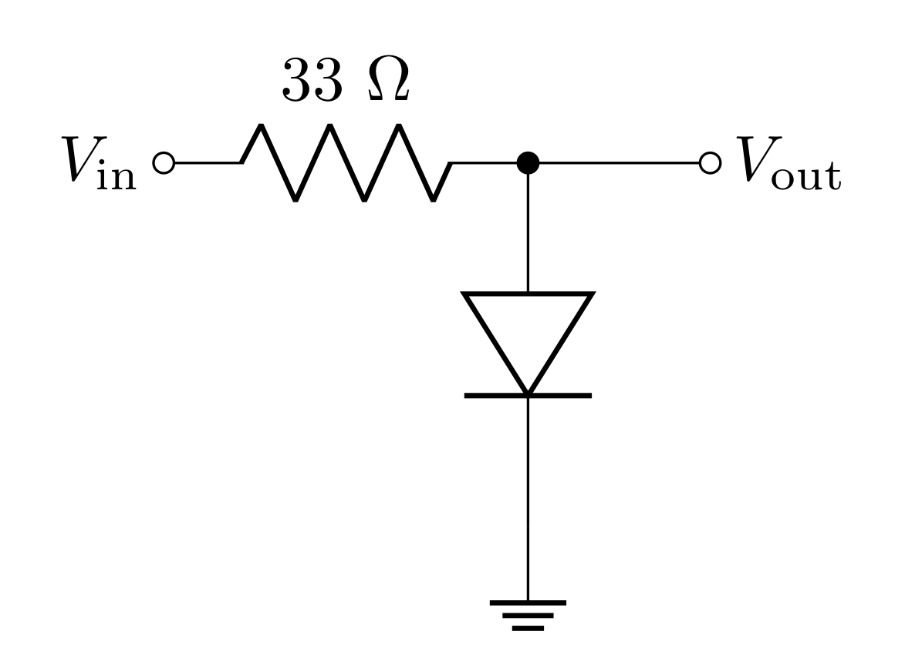
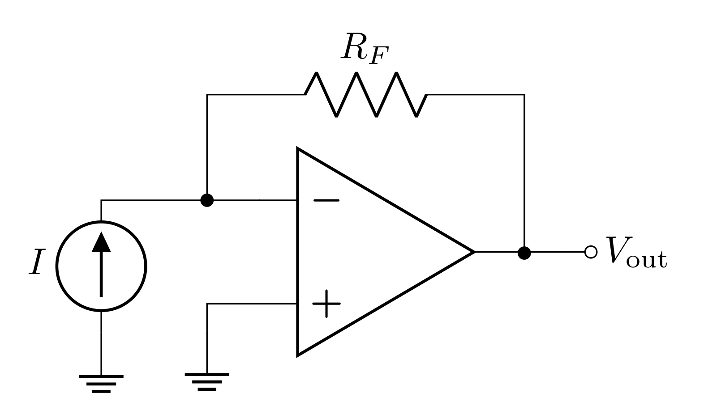
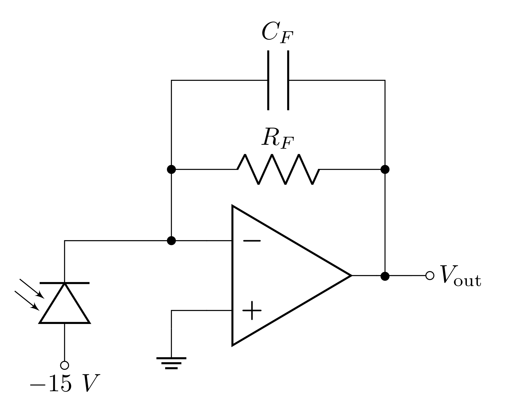
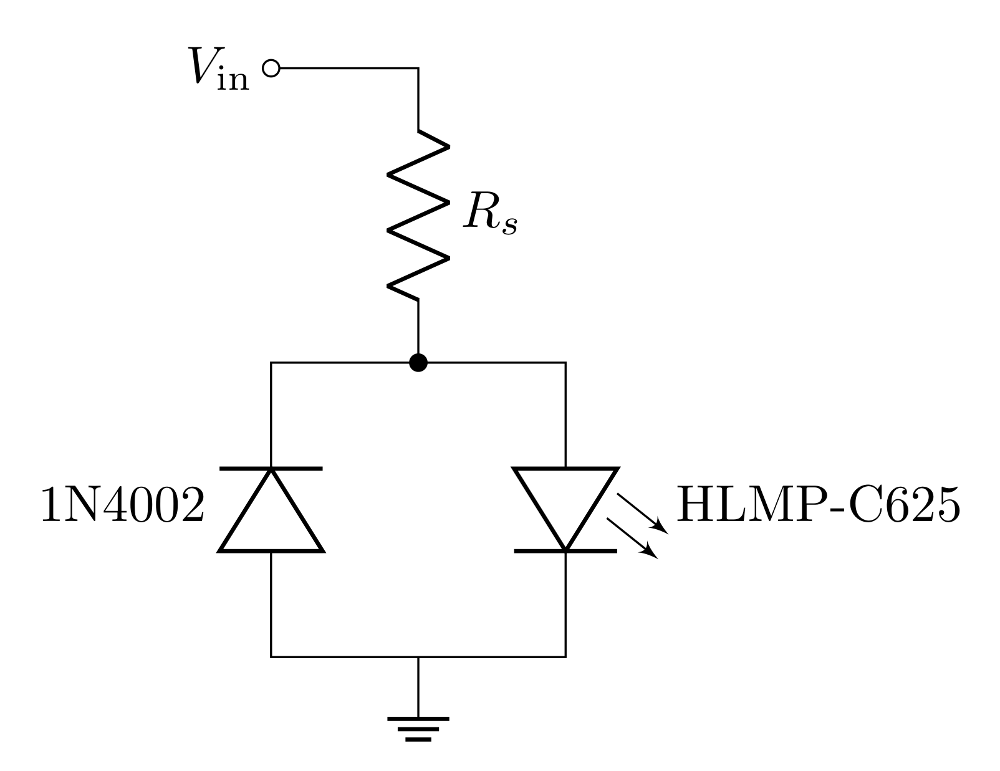
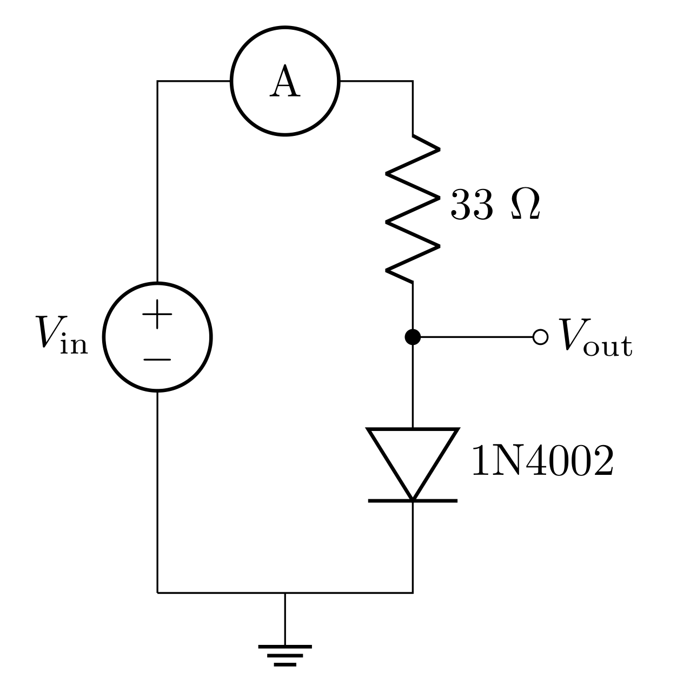
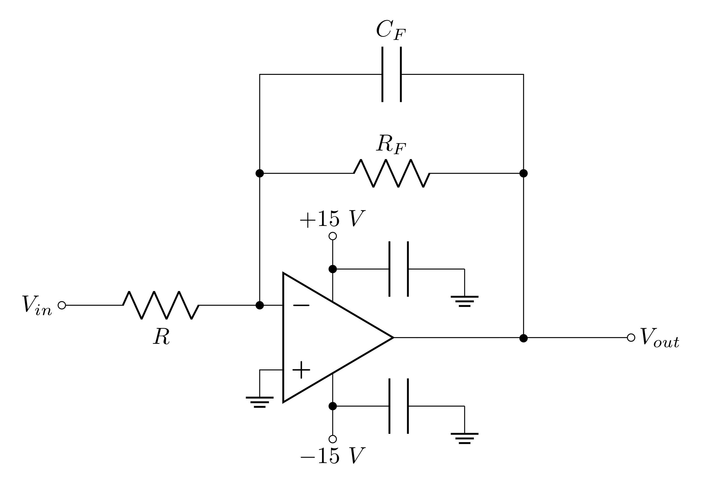
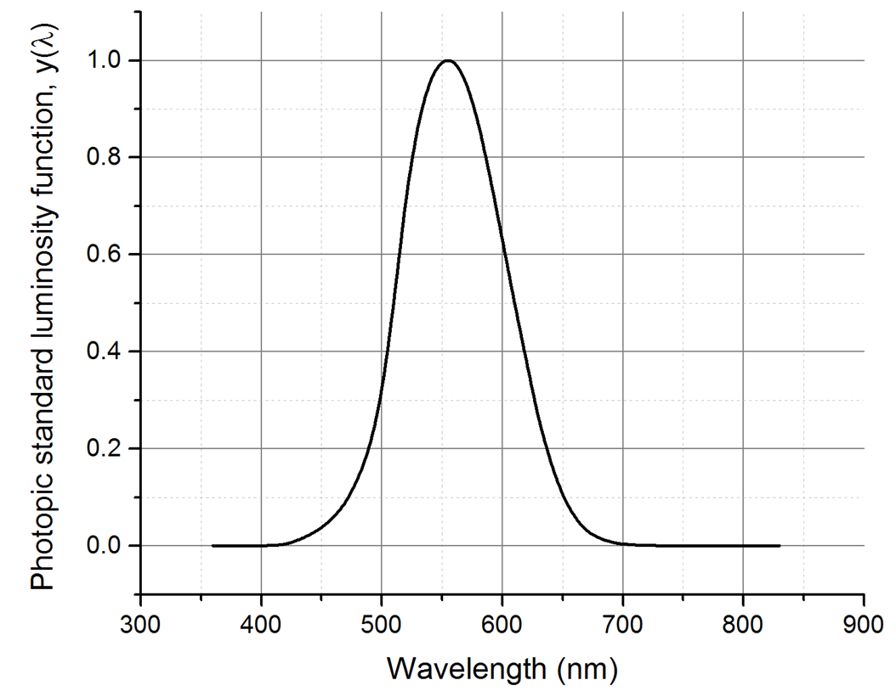

# Goals

In this lab, you will design and build a photometer (a device that measures the intensity of light) based on a silicon photodiode and a current-to-voltage amplifier whose output is proportional to the intensity of incident light. First, you will use it to measure the room light intensity. Then you will set up and investigate an optical communication link in which the transmitter is a light emitting diode (LED) and the receiver is your photodiode detector.

In this lab you will get your first exposure to diodes. There are three kinds of diodes you will use this week:

- Rectifier diodes (often just referred to as "diodes"),

- Light emitting diodes (LEDs),

- Photodiodes.

You will also learn how to build a new op-amp circuit: the transimpedance amplifier. This type of amplifier is a current to voltage converter, which means that it takes current as an input and outputs a voltage.

In this lab you will model the following physical systems:

-   A transimpedance amplifier

-   The sensitivity to light of a photodiode,

-   A photometer measurement system.

This week, you will build:

-   A device that measures light intensity (photometer),

-   A transducer device that can send information/signals via optical light from one circuit to another (optical communication link).

# Definitions

**Intensity** - power per unit area; units are $\text{W/m}^2$ and symbol (for this lab) is $N$ (often it is represented by $I$, but we use that symbol for current!).

# Prelab

## Diodes {#sec:simp-diodes}

A diode is a device which conducts electricity primarily in one direction. The original diodes were in the form of vacuum tubes ([here's a fun video if you care to learn more](https://www.youtube.com/watch?v=FU_YFpfDqqA)), but today they are made from semiconducting materials (like silicon) because of their relative robustness, long lifetimes, and compact size. A diode is made from a p-n junction where a positively-doped semiconductor (p-type) with mobile "holes" is in contact with a negatively-doped semiconductor (n-type) with mobile electrons. [Watch this short video.](https://www.youtube.com/watch?v=JNi6WY7WKAI)

A semiconductor diode has two terminals: an anode (+) and a cathode (-); a good mnemonic to remember the polarity of anodes and cathodes is remembering that cats (cathodes) have negative attitudes (sorry cat lovers). The symbol for a diode resembles an arrow with a hat (see the diagram in Figure @fig:diode-char), where the hat is referred to as "the bar" and is the cathode; a good mnemonic is seeing the symbol as an arrow which points in the direction that the diode allows current, since current flows from positive to negative, "the bar" is the cathode.

The fundamental property of a diode is its tendency to conduct electric current in only one direction. The diode can be operated in three regions (these regions are shown in different colors in Figure @fig:diode-char).

- The first region, called *forward biased*, is when the anode has a higher potential relative to the cathode by at least some threshold voltage (about $0.6\text{ V}$ for silicon diodes). When the anode-cathode voltage is above the threshold voltage the diode conducts with almost zero resistance and has a constant $0.6\text{ V}$ drop across it.

- The second region of operation is where the cathode has a higher potential relative to the anode. This region is called *reversed biased* and essentially no current can flow.

- In the reverse bias configuration, if the voltage across the diode exceeds a certain *breakdown* voltage, the diode will begin to conduct current. While regular diodes are not intended for operation in this region, Zener diodes are designed with specific breakdown voltages for various applications (these may be useful for your final project).

. The IV curve describes how much current will flow at different at different voltages.](../resources/lab6fig/diode-characteristics.png){#fig:diode-char width="15cm"}

The IV curve above describes the behavior of the diode as a function of voltage applied. A simple way to interpret this plot is that the diode only allows current to flow in the forward direction (the direction the diode symbol's arrow points) when the voltage is above the forward voltage, and it will allow current in the reverse direction only if a negative voltage exceeds the breakdown voltage. In general, to know the amount of current, requires analysis of the resistors involved in the circuit.

### Prelab Question {#sec:1.1}

Fill in the blank:

1. The ____ode terminal is marked with a (+) and the ____ode is marked with a (-)

2. When forward biased, current flows from the ____ode to the ____ode which is marked with "the bar."

### Prelab Question {#sec:1.2}

In your own words, describe:

1. The breakdown region.

2. The reverse bias region.

3. The forward bias region.

### Prelab Question {#sec:1.3}

{#fig:diode-cir-prelab width="7cm"}

1. Consider the circuit above. If the diode is ideal with a threshold voltage of 0.6 V and a breakdown voltage of 50 V, predict the behavior of the current $I$ (consider clockwise current to be positive) and $V_\text{out}$ as a function of the source voltage $V_\text{in}$. Make a table of the predicted $I$ and $V_\text{out}$ for the following values of $V_\text{in}$:

- -2 V,

- 0 V,

- +0.5 V,

- +0.6 V,

- +0.7 V,

- +1 V,

- +2 V,

- +4 V.

*Hint:* If you're struggling with this, consider the following strategy: consider the 3 regions in Figure @fig:diode-char. First determine which region the diode will be in as a result of the value of $V_\text{in}$. In this region, will there be current? In this region, what can the voltage across the diode be? If the diode is forward biased, there will be current, and the voltage across the diode will be $0.6\text{ V}$; how much of the total voltage will be across the resistor in this case? If the diode is reverse biased, there will not be current, and therefore, there will be no voltage drop across the resistor; what must be the voltage drop across the diode then?

*Hint:* $V_\text{out}$ is the voltage across the diode.

2. Now, consider $V_\text{in}$ being a sine wave with a 3 V amplitude (6 V peak-to-peak) centered on $V_\text{in}$ = 0 V. Predict $V_\text{out}$ and $I$ as a function of time and sketch your predictions (make a plot by hand or with Python) over 2-3 periods.

## Light emitting diode (LED)

LEDs act electronically like any other diode; however, unlike regular diodes, it also emits light when forward-biased due to direct radiative recombination of electrons and holes. The forward voltage drop of LEDs is typically higher than $0.6\text{ V}$. The HLMP-C625 you will use this week has a forward voltage of about $1.9\text{ V}$ because the LED is made of $\text{AlInGaP}$ instead of silicon.

When electrons cross from the n-type region to the p-type region in a diode, they dissipate energy. In regular diodes, the energy is converted into heat in the form of phonons, but LEDs have the energy converted into photons; therefore, the color of the light is dictated by the band gap energy of the diode.

<!-- The HLMP-C625 light emitting diode used in this lab acts electrically like any other diode. However, unlike regular diodes it also emits light when forward-biased due to direct radiative recombination of electrons and holes. The forward voltage drop is about 1.9 V rather than 0.6 V because the LED is made of AlInGaP instead of silicon.-->

### Prelab Question {#sec:2.1}

To turn on an LED, you have to run a certain amount of current through it. Current limiting resistors (this is just any resistor in series with the LED) are needed to limit the current to a specific value. Too little current and the LED will be too dim and too much current will destroy the LED. In the lab you will drive the HLMP-C625 LED with $8\text{ V}$. Determine the resistance needed in series with LED to get $20\text{ mA}$ of current through it. Don't forget to consider the forward voltage which is $1.9\text{ V}$. 

## PIN Photodiodes

{#fig:photodiode width="15cm"}

PIN photodiodes have an intrinsic region (undoped) between the p-type and n-type regions. Photons of appropriate wavelength absorb in the material creating an electron-hole pair; when reverse biased, the electric field generated by the voltage will pull the pair apart generating a small current. Therefore, (when reverse biased) the photodiode generates current proportional to the number of photons absorbed by the material. A sketch of the photodiode structure is shown in Figure @fig:photodiode.

<!--The PD204 photodiode used in this experiment is a p-intrinsic-n (PIN) silicon diode operated in reverse bias. A sketch of the photodiode structure is shown in Figure @fig:photodiode. The very thin p-type conducting layer acts as a window to admit light into the crystal. The reverse bias voltage maintains a strong electric field throughout the intrinsic region forming an extended depletion layer. The depletion layer should be thicker than the absorption length for photons in silicon in order to maximize the efficiency. An incident photon whose energy exceeds the band gap energy can be absorbed to produce an electron-hole pair by photoelectric excitation of a valence electron into the conduction band. The charge carriers are swept out of the crystal by the internal electric field to appear as a photocurrent at the terminals. The photocurrent is proportional to light intensity over a range of more than 6 orders of magnitude.-->

The amount of current generated can be determined by the following equation

$$I=S_{\lambda}P_o$$

where $P_o$ is the **optical** power (number of photons per second times the photon energy) and $S_{\lambda}$ is the wavelength dependent sensitivity of the photodiode (in units of $\text{A/W}$). A photon of wavelength $\lambda$ carries energy $E_\text{photon}=hc/\lambda$, so the photon rate is

$$R_\text{photon}=\frac{P_o}{E_\text{photon}} = \frac{P_o\lambda}{hc}$$

Let's consider what $S_{\lambda}$ would be for an ideal photodiode that converts every photon into an electron/hole pair. The rate of photons per second will then directly correspond to that many electrons per second worth of current, so the current is $I=eR=P\ (\lambda e)/(hc)$. However, in a real photodiode, not every photon gets absorbed and generates an electron; the probability that a photon is absorbed (and generates an electron/hole pair) depends on the wavelength $\lambda$ and the quantum efficiency of the photodiode $q_{\lambda}$ (which is a $\lambda$ dependant number between 0 and 1).

$$S_\lambda\le q_{\lambda}\frac{\lambda e}{hc}$$

At $\lambda$ = 940 nm (red), the ideal sensitivity (i.e. $q_{\lambda}= 1$) would be $0.76\text{ A/W}$ (about $3/4$), a fairly easy number to remember.

Photodiode manufacturers typically will provide the actual $S_{\lambda}$ in the data sheet. Because the PD204-6C photodiode comes with a curved lens, the data sheet specifies the short circuit current $I_{SC} = 10\ \mu \text{A}$ at an incident intensity of $1\text{ mW/cm}^2$ at $\lambda = 940\text{ nm}$. The lens has a diameter of $d = 0.3\text{ cm}$ or an area of $0.071\text{ cm}^2$. So, an incident intensity of $1\text{ mW/cm}^2$ corresponds to a total power of $71\ \mu \text{W}$ of optical power hitting the photodiode. The sensitivity at $\lambda= 940\text{ nm}$ is then:

$$S_{940} = \frac{I_{SC}}{71\ \mu\text{W}} = 0.14\text{ A/W}$$

Note that this means the quantum efficiency at 940 nm is only 0.18 (not so great).

The sensitivity at other wavelengths $\lambda$ is given on the data sheet in terms of the peak sensitivity $S_{940}$ at $940\text{ nm}$ times a correction factor called the relative spectral response (RSR) or the relative spectral sensitivity (RSS):

$$S_{\lambda} = S_{940}\ \text{RSR}(\lambda)$$

Figure @fig:pd204 shows the RSR (aka RSS) from the PD204-6C data sheet. You can see the maximum sensitivity is around 940 nm.

{#fig:pd204 width="10cm"}

### Prelab Question {#sec:3.1}

1. The photometer you will build this week will mostly be measuring white light (since this will be the kind of light most easily accessible). We can approximate white light as being $\lambda = 555\text{ nm}$. Use Figure @fig:pd204 and $S_{940} = 0.14\text{ A/W}$ to estimate the sensitivity $S_\lambda$ at this wavelength.

2. Estimate the current produced at this wavelength when the optical power is $P_o = 71\ \mu\text{W}$.

## Current to Voltage Amplifier (Transimpedance Amplifier)

All the op-amp circuits you have built so far take voltages as inputs. Since the input and output are both voltages, the gain (output/input) is unitless. Now we will look at a different kind of op-amp circuit that takes current as an input: a transimpedance amplifier. In this case, the gain is voltage/current, so it has units of Ohms (resistance).

{#fig:trans-amp width="10cm"}

The figure above shows a transimpedance amplifier circuit using an op-amp. We can analyze this circuit by applying the golden rules. First, consider the input current $I_\text{in}$ delivered from the current source; when it reaches the first node, where will the current go? The two paths are into the inverting input $V_-$ and through $R_F$. The current golden rule tells us that no current should flow into the inverting input, so all the current will go through $R_F$. Therefore the voltage will drop from $V_-$ to $V_\text{out}$ by an amount $I_\text{in}R_F$:

$$V_\text{out} = V_- - I_\text{in}R_F$$

We can then apply the voltage golden rule that says that, when there is negative feedback, $V_-=V_+$, and since $V_+$ is ground, $V_-$ is a virtual ground. We can plug in $V_-=0$ to the equation above to get

$$V_\text{out} = - I_\text{in}R_F$$

The gain can then be calculated by the output divided by the input, in this case it is

$$G = \frac{V_\text{out}}{I_\text{in}}=-R_F$$

<!--In an ordinary inverting amplifier, the input voltage is applied to a resistor, and the amplifier generates an output voltage in response to the current that flows through the input resistor to the virtual ground at the negative op-amp input. A current-to-voltage amplifier (Figure @fig:trans-amp) is an inverting amplifier with the input current $I_{in}$ supplied by the photodiode and applied to the inverting op-amp input. Since no current flows into the op-amp input, the output voltage must be $V_{out} = – I_{in}R_F$. The ideal (Golden Rules result) low-frequency gain of a current-to-voltage amplifier is

$$G=\frac{V_{out}}{I_{in}}=-R_F$$-->

This gain has the units of impedance i.e., Ohms, and it is often called a transimpedance gain. The current-to-voltage amplifier is also called a transimpedance amplifier. This type of amplifier is very common in research labs when transducer based measurements result in a predictable amount of current, such as photodiodes, photo multiplier tubes, ion detectors, etc.

### Prelab Question {#sec:4.1}

What are the voltages at $V_+$ and $V_-$?

### Prelab Question {#sec:4.2}

In LTspice, make the transimpedance amplifier as seen in @fig:trans-amp. You can create a current source by opening the components menu and searching "current" (the symbol is a circle with an arrow in it). Don't forget to power the op-amp with $\pm 15\text{ V}$.

Test 3 different combinations of $R_F$ and $I_\text{in}$ and record the resulting $V_\text{out}$ for each.

Does this circuit obey the transimpedance gain equation we constructed above?

### Prelab Question {#sec:4.3}

This week, you will build a photometer that uses a photodiode as a transducer to turn photon energy into current. You will design a transimpedance amplifier to convert small currents into measurable voltages. The current $I_\text{in}$ flows through the reverse-biased photodiode when it is illuminated. <!--The feedback capacitor $C_F$ enhances stability, i.e., it helps to avoid spontaneous oscillations of the op-amp by reducing the bandwidth of the amplifier (just like an active low-pass filter).-->

{#fig:photometer-prelab width="10cm"}

Since the photodiode is being pulled down by $-15\text{ V}$, the current will flow from the virtual ground to $-15\text{ V}$ when it is illuminated. This means that the input current is negative based on the analysis we did above.

Choose a value for the feedback resistor $R_F$ so that an incident white-light $(\lambda = 555\text{ nm})$ with optical power of $P = 71\ \mu\text{W}$ produces an output of $10\text{ V}$.

### Prelab Question {#sec:4.4}

When there is no light, there is a small amount of "dark current" that flows through the photodiode. The photodiode you will use this week has a dark current of $10\text{ nA}$. Predict the output voltage due to the dark current using the $R_F$ you chose above.

### Prelab Question {#sec:4.5}

{#fig:photometer-comp-c width="10cm"}

Often, a small feedback capacitor $C_F$ is used to suppress spontaneous, high-frequency oscillations. The transimpedance gain of the amplifier at any particular frequency is $(–Z_F)$, where $Z_F$ is the effective impedance of the parallel $R_FC_F$ circuit. The gain rolls off at high frequencies with a bandwidth of $f_B = 1/(2\pi R_FC_F)$, just like any low-pass filter. The bandwidth will suffer if $C_F$ is too large.

1. What is $Z_F$ at $500\text{ Hz}$ if $C_F = 10\text{ pF}$? Can you ignore the capacitor at low frequencies?

2. What is the bandwidth $f_B$ for $C_F = 10\text{ pF}$?

## Optical Communication Link

A basic optical communication link is composed of two circuits: a circuit which emits light with intensity that scales as a function of input voltage, and a circuit which can measure the light and convert it back into voltage. This allows two disconnected circuits to communicate with each other. This has many applications from sending signals across large distances to protecting sensitive circuits from power circuits.

The circuit below uses an AC voltage source $V_\text{in}$ to produce a light signal from the LED. The transimpedance amplifier you designed in the previous section can be used to measure and "pickup" the signal sent by this circuit.

{#fig:ocl width="9cm"}

<!--# LF356 Pin Out and Schematic

All op-amp circuits start out by making the basic power connections. Op-amps are active components, which means they need external power to function, unlike passive components such as resistors and capacitors.

{#fig:lf356 width="10cm"} -->

### Prelab Question {#sec:5.1}

1. To drive the transmitter, the function generator will be adjusted to produce a square wave with a high level of $8\text{ V}$ (unloaded) and a low level of 0 V. The high-level (8 V) should give a $20\text{ mA}$ forward current in the LED, and the low level $(0\text{ V})$ should give $0\text{ mA}$. You found the value of $R_s$ that accomplishes this. However, you will drive this using the function generator which has an output impedance of $50\ \Omega$. What value of $R_s$ do you need if you driving the circuit with the function generator?

The data sheet lists the LED forward voltage drop at 20 mA to be 1.9 V (instead of 0.6 V for silicon diodes).

## Lab activities

### Prelab question {#sec:6.1}

Please review the lab activities so that you're better prepared when you arrive to your lab section.

# Useful Readings

You can find more on these circuits from these recommended sources:

1.  [Steck](https://atomoptics-nas.uoregon.edu/~dsteck/teaching/electronics/electronics-notes.pdf) Sections 2.2.1, 3.1, 3.3, 3.4, 3.6, Problem 7.5 (pages 246-246)

2.  Fischer-Cripps Chapter 4, especially Sections 4.18--4.19

3.  Horowitz and Hill 2nd Ed., Sections 1.25--1.27, 15.02, and page 184

<!--# Prelab

Answer the following questions using Mathematica for the plots. You can use either Mathematica for the rest of the questions as well or do them by hand. **Make sure to have the Mathematica notebook for your lab section as well.**

## Simple diodes {#sec:simp-diodes}

1.  Consider the circuit in Figure @fig:diode-cir. If the diode is ideal with a threshold voltage of 0.6 V and a breakdown voltage of 50 V, predict the behavior of the current $I$ (consider clockwise current to be positive) and $V_{out}$ as a function of the source voltage $V_{in}$. Make a table of the predicted $I$ and $V_{out}$ for the following values of $V_{in}$: -2 V, 0 V, +0.5 V, +0.6 V, +0.7 V, +1 V, +2 V, +4 V.

2.  Now, consider the case where $V_{in}$ is a sine wave with a 3 V amplitude (6 V peak-to-peak) centered on $V_{in}$ = 0 V. Predict $V_{out}$ and $I$ as a function of time and sketch your predictions (by hand or with Mathematica) over 3 periods.

## Transimpedance amplifier {#sec:trans-pre}

1.  For the current-to-voltage amplifier in Figure @fig:photodetector, choose a value for the feedback resistor $R_F$ so that an incident white-light ($\lambda$ = 555 nm) optical power of P = 71 $\mu$W produces an output of 10 V.

2.  The small feedback capacitor $C_F$ is used to suppress spontaneous oscillations. The transimpedance gain of the amplifier at any particular frequency is $–Z_F$, where $Z_F$ is the effective impedance of the parallel $R_FC_F$ circuit. The gain rolls off at high frequencies with a bandwidth of $f_B = 1/(2\pi R_FC_F)$, just like any low-pass filter. The bandwidth will suffer if $C_F$ is too large. What is the bandwidth $f_B$ if $C_F$ = 10 pF?

3.  What are the DC values of the voltages at the + and - inputs and at the output of the op-amp for zero light on the photodiode? Consider the ideal situation where the diode allows zero current when there is no light hitting it. (In reality, about 10 nA of "dark current" flows through the diode even with no light on it.)

## Optical communication link

1.  To drive the transmitter, the function generator will be adjusted to produce a square wave with a high level of 8 V (unloaded) and a low level of 0 V. The high-level (8 V) should give a 20 mA forward current in the LED, and the low level (0 V) should give 0 mA. **Find the value of the series resistor Rs that gives the correct current.** The data sheet lists the LED forward voltage drop at 20 mA to be 1.9 V (instead of 0.6 V for silicon diodes). In addition, do not forget to model the function generator as an ideal voltage supply with a series output impedance of 50 $\Omega$, which is the true output impedance regardless of the "impedance setting" on the function generator. You will want to draw a circuit diagram with all of the components (modeling the output impedance as an extra resistor) and then use Kirchoff's rules to generate an equation that you can solve for $R_S$.

## Lab activities

1.  Read through all of the lab steps and identify the step (or sub-step) that you think will be the most challenging.

2.  List at least one question you have about the lab activity.-->

# Lab Activities

## Introducing Diodes

{#fig:diode-cir width="7cm"}

### Determine the I-V characteristics for a silicon diode {#sec:iv-silicon}

1.  Build the circuit in Figure @fig:diode-cir using the silicon diode 1N4002 and draw the diagram in your lab notebook. Measure the $33\ \Omega$ resistor before placing it in the circuit and record the measured value.

2.  Measure the current $I$ and the voltage across the diode $(V_\text{out})$ for different values of $V_\text{in}$ from $-3\text{ V}$ to $+3\text{ V}$. You can use the DMM to measure the voltage across the diode. To maximize accuracy, you would use another DMM to measure current. But reading the current directly from the power supply is fine. Be sure to take many data points (at least 10) to map out the characteristic curve of the diode, with a few extra points around $V_\text{in}$ of 0.6--0.9 V. How does the result compare with your predictions from prelab question @sec:1.3? How does your plotted data compare with Figure @fig:diode-char?

3.  Specifically consider the points at $V_\text{in}$ = $+0.5\text{ V}$, $+0.8\text{ V}$, and $+2.0\text{ V}$. What is the power dissipated in the diode and in the resistor for these values? Remember $P = I\Delta V$ and $I$ is the same for both components, but $\Delta V$ is not.

4.  Now, change $V_\text{in}$ from the DC voltage source (power supply) to the AC voltage source (function generator) and input a $1\text{ kHz}$ sine wave with a $3\text{ V}$ amplitude ($6\text{ V}$ peak-to-peak) Record the resulting $V_\text{in}$ and $V_\text{out}$ waveforms and compare both of them with your prediction in prelab question @sec:1.3.

5. There should be some discrepancy between your prediction and your measurement. Discuss with an instructor all the things you see that differs from your prediction. Record a brief summary of the discussion explaining the difference in measured and predicted behavior. 

### Determine the I-V characteristics for a light emitting diode

1.  Now, replace the silicon diode with a red LED (HLMPC625). Repeat section @sec:iv-silicon\.2, but take the extra points in the region where the current begins to rapidly increase. Be sure to read the spec sheet for the LED and don't exceed the DC current limit. Take note whether the LED is emitting light and give a qualitative description of the amount of light. How does the LED behave differently in the circuit from a silicon diode? Does the LED's light output seem to be proportional to voltage or current, or some combination?

## Photometer

The transimpedance amplifier has a lot of different components that could be the source of issues, so we want to build the circuit in a systematic way that allows us to identify the source of any issues along the way.

### Test the Op-Amp

Use your op-amp test circuit to test your op-amp.

## Test with Inverting Amplifier

<!--{#fig:inv-amp-cir width="12cm"}-->

1. You may have noticed the similarities between the inverting amplifier and the transimpedance amplifier. It is reasonable to think of the $V_\text{in}$ and $R$ of the inverting amplifier as a current source for the transimpedance amplifier. Design an inverting amplifier (refer to your lab notebook if you need a refresher; you built this circuit last week) using the $R_F$ you calculated in Question @sec:4.3 and a value of $R$ such that a $V_\text{in}=1\text{ V}$ corresponds to an $I_\text{in}=1\ \mu\text{A}$.

    - Don't forget to power the amplifier and use decoupling capacitors.

2. Measure the components and label the diagram with the measured values.

3. Predict the voltage gain of the inverting amplifier. Also predict the transimpedance gain, assuming that $V_\text{in}$ and $R$ form a current source (don't forget to include appropriate units).

4. Measure the DC voltage gain at an appropriate frequency and compare to your prediction. If these do not agree resolve any issues.

5. Add a $10\text{ pF}$ capacitor in parallel with $R_F$ (measure and record it first). Make a new diagram in your lab notebook corresponding to the updated circuit.

6. Did this change your DC voltage gain? Should it have?

7. Predict the 3 dB frequency of this amplifier. *Hint:* Look at your prelab answers. This will be the $R_FC_F$ time constant from Question @sec:4.5; in this circuit the time constant will be determined by the feedback resistor and capacitor (not the input resistor). Do you have the means to be able to measure this 3 dB frequency? Why not? (chat with an instructor if you are not sure)

<!--1.  We will first build the amplifier in a normal voltage amplifier configuration to test the setup and all the connections. Build the inverting amplifier circuit shown in Figure @fig:inv-amp-cir. Use a value for $R_F = R$ close to what you found in @sec:trans-pre, and a 10 pF capacitor $C_F$ in parallel with the feedback resistor to avoid spontaneous oscillations. Draw the schematic in your lab notebook and record the values of the components.

2.  Predict the low frequency gain and 3 dB frequency of the circuit. HINT: Look at your prelab answers. This will be the $R_FC_F$ time constant from @sec:trans-pre; in this circuit the time constant will be determined by the feedback resistor and capacitor (not the input resistor). Design a test to ensure the amplifier is working as predicted at low frequency (much lower than the cutoff). Don't bother testing the high-frequency behavior.-->

## Room Light Photometer

1. Reconfigure the amplifier such that the input is a current from a photodiode (PD204-6C). Refer to @fig:photometer-comp-c if you need help remembering the correct orientation of the photodiode. Draw the updated circuit diagram in your lab notebook. For the $-15\text{ V}$, you can connect the anode to the same voltage source powering the negative power pin of the op-amp.

    - The cathode and anode of the photodiode can be determined using the DMM.

    - The DMM will read a forward voltage when you connect the bar side (cathode) to the (-) terminal of the DMM such that the diode is forward biased and current can flow.

    - Consult an instructor if you are unsure how to make this measurement.

2. Verify that the voltage output changes as a function of the amount of incident light on the photodiode, for instance, by putting your hand over the photodiode to shade it from the room lights or shining your cell phone light on it. Look at the output voltage on an oscilloscope.

3. Put the scope in AC coupling mode so that you can see the waveform that sits on the DC offset. What is the period of the waveform produced? What is it you think you're seeing? Discuss your findings with an instructor and summarize your discussion in your lab notebook.

<!--1.  Reconfigure your voltage amplifier to the transimpedance amplifier circuit shown in Figure @fig:photodetector. Pay attention to the direction of the photodiode. You can use your DMM set to the "diode setting" to determine which side of the diode is the cathode.

2.  Verify that it changes as a function of the amount of incident light on the photodiode, for instance, by putting your hand over the photodiode to shade it from the room lights. Look at the output voltage on an oscilloscope. What is the period of the waveform produced? What is it you think you're seeing?-->

## Optical Communication Link

### LED emitter

1.  Set up the function generator to produce $5\text{ Hz}$ square waves with the low voltage level $0\text{ V}$ and the high voltage of $8\text{ V}$. You can accomplish this by using the DC offset setting of the function generator. Make sure the oscilloscope shows a square wave that goes from $0\text{ V}$ to $8\text{ V}$.

2.  Set up a light emitting diode type HLMP-C625 as the transmitter on a separate small circuit board according to the schematic in Figure @fig:ocl. Be sure to protect the LED with a series resistance that prevents the forward current exceeding $20\text{ mA}$. *Hint:* You calculated the required resistance in the prelab. Also, the LEDs have a nominal breakdown voltage of $5\text{ V}$, which, if exceeded, can damage the LED. Therefore, to prevent this from happening, connect a regular diode in parallel with the LED but with opposite polarity. This will protect the LED from a large negative voltage.

3. Connect this to the oscilloscope and the LED circuit and confirm that you see the LED flashing 5 times per second before moving on.

### Measure the output of the LED with the photometer

1.  <!--Place the LED transmitter close to the photodiode and verify that the photodiode sees the light from the LED.--> Configure the LED and photodiode so the tops of them face each other. The LED is directed forward so make sure to orient both the LED and photodiode so they are pointing at each other to maximize the amount of light detected. You can bend the wire leads to get both devices pointed horizontally. You can check the alignment by using a piece of white paper to see if the red illumination is centered on the photodiode.

2.  Observe the input driving signal and the output of the receiver on the scope using DC coupling for both signals. Make sure the received signal is due to the red LED, and not from an electrical connection. How did you determine that it was working? You may want to increase the frequency to about $100\text{ Hz}$ to allow the scope to update faster. You can also try switching to AC coupling for the receiver to see if it is easier to see the signal.

3.  Determine the frequency limitations of your photometer. We did this in previous labs by measuring the frequency dependence of sine waves to find where the gain dropped by 3 dB. This method is only correct for sine waves. In lab 3, you used a different method for square waves by measuring the RC-time. The capacitor charges or discharges exponentially with a time constant of $RC$. Measure the time it takes for the signal to rise from the base level (room lights) to $(1–1/e)$ of the maximum value or to fall from the maximum value to $1/e$ of the difference between the maximum value and the base level. This gives the time constant $RC$. As the 3 dB frequency is $f_B =1/2\pi RC$, you can determine $f_B$. Does this measurement agree with your model predictions? Review your lab 3 prelab if you don't remember doing this analysis 3 weeks ago.

4. Transfer your LED circuit onto a small breadboard so that you can move the LED relative to the photodiode.

5.  Measure the output of the transimpedance amplifier (in Volts) of the transmitted light versus distance from a few cm to about 0.5 meter. How does the background light from the room affect the signal? Explain how you made this measurement. Estimate the the photodiode sensitivity $S_{\lambda}$ at the wavelength 625 nm of light emitted by the LED. Plot the power in Watts hitting the photodiode as a function of distance.

# Appendix A: Some Related Concepts About Measuring Light {#appendix-a-some-related-concepts-about-measuring-light .unnumbered}

The sun has a power output (radiant flux) of $P = 3.85\cdot 10^{26}\text{ W}$ (Watts). Assuming a transparent atmosphere and a $1\text{ m}$ by $2\text{ m}$ solar panel perpendicular to the sun that absorbs 100% of the light, how much power is received? Consider that the entire $3.85\cdot 10^{26}\text{ W}$ is distributed evenly on a hypothetical sphere with radius $1.50\cdot 10^{11}\text{ m}$ (distance from sun to Earth). Since we know the area of a sphere is $4\pi r^2$, we can calculate the irradiance or intensity (power per area) as $N = P/4\pi r^2 = 1360\text{ W/m}^2$. Since the solar panel has an area of $2\text{ m}^2$, the power delivered to the solar panel is $2720\text{ W}$.

There are additional concepts and units that are made necessary by the fact that the eye is not uniformly sensitive to all wavelengths and we are often interested in how humans perceive things. The luminous flux $F$ is measured in units of lumens (lm) and is basically the same as the power (measured in watts) except that the spectrum of emitted light is weighted by the eye's response. The conversion from radiant flux (power) in watts to luminous flux in lumens is given by:

$$F = y(\lambda)\ P\cdot 683\frac{\text{lm}}{\text{W}}$$

The dimensionless quantity $y(\lambda)$ is the photopic standard luminosity function and is shown in Figure @fig:lum and tabulated in the Datasheets section of Canvas. At $\lambda = 555 \text{nm}$, where the eye is most sensitive, $y(\lambda) = 1$. Therefore, two sources with the same luminous flux will have the same subjective brightness to a human observer (even though the outputted power may be different). This kind of color corrected unit is helpful if you want to design a control panel with lots of colored lights, and you want them all to have the same perceived brightness. We may also be interested in the luminous flux per unit area (similar to intensity). This is measured in units of lux, where $1\text{ lux} = 1\text{ lm/m}^2$.

{#fig:lum width="10cm"}

# Appendix B: Light Output in Lumens for Various Light Sources {#appendix-b-light-output-in-lumens-for-various-light-sources .unnumbered}

| Light Output (lm) | Tungsten Filament (W) | Halogen (W) | CFL (W) | LED (W) |
| :-----------------: | :---------------------: | :-----------: | :-------: | :-------: |
| 200               | 25                    |             | 4       | 3       |
| 450               | 40                    | 29          | 10      | 6       |
| 800               | 60                    |             | 14      | 9       |
| 1100              | 75                    | 53          | 19      | 12      |
| 1600              | 100                   | 72          | 26      | 15      |
| 2400              | 150                   |             | 40      | 26      |
| 3100              | 200                   |             | 60      | 32      |

Table: Electrical power consumption of select light sources as a function of light output. {#tbl:1}

 