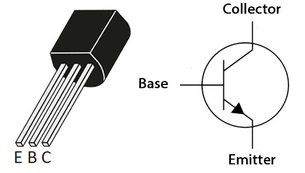
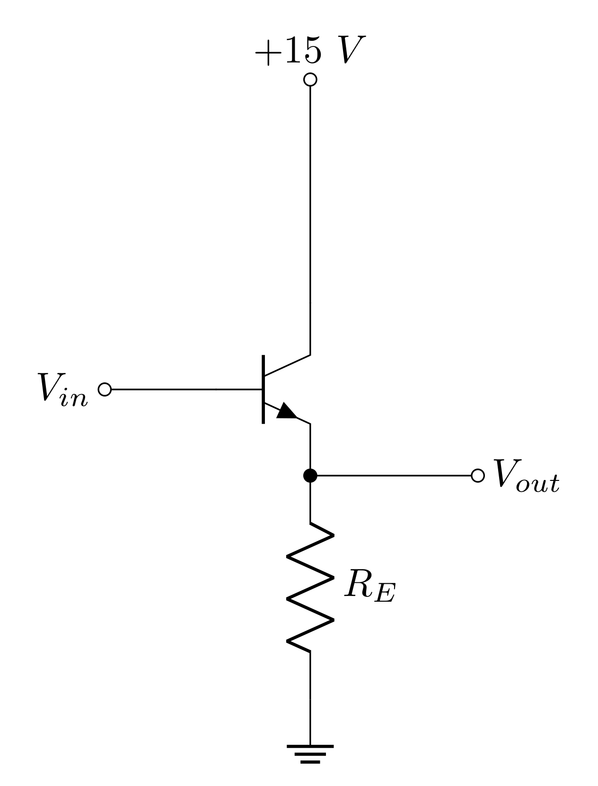
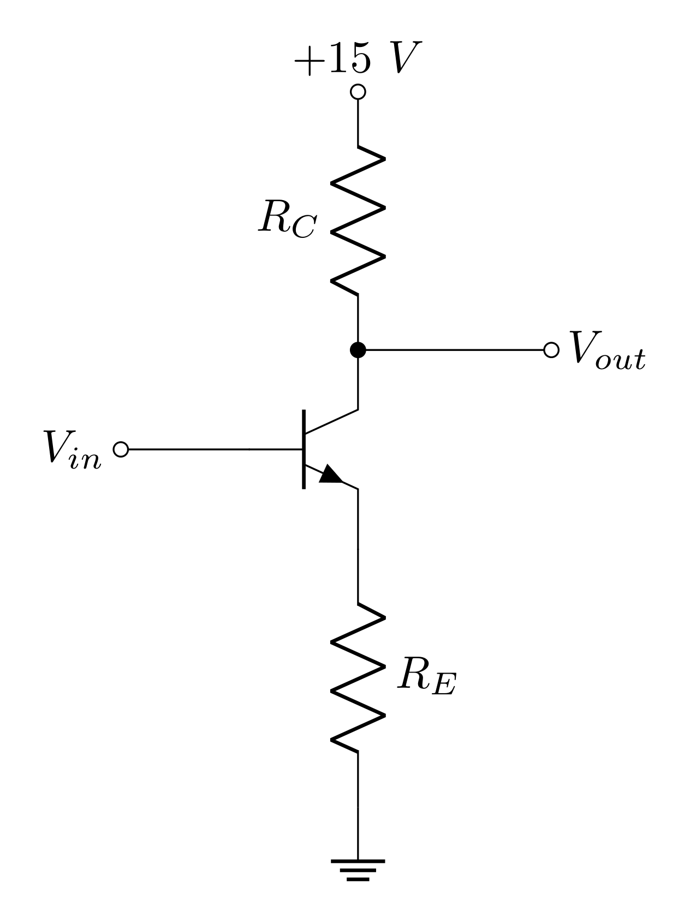
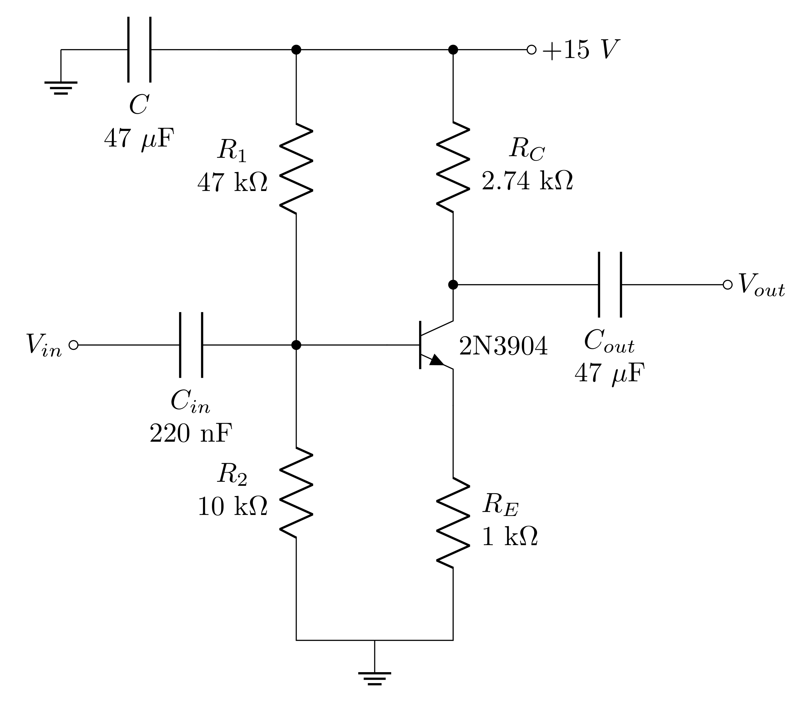
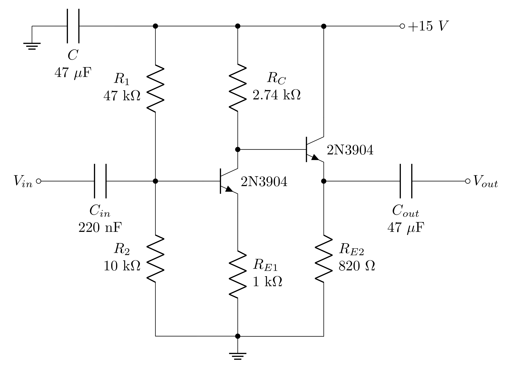

# Goals

In this lab, you will begin learning how transistors work by creating a dual-stage amplifier out of a common emitter amplifier plus an emitter follower and use this as an audio amplifier.

Proficiency with new equipment:

-   Bipolar junction transistors

Modeling the physical system:

-   Develop a model of bipolar junction transistors

Applications:

-   Build a dual-stage amplifier

-   Use the amplifier to drive a speaker

# Definitions

$\mathbf{h_{fe}}$ **or** $\beta$ - transistor current gain intrinsic to the transistor itself.

$\mathbf{V_{E},~V_{B},~V_{C}}$ - voltages at the emitter, base, and collector, respectively. These are the quiescent (DC) voltages.

$\mathbf{v_{in},~v_{out}}$ - input and output voltages; written in lower-case to indicate an AC signal only (not including any DC offset).

**Blocking capacitor** or **coupling capacitor** - capacitors used to transmit an AC signal while blocking the DC component.

# Bipolar Junction Transistors - General Use

An electrical signal can be amplified using a device that allows a small current or voltage to control the flow of a much larger current from a DC power source. Transistors are the basic devices providing control of this kind. There are two general types of transistors, bipolar and field-effect. The difference between these two types is that for bipolar devices an input current controls the large current flow through the device, while for field-effect transistors an input voltage provides the current control. In this experiment we will build a two-stage amplifier using two bipolar transistors.

In many practical applications it is better to use an op-amp as a source of gain rather than to build an amplifier from discrete transistors. A good understanding of transistor fundamentals is nevertheless essential because op-amps are built from transistors. We will learn later about digital circuits, which are also made from transistors. In addition to the importance of transistors as components of op-amps, digital circuits, and an enormous variety of other integrated circuits, single transistors (usually called "discrete" transistors) are used in many applications. They are important as interface devices between integrated circuits and sensors, indicators, and other devices used to communicate with the outside world. High-performance amplifiers operating from DC through microwave frequencies use discrete transistor "front-ends" to achieve the lowest possible noise. Discrete transistors are generally much faster than op-amps. The device we will use this week has a gain-bandwidth product of 300 MHz (compared to 5 MHz for the LF356 op-amp you have been using).

The three terminals of a bipolar transistor are called the emitter, base, and collector (Figure @fig:NPN). A small current into the base controls a large current flow from the collector to the emitter. The current at the base is typically about 1% of the collector-emitter current. This means that the transistor acts as a current amplifier with a typical current gain ($h_{fe}$ or $\beta$) of about 100. Moreover, the large collector current flow is almost independent of the voltage across the transistor from collector to emitter. This makes it possible to obtain a large amplification of voltage by having the collector current flow through a resistor.

{#fig:NPN}

# Current Amplifier Model of a Bipolar Transistor

From the simplest point of view a bipolar transistor is a current amplifier. The current flowing from collector to emitter is equal to the base current multiplied by a factor. An NPN transistor like the 2N3904 operates with the collector voltage at least a few tenths of a volt above the emitter, and with a current flowing into the base. There are also PNP transistors with opposite polarity voltages and currents. The base-emitter junction acts like a forward-biased diode with a 0.6 V drop:

$$V_E \approx V_B-0.6~V$$

Under these conditions, the collector current is proportional to the base current:

$$I_C = h_{fe}I_B$$

The constant of proportionality ('current gain') is called $h_{fe}$ because it is one of the \"h-parameters\", which are a set of numbers that give a complete description of the small-signal properties of a transistor. It is important to keep in mind that hfe is not really a constant. It depends on collector current, and it can vary by 50% or more from device to device.

If you want to know the emitter current, rather than the collector current, you can find it by current conservation:

$$I_E = I_B+I_C = I_C\left(\frac{1}{h_{fe}+1}\right)$$

The difference between $I_C$ and $I_E$ is almost never important since $h_{fe}$ is normally in the range of 100--1000, so you can generally assume that $I_E$ = $I_C$. Another way to say this is that the base current is very small compared to the collector and emitter currents.

# Emitter Follower and Common Emitter Amplifier

We will begin by constructing a common emitter amplifier (CEA), which operates on the principle of a current amplifier. However, a major fault of the common emitter amplifier is its high output impedance. This problem can be fixed by adding a second circuit, the emitter follower (EF), as a second stage. The common-emitter amplifier and the emitter follower are the most common bipolar transistor circuits.

First consider the emitter follower (Figure @fig:emitterf). The output (emitter) voltage is always 0.6 V (one diode drop) below the input (base) voltage. A small AC signal of amplitude $v_{in}$ at the input will therefore give a signal $v_{in}$ at the output, i.e. the output just "follows" the input. There is no gain (the gain is 1) but we will see later that this circuit is still useful because it has high input impedance and low output impedance.

Now consider the common emitter amplifier (Figure @fig:emittera). A small AC signal of amplitude $v_{in}$ at the input will give the same AC signal $v_{in}$ at the emitter (just like the emitter follower). This will cause a varying current of amplitude $v_{in}/R_E$ to flow from the emitter to ground. As we found above, $I_E\gg I_C$, and so the same current will flow through $R_C$. This current generates $v_{out} = –R_C(v_{in}/R_E)$. Thus, the common emitter stage has a small-signal AC voltage gain of:

$$G=\frac{-R_C}{R_E}$$

**Note:** this gain is about the change in voltage, which is a bit different than the gains you have been working with so far.

{#fig:emitterf width="7cm"}

{#fig:emittera width="7cm"}

# Biasing a Transistor Amplifier

Figure @fig:emittera shows the basic common emitter amplifier, while Figure @fig:emitterabn shows the common emitter amplifier circuit that you will build with the biasing resistors, power filter capacitor, and coupling capacitors in place. The power filter capacitor connecting +15 V to ground serves to ensure that electronic noise from the power supply does not enter the circuit. The coupling capacitors on the input and output serve to transmit the AC signal and block the DC voltage. For the input, this is essential because if you feed DC voltage into something providing its own voltage, bad things will happen. In this case, if the biasing DC voltage is directly connected to the output of the function generator ($V_{in}$) the output buffer in the function generator will break. For the output, the coupling capacitor is simply convenient as we don't care about the DC voltages, just the AC signal.

{#fig:emitterabn width="13cm"}

This brings us to the biasing network. While we are usually trying to amplify a small AC signal, it is essential that we setup the proper "quiescent point" or bias voltages. These are the DC voltages present when the signal is zero. Setting up the proper biasing often requires an iterative process. Here are the steps to understand what is happening in a transistor setup.

1.  Set the DC voltage of the base, $V_B$, with a voltage divider ($R_1$ and $R_2$ in Figure @fig:emitterabn).

2.  The emitter voltage, $V_E$, will be 0.6 V less than the base voltage.

3.  Between the emitter and ground, there is one resistor so we can determine the current flowing through that resistor, which is the same as the current flowing out of the emitter: $I_E = V_E/R_E$.

4.  Recall that the emitter and collector current are approximately equal so $I_C = I_E$.

5.  Using this current, we can calculate voltage drop across the collector resistor and subtract that from the power supply voltage, $V_{PS}$ = +15 V, to get the collector voltage: $V_C = V_{PS}~ –~ I_CR_C$.

6.  If we have capacitors or inductors in parallel with (or in place of) the resistors $R_C$ and $R_E$, then we would use the AC impedances.

For an emitter follower, the biasing is about the same except that the collector is usually tied to the positive supply voltage so $V_C = V_{PS}$.

Determining the best values to use for the resistors and capacitors depends on what the circuit needs to do.

# Output Range of the Common Emitter Amplifier (Clipping Voltages)

Even with proper biasing of the transistor, the output voltage has a range that is less than 0-15 V. Let's determine the maximum and minimum output voltages. Since $V_{out} = V_{PS}~ –~ I_CR_C$, the maximum voltage will occur when $I_C = 0$ and the minimum voltage when $I_C$ is a maximum.

**Maximum voltage:** This occurs when the transistor is turned off and no current is flowing. As there is no current flowing through $R_C$, there is no voltage drop across it. Thus $V_{out} = V_{max} = V_{PS} = 15 ~V$.

**Minimum Voltage:** This occurs when the transistor is fully on. The maximum current is flowing and there is very little voltage drop across the transistor. The voltage is:

$$V_{out} = V_{min} = V_{PS} ~– ~R_C I_C~ (max)$$

$I_C~(max)$ can be found by considering the voltage drop from the power supply to ground when there is no voltage drop across the transistor: $V_{PS}~-~R_C I_C ~-~ R_E I_E = 0$.

# Input and Output Impedances of the Common Emitter Amplifier

The input impedance is the same for both the emitter follower and the common emitter amplifier. The input impedance looking into the base of the common emitter amplifier is

$$r_{in} = R_E h_{fe}$$

where $R_E$ is whatever impedance is connected to the emitter. If there is no load attached, it is just the emitter resistor. However, if there is a load attached, $R_E$ will be the emitter resistor in parallel with the input impedance of the load (or the next stage). This input impedance is for the base of the transistor. If there is a biasing network in place, then the input impedance of the *circuit* will be $r_{in}$ in parallel with the base bias resistors.

The output impedance of the common emitter amplifier (Figure @fig:emittera) is just equal to the collector resistor $R_C$:

$$r_{out} = R_C ~~\text{(common emitter)}$$

The output impedance of the emitter follower is found to be:

$$r_{out} = \frac{R_B}{h_{fe} +1}~~ \text{(emitter follower)}$$

where $R_B$ indicates whatever impedance is connected to the base. To be more precise, one should also include the emitter resistor in parallel with rout for the true output impedance of the circuit, but this is usually not necessary as rout is usually much smaller than $R_E$. Also, please note the next section gives a more precise estimate of $r_{out}$.

# Ebers-Moll Model of a Bipolar Transistor

Instead of using the current amplifier model, one can take the view that the collector current $I_C$ is controlled by the base-emitter voltage $V_{BE}$. For our purposes, the Ebers-Moll model modifies our current amplifier model of the transistor in only one important way. For small variations about the quiescent point, the transistor now acts as if it has a small internal resistor, $r_e$, in series with the emitter. The magnitude of the intrinsic emitter resistance, $r_e$, depends on the collector current $I_C$:

$$r_e = 25~\Omega \left(\frac{1~mA}{I_C}\right)$$

The presence of the intrinsic emitter resistance, $r_e$, modifies the above input and output impedances to:

$$r_{in} = (R_e + r_e)~h_{fe}~~ \text{(CEA and EF)}$$

$$r_{out} = \frac{R_B}{h_{fe}+1}+r_e~~ \text{(EF)}$$

In addition, this modifies the gain of the common emitter amplifier to:

$$G = \frac{-R_C}{R_E+r_e}$$

which shows that the common emitter gain is not infinite when the external emitter resistor goes to zero.

# Useful Readings

1.  [Steck](https://atomoptics-nas.uoregon.edu/~dsteck/teaching/electronics/electronics-notes.pdf) Sections 4.1, 4.2, 4.3, 4.4, 4.6, 4.6.1, 4.8, 4.9, and 4.11.3

2.  Fischer-Cripps Chapters 5 and 6

3.  Horowitz and Hill 2^nd^ Ed. Chapter 2

# Prelab

## Biasing the transistor 

1. Explain why we need to have the biasing resistors $R_1$ and $R_2$ in Figure @fig:emitterabn if we are going to amplify an AC signal? That is, why won’t Figure @fig:emittera work as is?
2. Calculate the quiescent voltages (the DC voltages with no signal present) $V_B$, $V_E$, and $V_C$ and the currents $I_E$ and $I_C$ for the common emitter circuit in Figure @fig:emitterabn. You may assume that $h_{fe}$ is so large that the base current is negligible.
3. How much power is dissipated in the transistor itself? Is the power safely below $P_{max}$? See the 2N3904 data sheet posted on Canvas.
4. What is the purpose of the input and output coupling capacitors, $C_{in}$ and $C_{out}$?

## Common emitter amplifier {#sec:cea}

1. What is the maximum $h_{fe}$ value at 10 mA collector current? See the 2N3904 data sheet posted on Canvas. (You may use this value for calculations below.)
2. What is the AC voltage gain of the circuit in Figure @fig:emitterabn for 10 kHz sine waves?
3. What are the maximum and minimum possible output voltages without the output coupling capacitor in place?
4. Since the gain is negative, this is an inverting amplifier. Therefore, the maximum output voltage occurs with a small input voltage and the minimum output voltage occurs with a large input voltage. What is the largest input voltage that gives the minimum output voltage and what is the smallest input voltage that gives the maximum output voltage? In this case, you should consider the input coupling capacitor to be in place.
5. What are the input and output impedances $r_{in}$ and $r_{out}$ at 10 kHz? The input impedance with the bias resistor network in place is the input resistance of the common emitter in parallel with both $R_1$ and $R_2$. That is, $r_{in}$ (total) = $r_{in}$ (common emitter) || $R_1$ || $R_2$.
6. Calculate the fraction of the original amplitude obtained when a 470 $\Omega$ load is connected to the output via a coupling capacitor ($C_{out}$ in Figure @fig:emitterabn) to ground. HINT: the 470 $\Omega$ resistor is in series with the output impedance of the circuit to ground. The output capacitor only blocks the DC component; it passes the AC signal just fine.

## Dual stage amplifier {#sec:dsa}

1. What is the AC voltage gain for 10 kHz sine waves of the entire dual-stage amplifier (common emitter + emitter follower) shown in Figure @fig:dualsa?
2. Calculate the quiescent voltages (the DC voltages with no signal present) $V_B$, $V_E$, and $V_C$ as well as the currents $I_E$ and $I_C$ for the emitter follower part of the circuit in Figure @fig:dualsa. You may assume that $h_{fe}$ is so large that the base current is negligible.
3. How much power is dissipated in the transistor of the emitter follower? Is the power safely below $P_{max}$? See 2N3904 data sheet posted on Canvas. What if we connected an 8 $\Omega$ speaker to $V_{out}$ without using the $C_{out}$ coupling capacitor? This basically changes $R_E$ to 8 $\Omega$. How much power would be dissipated in the emitter follower transistor in that case? Is that safe to do?
4. For the entire dual stage amplifier in Figure @fig:dualsa, what is the output impedance $r_{out}$ at 10 kHz? You should use the Eber-Molls model. Also, the impedance at the base of the emitter follower is simply the collector resistor of the common emitter amplifier.
5. Calculate the fraction of the original amplitude obtained when a 470 $\Omega$ load is connected to the output via a coupling capacitor ($C_{out}$ in Figure @fig:dualsa). HINT: the 470 $\Omega$ resistor will be in series with the output impedance of the circuit to ground. Even at only 10 kHz, the output capacitor acts as a wire for the AC impedance. It serves to block only the DC voltage.

## Audio amplifier

1. A standard non-amplified speaker has an input impedance of 8 $\Omega$. If your computer headphone jack had an output voltage at 1 V unloaded and an output impedance of 8 $\Omega$, what would the loaded voltage be if you hooked it up to the 8 $\Omega$ speaker? HINT: Think voltage divider
2. Now, instead you can use the common emitter to amplify the signal from the computer first. If your common emitter amplifier has an unloaded output voltage of 2.7 V (assuming a gain of 2.7), what is the output voltage if you connect an 8 $\Omega$ speaker to the amplifier? HINT: Think voltage divider with the output impedance of the common emitter.
3. Finally, consider using the two-stage amplifier shown in Figure @fig:dualsa to drive the speaker. If the emitter follower amplifier output stage has an unloaded output voltage of 2.7 V (assuming a gain of 2.7), what is the output voltage if you connect an 8 $\Omega$ speaker to the amplifier? Note that in the lab you will be using the output of the lab’s laptop computer headphone jack. HINT: Think voltage divider with the output impedance of the emitter follower.

## Lab activities

1.  Read through all of the lab steps and identify the step (or sub-step) that you think will be the most challenging.

2.  List at least one question you have about the lab activity.

# Common Emitter Amplifier

## Quiescent scale

1. Build the common emitter amplifier shown in Figure @fig:emitterabn without the capacitors $C_{in}$ and $C_{out}$ (and without $V_{in}$). Measure the resistors before putting them in the circuit, and if they differ from the values used in your calculations, recalculate the predicted quiescent voltages. Draw the circuit schematic in your lab book and label all components.
2. Measure the DC voltages (quiescent voltages) $V_B$ (at the transistor base), $V_E$ (at the emitter), and $V_C$ (at the collector)? Do they agree with your predictions?

## Check limits with AC signal

1. Add the input coupling capacitor $C_{in}$ and the input AC source $V_{in}$ (and use the sync output to trigger the scope). The capacitor allows one to transmit an AC signal while maintaining the DC voltages established by the bias network. When you switch on the power, you may see high frequency spontaneous oscillations. These must be suppressed before you can proceed. An additional bypass capacitor (~100nF) between +15 V and ground close to the transistor may help. Also, reducing the length of your circuit wires can help. Do not add $C_{out}$ yet.
2. Assemble a test setup to observe the input (before $C_{in}$) and output of the amplifier with 10 kHz sine waves. Check that your setup works, and you can measure both the input and output.
3. Vary the input amplitude to determine the output amplitude at which clipping begins. Compare your results to section @sec:cea\.3? and @sec:cea\.4. You will want to stay below half of the clipping voltage to ensure the amplifier is not distorting the output waveform.
4. For the scope channel connected to the output, switch the coupling between DC and AC coupling and adjust the scope to see the signal in both cases. Explain the different behavior and say why you may want one or the other.

## Measuring the AC gain

1. Add the output coupling capacitor $C_{out}$. It will be polarized. Since the left side is connected to a positive DC voltage of $V_C$ and the right side will be connected to ground through the scope, you should have the negative side (the one that is marked and has the shorter lead) on the right. Move your scope measurement to occur after $C_{out}$. When you first turn it on, you may find that the output voltage has a large DC offset due to charging of the output coupling capacitor. This should discharge since the scope provides a 1 M$\Omega$ path to ground but if it doesn’t, you can add a 220 k$Omega$ resistor to ground after $C_{out}$. Check that the output now oscillates around 0 V with the scope channel set to DC coupling.
2. Measure the gain of the amplifier for 10 kHz sine waves using an amplitude that ensures the voltages are less than half of the clipping voltage (either positive or negative). You should use the 10X scope probe for measuring the output. Does your measurement agree with your prediction? Screen shots here would be good.

## Output impedance

1. The common emitter amplifier often has a large output impedance. Connect a 470 $\Omega$ load from the output to ground. What fraction of the original output do you now see? Does this agree with your prediction from section @sec:cea\.6? If not, can you use your measurements of the output voltage before and after the resistor was in place to refine the model of your amplifier’s output impedance?
2.  Remove the 470 $\Omega$ load resistor.
3. Attach the speaker to your circuit board. Connect the black wire to ground and connect the red wire to a free row on the circuit board. Drive the speaker directly with the function generator output. You should hear a tone. Vary the frequency and amplitude to check the effect on the output of the speaker. Then setup the same amplitude that you used in the previous section and a frequency of 1 kHz
4. Switch back to driving the common emitter amplifier circuit with the function generator and connect the speaker to the output, just like you did with the 470 $\Omega$ load resistor. Describe the results of both speaker tests. Does the gain provided by the common emitter amplifier result in a louder tone from the speaker? Explain your results. You may want to measure the impedance of the speaker with your DMM and do a calculation similar to section @sec:cea\.6 to understand what is going on.

{#fig:dualsa width="15cm"}

# Dual Stage Amplifier

## Quiescent scale

1. Ordinarily, the quiescent base voltage is determined by a bias circuit (as was done for the common emitter stage). In the present case, the collector voltage VC of the previous circuit already has a value suitable for biasing the emitter follower, so a direct DC connection can be made between the two circuits. Add the emitter follower to your circuit to build the dual stage amplifier shown in Figure @fig:dualsa.
2. Using your measured resistor values, calculate the DC voltages for the emitter follower’s base, emitter, and collector (see section @sec:dsa\.2).
3. Measure the quiescent (DC) voltages ($V_B$, $V_E$, $V_C$) for the emitter follower part. Do the measurements agree with your predictions? Correct for/reconcile any errors before proceeding.

## Low frequency AC gain

1. Drive the complete system with the function generator at 10 kHz. Measure the AC amplitudes at the input of the common emitter, the input of the emitter follower, and at the output. What is the gain of the full circuit? What is the gain of just the emitter follower? Do these measurements agree with your predictions? HINT: As before, you may need a 220 k$\Omega$ resistor to ground after $C_{out}$ to keep the DC level near ground as the large output capacitor can slowly charge up. You may also want to put the scope on AC coupling when you probe points with large DC offsets but switch it back to DC coupling if you want to measure quiescent voltages.

## Output impedance

1. The emitter follower amplifier should have a low output impedance. Connect a 470 $\Omega$ load from the output to ground. What fraction of the original output do you now see? Does this agree with your prelab predictions? If not, can you use your measurements of the output voltage before and after the resistor was in place to refine the model of your amplifier’s output impedance?
2. Remove the load resistor and drive a speaker with the output of the amplifier. Explain how you hooked up the speaker. Drive your amplifier with the function generator. Describe your measurements and observations. Do they agree with your model of the output impedance of the dual stage amplifier? Compare your results with the output from just the common emitter amplifier. Do the results make sense?
3. Now drive your amplifier with the audio source (computer). Describe your measurements and observations. Do they agree with your model of the output impedance of the dual stage amplifier?
