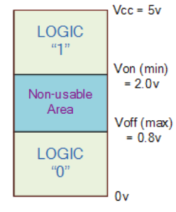
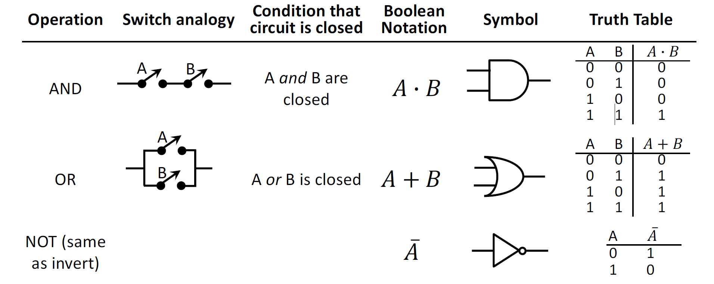
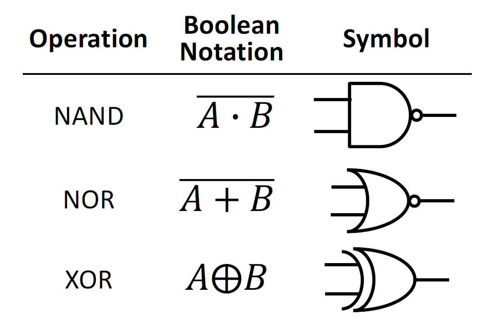
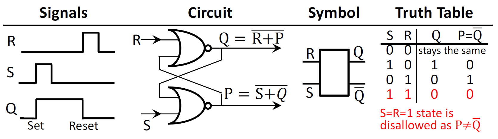
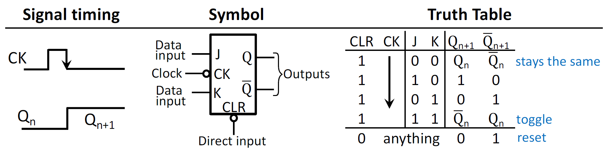
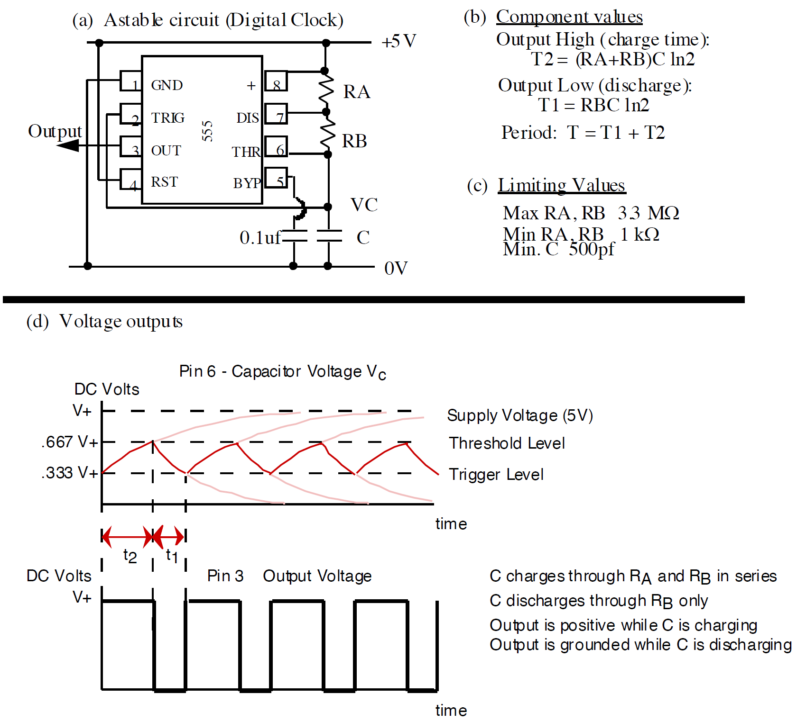
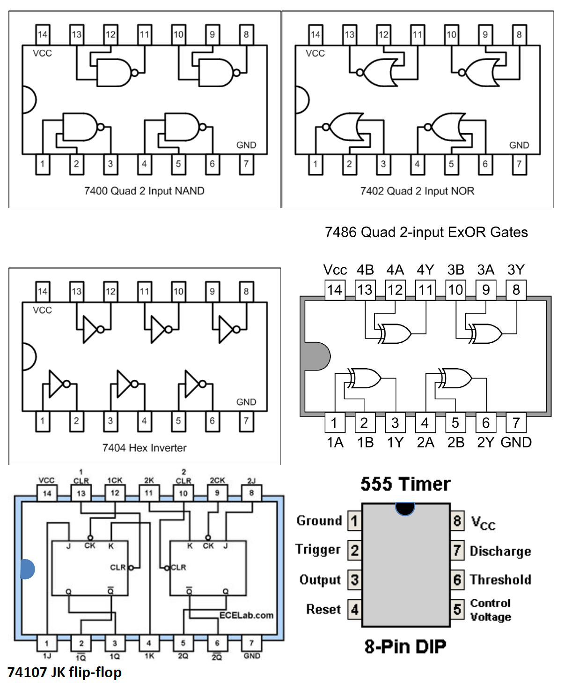
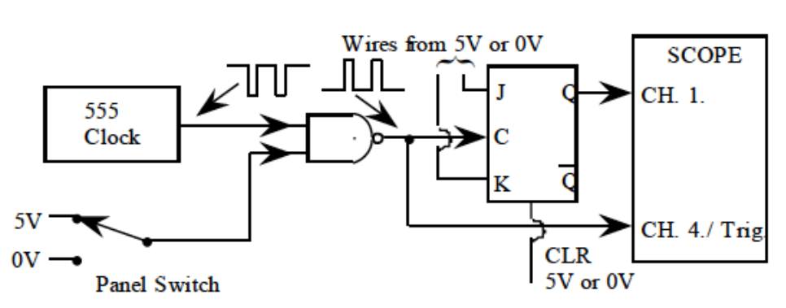
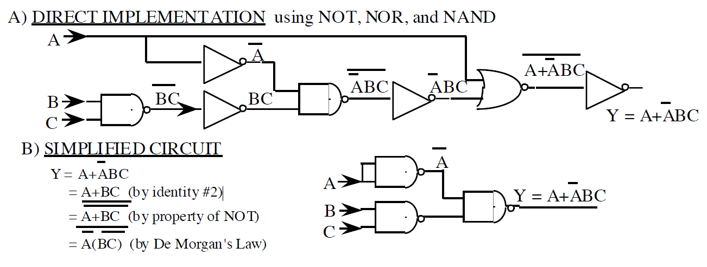

# Goals

In this lab, we will gloss over the basics of digital electronics. You will utilize some of the most basic components that are used to build more complex circuits, like computers. You will learn to use logic gates, memory circuits, and digital clocks (a kind of oscillator), and you will learn how to combine gates and predict the behavior with Boolean algebra.

This subject can easily span an entire semester, but we will just dip our toes in the water so that you will be equipped to employ some basic components into your final project if needed. The digital clock you will build in this lab, for example, has many applications. It is worth also investigating [other kinds of oscillators](https://en.wikipedia.org/wiki/Electronic_oscillator) for your project (if relevant).

## Some Useful Definitions

**Duty cycle** - percentage of time during one cycle that a system is active (+5V in the case of TTL digital logic)

**Truth-table** - table that shows all possible input combinations and the resulting outputs of digital logic components

**Flip-flop**- a circuit that has two stable states and can be used to store state information

# Intro to Digital Circuits

In almost all experiments in the physical sciences, the signals that represent physical quantities start out as *analog* waveforms. However, in the modern day, all our data eventually ends up on a computer (which is a digital circuit) to store and display. This requires analog-to-digital converters (ADC or A/D converter). There are plenty of commercially available ADCs that read voltages and connect to computers via USB, ethernet, RS-232, PCI, or PCIe; however, most instruments, such as the oscilloscope you use, have ADCs built in and communicate with a computer via USB, RS-232, ethernet, or GPIB. Scientists usually buy their data acquisition equipment rather than build it, so they usually don’t have to know too much about the digital circuitry that makes it work.

In lab 5 you built a 3-bit digital-to-analog converter (DAC). Both DACs and ADCs have limited precision by the number of bits. A set of $N$ bits has $2^N$ possible different values. The precision will be determined by the range of value and the number of possible values. If you try to represent an analog voltage by $7$ bits, your minimum uncertainty will be about $1\%$ of the total range, since there are $2^7 = 128$ possible combinations of $7$ bits. For higher accuracy you need more bits.

There are three key components of digital circuits:

- logic

- memory

- timing

Transistors are the building blocks of all of these components, but both logic and memory can be exclusively made with **gates**.

**DEFINITION: Logic gates** - a simple transistor circuit that implements some Boolean logic operation.

In digital circuits, it is easier to abstract the discrete transistor circuits into gate circuits (similar to how we can treat an op-amp as a lumped element completely independent of the exact transistor layout that makes up the op-amp). In computers, gates are [CMOS](https://en.wikipedia.org/wiki/CMOS) (where gates are designed with MOSFETs), but gates originated as [TTL](https://en.wikipedia.org/wiki/Transistor%E2%80%93transistor_logic) (where gates are made from BJTs). Most gates on DIP chips are still TTL (including the ones we will use in this lab).

Gates can be used to construct arbitrary combinatorial logic (they can generate any *truth-table*), but to create a machine that steps through a sequence of instructions like a computer does, we also need *memory* and a *clock*. The fundamental single-bit memory element of digital electronics is called a *flip-flop*. We will study two types, called SR (or RS) and JK. Both of these can be built exclusively with gates (the ones we use are TTL). A *digital clock* is a repeating digital waveform used to step a digital circuit through a sequence of states. We will introduce the 555 timer chip and use it to generate a clock signal. Digital circuits that are able to step through a sequence of states with the aid of flip-flops and a clock are called sequential logic.

The voltage in a digital circuit is allowed to be in only one of two states: HIGH or LOW. HIGH is taken to mean logical $(1)$ or logical TRUE. LOW is taken to mean logical $(0)$ or logical FALSE. In the TTL logic family (see Figure @fig:TTLvolt), the “ideal” HIGH and LOW voltage levels are $5\text{ V}$ and $0\text{ V}$, respectively, but any input voltage in the range of $2–5\text{ V}$ is interpreted as HIGH, and any input voltage in the range of $0–0.8\text{ V}$ as LOW. Voltages outside this range are undefined, and therefore “illegal,” except if they occur briefly during transitions. If the input to a TTL circuit is a voltage in this undefined range, the response is unpredictable, with the circuit sometimes interpreting it as a $“1”$ and sometimes as a $“0.”$ Avoid sending voltages in the undefined range into TTL components.

{#fig:TTLvolt width="6cm"}

# Prelab

## Digital Logic Gates

The flow of digital signals is controlled by transistors in various configurations depending on the logic family (we mentioned CMOS and TTL above). For most purposes, we can imagine that the logic gates are composed of several ideal switches with just two states: OPEN and CLOSED. The state of a switch is controlled by a digital signal. The switch remains closed so long as a logical $(1)$ signal is applied. A logical $(0)$ control signal keeps it open.

Logic signals interact by means of gates. The three fundamental gates, AND, OR, and NOT, are named after the three fundamental operations of logic that they carry out. The AND and OR gates each have two inputs and one output. The output state is determined by the states of the two inputs. The NOT gate has one input and one output.

The function of each gate is defined by a truth table, which specifies the output state for every possible combination of input states. The output values of the truth tables can be understood in terms of two switches. If the switches are in series, you get the AND function. Parallel switches perform the OR operation. The most common gates are shown in Figure @fig:simpgates and Figure @fig:compgates. A small circle after a gate or at an input indicates negation (NOT).

{#fig:simpgates width="15cm"}

{#fig:compgates width="9cm"}

### Prelab Question {#sec:bdlpre}

1. Read Section @sec:TTL of the lab thoroughly and enter in your lab notebook the circuit diagrams (symbols) and truth tables of all the circuits that you will test: NAND, NOR, NOT (INVERT), and XOR (EXCLUSIVE OR).

2. Read through the appendix. Design a circuit to perform the XOR function using only NAND gates or only NOR gates. Simplify the circuit so that you use the smallest possible number of gates.

3. Prove that your circuit is equivalent to the XOR using the truth tables or with Boolean algebra.

## Memory Elements and Flip-Flops

In sequential logic circuits, the output depends upon previous values of the input signals as well as their present-time values. Such circuits necessarily include memory elements that store the logic values of the earlier signals. The fundamental memory circuit is the RS memory element. The JK flip-flop has an RS flip-flop at its core, but it adds circuitry that synchronizes output transitions to a clock signal. Timing control by a clock is essential to most complex sequential circuits.

**RS memory circuit**

The truth table for the RS memory element shows how the circuit remembers. Suppose it starts in a state with $Q=0$ and $R=S=0$. A positive pulse $S$ at the input sets it into the state $Q=1$, where it remains after $S$ returns to zero. A later pulse $R$ on the other input resets the circuit to $Q=0$, where it remains until the next $S$ pulse.

{#fig:rsmem width="15cm"}

**JK flip-flop (TTL74107)**

There are three kinds of inputs to the JK flip-flop:

1. Data inputs $J$ and $K$
2. The clock $\text{CK}$
3. The direct input clear $\text{CLR}$

There are two outputs: $Q$ and it's complement $\bar{Q}$ (not $Q$).

The index $n$ counts the number of clock pulses since the start of the experiment. In the absence of a clock pulse, the output remains unchanged at the previously acquired value, $Q_n$, which is independent of the present-time data inputs $J$ and $K$. Only on the arrival of a clock pulse, $\text{CK}, can the output change to a new value, $Q_{n+1}$. The value of $Q_n$ depends on the $J$ and $K$ inputs in the way specified in the truth table. The change occurs at the falling (trailing) edge of the clock pulse, indicated by a downward arrow in the truth table in Figure @fig:jkflipflop. The direct input, $\text{CLR}$, overrides the clock and data inputs. During normal operation, $\text{CLR} = 1$. At the moment $\text{CLR}$ goes to zero, the output goes to zero and remains there as long as $\text{CLR} = 0$.

{#fig:jkflipflop width="15cm"}

### Prelab Question {#sec:jkffpre}

1. A JK flip-flop with $J=K=1$ and $\text{CLR=1}$ is driven at the clock input by the $4\text{ kHz}$ clock you designed in section @sec:555pre. Draw the waveforms for the clock and the $Q$ output (labeling each) vs. time using the same time scale (making sure the times are indicated on the x-axis). Include enough periods of the clock signal to see the full behavior of the flip-flop’s output.

## 555 timer and digital clock

**READ** [Steck](https://atomoptics-nas.uoregon.edu/~dsteck/teaching/electronics/electronics-notes.pdf) section 15.1 and 15.1.1. 

Figure @fig:555timer shows the circuit for generating a clock with the 555 and summarizes the formulas relating the resistor and capacitor values to the output low time T1 and the output high time T2. Much more information is available in [Steck](https://atomoptics-nas.uoregon.edu/~dsteck/teaching/electronics/electronics-notes.pdf) section 15.1.2.

{#fig:555timer width="12cm"}

### Prelab Question {#sec:555pre}

1. Design a $4\text{ kHz}$ clock using the 555-timer chip. Make the low level $1/4$ of the output period (a $75\%$ duty cycle: $25\%$ low, $75\%$ high).

2. How large a capacitor would you need to substitute in order to modify your clock to run at $2\text{ Hz}$ (e.g. for visual observation of LEDs), keeping all other components fixed?

## Lab activities

### Prelab Question {#sec:10.1}

Please review the lab activities so that you're better prepared when you arrive to your lab section.

# Useful Readings

You can find more on digital circuits in these recommended sources:

1.  [Steck](https://atomoptics-nas.uoregon.edu/~dsteck/teaching/electronics/electronics-notes.pdf) Sections 9.1, 9.2, 9.3, 10.1, 10.2, 11.4, 13.1, 13.2, 15.1.1, 15.1.2

2.  Fischer-Cripps Chapter 11

3.  Horowitz and Hill 2^nd^ Ed. Chapter 8

4.  Horowitz and Hill 3^rd^ Ed. Chapter 10

# Digital Logic Chip Pin-Outs

Each chip has a dot or notch to indicate the end where pins 1 and 14 are located. The pin numbers increase sequentially as you go counterclockwise around the chip viewed from above. In 74xx family logic chips, pin 7 is always grounded $(0\text{ V})$ and pin 14 is always connected to the $+5\text{ V}$ supply. You connect these to the breadboard the same way as the op-amp (across the groove in the middle of the breadboard). Decoupling capacitors for the power to these chips are not needed in steady state use of these chips, but it's typically a good idea to use them when dealing with switching on/off states rapidly.

{#fig:logicchips width="20cm"}

# Lab Activities

## Switches

Throughout this lab you will switch inputs between $0\text{ V}$ and $5\text{ V}$. This can be done by moving wires between two rails (one at ground and on at $5\text{ V}$); however, for the memory circuits, it can cause problems to leave an input floating for too long (the time it takes to move the wire). In these cases, it is crucial to use a switch to switch between these voltages.

1. The middle pin of a switch  is connected to either of the other two of the pins depending on the position of the lever. Connect one outer pin of the switch to ground and the other to $5\text{ V}$.

2. Measure the middle pin with your DMM with respect to ground and confirm that the switch switches between the two desired voltages.

The logic level of any state (input, output, or any intermediate state) using a light emitting diode (LED). When a state is $(1)$, $5\text{ V}$ will be applied to one end, and the LED will light up, and when a state is $(0)$, there won't be a voltage across the LED, so it won't light up. This is a nice way to visualize what is happening in your circuit without needing to endless probe around with your DMM. You will likely want quite a bit of LEDs for this purpose, so you may want to use at least one 10-LED bank (MV57164). It can be nice to use individual LEDs (HLMP-C625) to be able to place each one physically where you want in the circuit.

1. To limit the amount of current though each diode, place a resistor in series with it. What value of resistor should you use to limit the current to $20\text{ mA}$ (don’t forget that the LED has a voltage drop of about $2\text{ V}$)? Record your calculation. Check that the LED lights up appropriately. If you don’t see light, try reversing the $+5\text{ V}$ and ground connections. You can review Lab 6 for more information on LEDs.

2. Connect an LED to the output of each switch and toggle them to confirm you can visualize the state of each switch. These switches can be used as the inputs for all the circuits you will build moving forward. You should use other LEDs to visualize output states of your circuits as well.

## TTL Gates {#sec:TTL}

### Truth tables

1. Check your power supply before connecting to the circuit board. Often supplies have a fixed $5\text{ V}$ output for powering TTL digital circuits. However, our supplies do not. Chose a channel to set to $5\text{ V}$.

2. Input logical values can be set by connecting wires from the gate inputs to either $0\text{ V}$ (logical $0$) or $+5\text{ V}$ (logical $1$). Use one long rail on your prototyping board for $0\text{ V}$ and one for $+5\text{ V}$. **Note: Disconnecting an input from the $+5\text{ V}$ rail is not the same as connecting it to $0\text{ V}$. If it is disconnected, the input can float up to $+5\text{ V}$ on its own.**

3. Configure an LED to observe the output of the circuit you are testing.

4. Record the measured truth tables for the NAND (7400), NOR (7402), and INVERT (7404) gates, using the LED indicator for your measurements.

### Modifying basic gates

1. Connect a NAND gate so that it performs the INVERT function. Do this for a NOR gate also.

2. Record your circuit and measured truth table.

### Exclusice OR

1. Verify the truth tables for an XOR chip (7486).

2. Build and test the XOR circuit you designed using only NAND or only NOR gates in section @sec:bdlpre\.2.

## Sequential Logic

### RS memory circuit

1. Build an RS memory circuit from two NOR gates. Draw a schematic of your circuit.

2. Demonstrate the memory property by going through a complete memory cycle: Set $(R = 0,\ S = 1)$, Store $(0,\ 0)$, Reset $(1,\ 0)$, Store $(0,\ 0)$, Set $(0,\ 1)$. Record all inputs and outputs for each cycle. You can determine the output by using one LED for each output or measuring the voltage of each output. Do your results agree with your predictions?

3. Examine the effect of the “illegal” input $(R = 1,\ S = 1)$ for different initial states of the RS system. Describe the outcomes of the illegal operation.

### Digital clock with 555 timer

1. Build the $\sim4\text{ kHz}$ digital clock using a 555 Timer according to your design in section @sec:555pre\.1. Measure the frequency, the pulse length (time the output is high), the duty cycle, and the nominal $5\text{ V}$ amplitude. Include a screen shot showing the results. Do your measurements agree with your predictions using the measured values of your components?

2. Check that a suitable large capacitor placed in parallel with the existing one converts the clock to $2\text{ Hz}$.

### JK flip-flop

1. Test a JK flip-flop by constructing a truth table utilizing different inputs for $J$ and $K$ and creating a clock transition by switching the voltage from $0\text{ V}$ to $5\text{ V}$ to $0\text{ V}$. This is a perfect opportunity to use the switch on the front panel of your setup. Connect LEDs to both outputs to record your data. Since the output depends upon the previous state, $Q_n$, you will need to tabulate $Q_{n+1}$ for both possible previous states, $Q_n=0$ and $Q_n=1$. You should add an additional column, $Q_{n+2}$, to get a better feel for the behavior of the flip-flop.

2. Set $\text{CLR} = 1$ and $J = K = 1$. Now drive the clock input of the flip-flop with $4\text{ kHz}$ pulses from your clock circuit. Use the oscilloscope to measure the clock input and the output, $Q$, of the flip-flop. You may find Figure @fig:jkfftest helpful to setup this part. Record your measurements and compare with your prediction from section @sec:jkffpre. Include a screen shot showing the results.
3. Do the same test with $J = K = 0$ and record what happens.

{#fig:jkfftest width="20cm"}

# Appendix: Boolean Algebra

## Fundamental laws

We imagine a logical variable, $A$, that takes on the values $0$ or $1$. If $A = 0$ then $\bar{A} = 1$ and if $A = 1$ then $\bar{A}=0$ . Here are some obvious identities using the AND, OR and NOT operations. Looking at these identities you can see why the ‘plus’ $(+)$ symbol was chosen for OR and ‘times’ $(\cdot)$ for AND.

| OR              | AND             | NOT           |
| --------------- | --------------- | ------------- |
| $A + 0 = A$     | $A \cdot 0 = 0$ | $A+\bar{A}=1$ |
| $A +1 = 1$      | $A\cdot 1=A$    | $A\cdot\bar{A}=0$ |
| $A+A =A$        | $A\cdot A=A$    | $\bar{A}=A$   |
| $A+\bar{A}=1$   | $A\cdot\bar{A}=0$ |             |

Table: Caption. {#tbl:1}

## Equality

Two Boolean expressions are equal if and only if their truth tables are identical.

## Associative laws

$$(A+B) + C = A + (B+C)$$

$$(AB)C=A(BC)$$ 

## Distributive laws

$$A(B+C)=AB+AC$$

**Related identities:**

$$(A+AB)=A$$

$$(A+\bar{A}B)=A+B$$

$$(A+B)\cdot (A+C) = (A+ BC)$$

## DeMorgan's theorems

$$\overline{A \cdot B\cdot \ldots} = \bar{A}+\bar{B}+\ldots$$

$$\overline{A + B+ \ldots} = \bar{A}\cdot \bar{B}\cdot\ldots$$

## Example proof

Each of the above equalities is a theorem that can be proved. Let's do an example by directly comparing the truth tables for the left and right sides. We take on DeMorgan's first theorem for two variables, $\overline{AB}=\bar{A}+\bar{B}$:

| $A$  | $B$  | $AB$ | $\overline{AB}$ |
| ---- | ---- | ---- | --------------- |
| 0    | 0    | 0    | 1               |
| 0    | 1    | 0    | 1               |
| 1    | 0    | 0    | 1               |
| 1    | 1    | 1    | 0               |

Table: Caption. {#tbl:2}

| $A$  | $B$  | $\bar{A}$ | $\bar{B}$ | $\bar{A}+\bar{B}$ |
| ---- | ---- | --------- | --------- | ----------------- |
| 0    | 0    | 1         | 1         | 1                 |
| 0    | 1    | 1         | 0         | 1                 |
| 1    | 0    | 0         | 1         | 1                 |
| 1    | 1    | 0         | 0         | 0                 |

Table: Caption. {#tbl:3}

The last columns of the truth tables are identical. Thus, the first theorem is proven for two variables.

## Example of simplification

Boolean algebra can be used to simplify logical expressions and reduce the number of gates required in a circuit. In the figure below, we show two ways to implement the expression, $Y=A+\bar{A}BC$.

**Direct implementation** using NOT, NOR, and NAND

{#fig:logic}

